# Querying information using access keys

Access keys allow users to interact with **Cloud Workload Protection Platform (CWPP)** and **Cloud Security Posture Management (CSPM)** systems programmatically, replicating most operations available in the user interface (UI). Below are key aspects and best practices for using access keys effectively and securely

## **Capabilities with Access Keys**

1. **Operational Flexibility**

    - Perform a wide range of actions available in the UI.

    - Automate workflows to increase efficiency in security operations.

2. **Data Retrieval**

    - Fetch detailed findings from CWPP endpoints (e.g., runtime threats, vulnerabilities).

    - Query compliance and posture data from CSPM endpoints.

3. **Support for Multiple Data Types**

    - Handle various finding types with specific `data_type` values:

        - Examples include `Cloud Security Findings` (CSPM findings), vulnerability scans (SCA), `SQ` (security queries), and `IaC` (Infrastructure as Code findings).

4. **Bulk Operations**

    - Automate repetitive tasks and bulk actions using programmatic workflows.

    - Streamline processes like remediation, tagging, or status updates.

## Pre-requisite

1. User Access key with relevant permission

2. Tenant id

3. CSPM/CWPP URL for the environment

Please refer to Help-Doc to understand How to create [Access_Keys](https://help.accuknox.com/how-to/create-access-keys/ "https://help.accuknox.com/how-to/create-access-keys/")

For the CSPM/CWPP URL, you can inspect the network tab and get the URL from there

e.g.: [cspm.demo.accuknox.com](http://cspm.demo.accuknox.com/ "http://cspm.demo.accuknox.com"), [cwpp.demo.accuknox.com](http://cwpp.demo.accuknox.com/ "http://cwpp.demo.accuknox.com")

## Querying data from CWPP using automated Script

Users can create scripts to automate various tasks using access keys.\
These scripts assist users in performing batch-processing tasks by leveraging AccuKnox control plane APIs. For instance:

- Exporting runtime policies.

- Getting Remediation Ticket Reports

- Checking Node Enrollment

### Sample Scripts

Below are the steps for performing batch processing tasks by leveraging AccuKnox control plane APIs

### Steps

1. Clone the [repo](https://github.com/nyrahul/tools/tree/main/api-samples "https://github.com/nyrahul/tools/tree/main/api-samples")
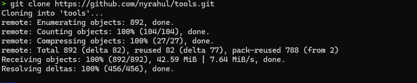

2. In `.accuknox.cfg` file set `tenant_id` and `access_key` as TOKEN and move the `.accuknox.cfg` file to the current user home directory
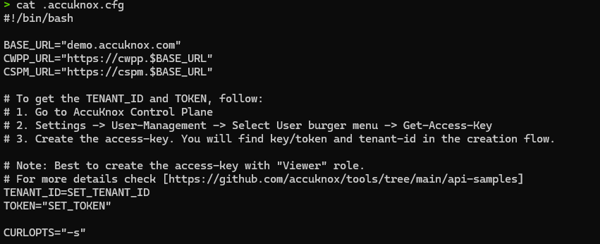

```sh
#!/bin/bash

BASE_URL="demo.accuknox.com"
CWPP_URL="https://cwpp.$BASE_URL"
CSPM_URL="https://cspm.$BASE_URL"

# To get the TENANT_ID and TOKEN, follow:
# 1. Go to AccuKnox Control Plane
# 2. Settings -> User-Management -> Select User burger menu -> Get-Access-Key
# 3. Create the access-key. You will find key/token and tenant-id in the creation flow.

# Note: Best to create the access-key with "Viewer" role.
# For more details check [https://github.com/accuknox/tools/tree/main/api-samples]
TENANT_ID=SET_TENANT_ID
TOKEN="SET_TOKEN"

CURLOPTS="-s"
```

The environment is now set up, and users can run the scripts to view the results.

### Check Node Enrollment

To view the number of nodes connected to a cluster execute the `checkNodeEnrollment.sh` script
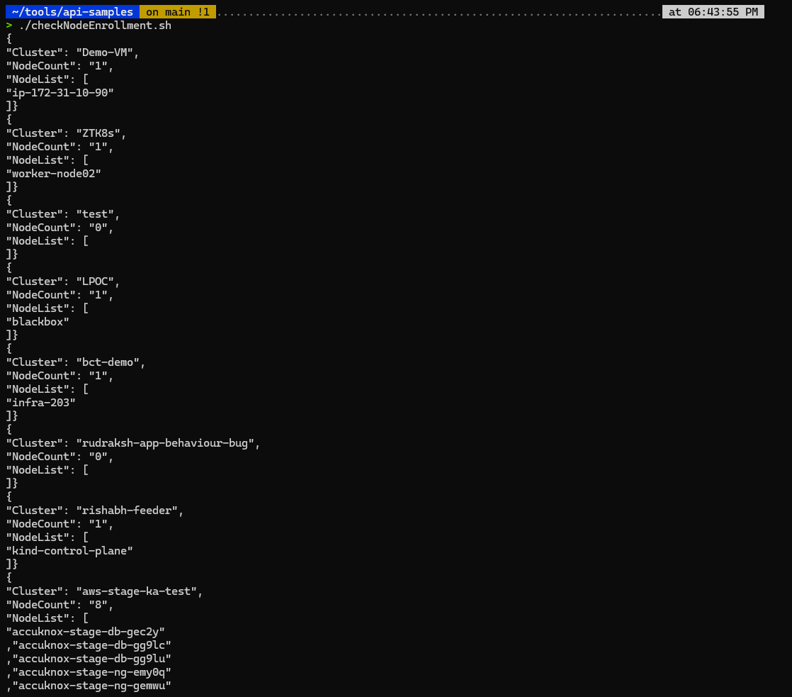

#### Get Remediation Tickets Report

To view the remediation ticket report, the User needs to update `ak_api` in the script

1. Change `status=Opened` to `Closed/Ongoing/Canceled` to view the desired information
The queries are case-sensitive. Make sure to use the proper case.

```sh
ak_api "$CSPM_URL/api/v1/tickets?page=1&page_size=20&status=<Opened>&created_before=2024-11-13&created_after=2024-11-05"
```

2. Change `created_before` and `created_after` dates with relevant dates to view the tickets for a particular period

```sh
&created_before=<2024-11-13>&created_after=<2024-11-05>"
```

Now, You can run the script to view the ticket report
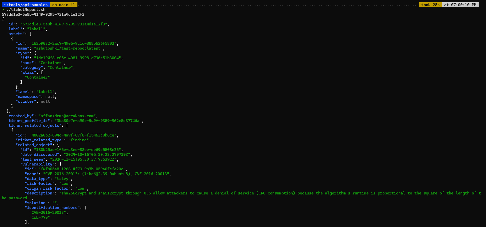

Users can view comprehensive ticket reports for a specified period, filtered by any status.

### Policy Dump

To dump all the policies for the onboarded Kubernetes cluster

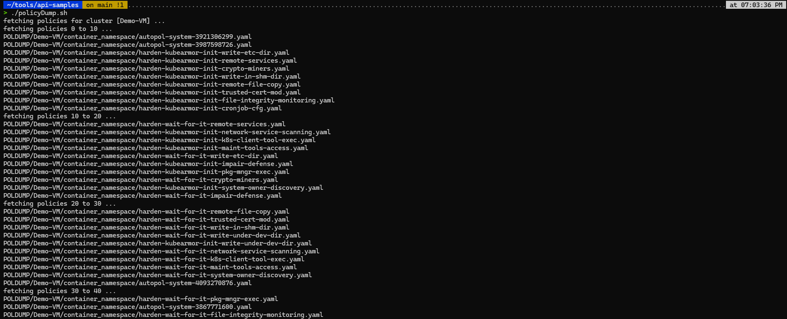

Users can find the policies in the `POLDUMP` folder

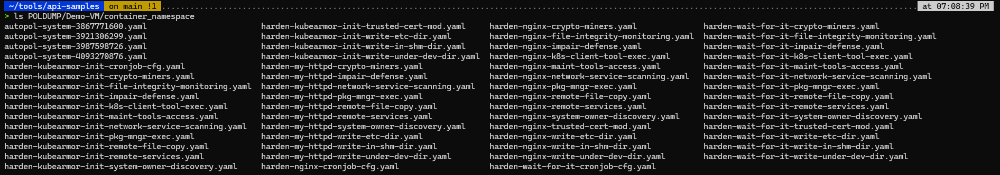

### Querying data From CWPP using Manual commands

### Setting up the env variables

```sh
env=cwpp.demo.accuknox.com tenant=<tenant_id> token=<access-key>
```

### Query the number of onboarded-clusters

```sh
curl -sL "https://$env/cluster-onboarding/api/v1/get-onboarded-clusters" -H "authorization: Bearer $token" | jq
```

**Output**

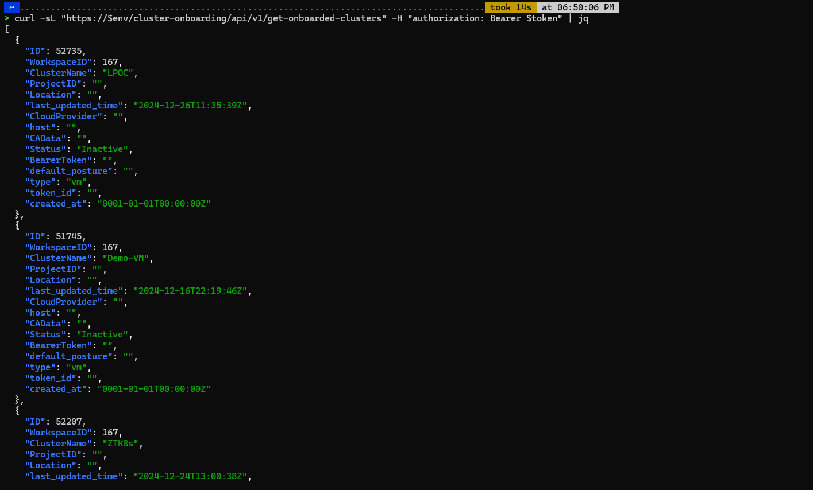

### Querying the count of CWPP policies

```sh
curl -sL "https://$env/policymanagement/v2/policy-count" -H "authorization: Bearer $token" -d "{\"cluster_id\":[$cluster_id]}" | jq
```

**Output**

```json
{ "total_count": 2628, "discovered_count": 640, "active_count": 29, "inactive_count": 2599, "pending_count": 0, "ignored_count": 0, "changed_count": 3, "hardening_count": 1977, "custom_count": 11 }
```

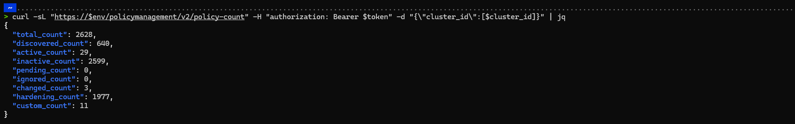

### Querying the count of nodes for a particular cluster

#### Steps

**Step 1: Query for the cluster_id information**

```sh
curl -sL "https://$env/cluster-onboarding/api/v1/get-onboarded-clusters" -H "authorization: Bearer $token" | jq
```

**Output**

```
ID=33332 (cluster_id)

ClusterName=DO-demo-cluster
```

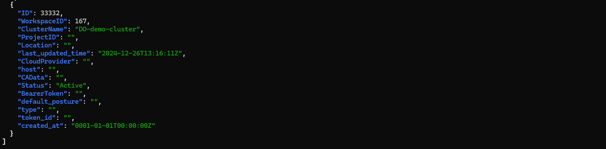

**Step 2: Querying the number of nodes present in the DO-demo-cluster**

You can use the `cluster_id` in the below curl command to fetch the number of nodes present in `DO-demo-cluster`

```sh
curl -sL "https://$env/cm/api/v1/cluster-management/nodes-in-cluster" -H "authorization: Bearer $token" -d "{\"cluster_id\":[33332]}" | jq
```

**Output**

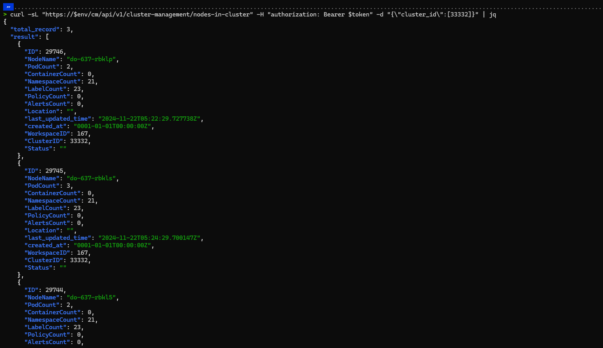

### Querying for the count of policies for a particular cluster

We can find the cluster_id using the above method, then we can query using the below curl command

```sh
curl -sL "https://$env/policymanagement/v2/policy-count" -H "authorization: Bearer $token" -d "{\"cluster_id\":[33332]}" | jq
```

**Output**

```json
{ "total_count": 580, "discovered_count": 227, "active_count": 26, "inactive_count": 554, "pending_count": 0, "ignored_count": 0, "changed_count": 3, "hardening_count": 342, "custom_count": 11 }
```

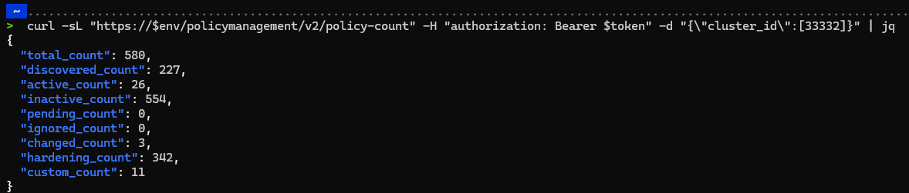

### Querying workload details for a cluster

```sh
curl -sL "https://$env/cm/v2/get-workloads" -H "authorization: Bearer $token" -d "{\"cluster_id\":[33332]}" | jq
```

**Output**

```json
{ "result": [ { "id": 368375, "type": "Pod", "name": "web-nginx", "namespace": "default", "namespace_id": 261692, "cluster_id": 33332, "created_at": "0001-01-01T00:00:00Z" }, { "id": 368644, "type": "Pod", "name": "test-pod", "namespace": "custom", "namespace_id": 267301, "cluster_id": 33332, "created_at": "0001-01-01T00:00:00Z" }, { "id": 370362, "type": "Pod", "name": "test-shell", "namespace": "default", "namespace_id": 261692, "cluster_id": 33332, "created_at": "0001-01-01T00:00:00Z" }, { "id": 402800, "type": "ReplicaSet", "name": "kubearmor-relay-f4f9b5cfd", "namespace": "kubearmor", "namespace_id": 261697, "cluster_id": 33332, "created_at": "0001-01-01T00:00:00Z" }, { "id": 402801, "type": "ReplicaSet", "name": "kubearmor-operator-64f668576", "namespace": "kubearmor", "namespace_id": 261697, "cluster_id": 33332, "created_at": "0001-01-01T00:00:00Z" }, .. .... ...... ] }
```

## Querying data From CSPM

In the case of CSPM, the environment will change from CWPP to CSPM, e.g.: [cspm.demo.accuknox.com](http://cspm.demo.accuknox.com/ "http://cspm.demo.accuknox.com")

### Fetching details of Onboarded Cloud accounts

```sh
curl -sL "https://$env/api/v1/clouds?page=1&ordering=&search=&page_size=20" -H "authorization: Bearer $token" | jq
```

**Output**

```json
{ "count": 5, "next": null, "previous": null, "results": [ { "id": "83293ac4-ee7b-4078-8b94-7e98f89d265b", "last_execution_date": "2024-12-26T01:15:50.070856Z", "last_scan_date": "2024-12-26T01:27:08.252871Z", "name": "gcp: accuknox-cnapp", "hvac_path": "accuknox-cnapp832b", "enabled": true, "is_active": false, "connected": true, "connect_date": "2024-01-25T05:33:59.447310Z", "enabled_date": "2024-01-25T05:33:59.447346Z", "cloud_type": "gcp", "cloud_name": "accuknox-cnapp", "schedule": { "date": "2024-02-19", "start": "02:00", "timezone": { "value": "UTC" }, "frequency": { "value": "daily" }, "isEnabled": true, "repeatEvery": { "value": 1 } }, ] }
```

### View aggregated findings across multi-cloud

```sh
curl -sL "https://$env/api/v1/findings?page=1&search=&page_size=20&data_type=cloudsploit&ordering=" -H "authorization: Bearer $token" | jq
```

**Output**

```json
{ "count": 6314, "next": "https://cspm.demo.accuknox.com/api/v1/findings?data_type=cloudsploit&ordering=&page=2&page_size=20&search=", "previous": null, "results": [ { ...... <findings> ...... } ] }
```

### Get findings with High severity

`risk_factor=High`, In case users want to view Critical, Medium, Or Low risk findings they can change the `risk_factor` value as required

```sh
curl -sL "https://$env/api/v1/findings?page=1&search=&page_size=20&data_type=cloudsploit&ordering=&risk_factor=High" -H "authorization: Bearer $token" | jq
```

**Output**

```json
{ "count": 641, "next": "https://cspm.demo.accuknox.com/api/v1/findings?data_type=cloudsploit&ordering=&page=2&page_size=20&risk_factor=High&search=", "previous": null, "results": [ { ...... <findings> ....... } }
```

### Querying findings related to asset_type S3 Bucket with risk factor High

```sh
curl -sL "https://$env/api/v1/findings?page=1&search=&page_size=20&data_type=cloudsploit&ordering=&risk_factor=High&asset_type=aws_s3_bucket" -H "authorization: Bearer $token" | jq
```

**Output**

```json
{ "count": 438, "next": "https://cspm.demo.accuknox.com/api/v1/findings?asset_type=aws_s3_bucket&data_type=cloudsploit&ordering=&page=2&page_size=20&risk_factor=High&search=", "previous": null, "results": [ { ...... <Findings> ........ } ] }
```

### Searching for a particular finding

If a user wants to search for any keyword related to cloud findings, they can use the API endpoint below and use cURL to request a response.

```search=s3%20public%20access```

```/api/v1/findings?page=1&search=&page_size=20&data_type=cloudsploit&ordering=&search=s3%20public%20access```

**Output**

```json
{ "count": 8, "next": null, "previous": null, "results": [ { ...... <Findings> ........ } }
```

### **Best Practices for Secure Access Key Usage**

1. **Use Minimal Permissions**

    - Avoid using access keys with administrative privileges unless necessary.

    - Apply the principle of least privilege to reduce risk.

2. **Secure Access Key Storage**

    - Store access keys securely in environments like a secrets manager.

    - Avoid hardcoding keys in scripts or applications.

3. **Audit and Rotate Keys Regularly**

    - Monitor access key usage for suspicious activity.

    - Periodically rotate keys to minimize exposure in case of compromise.

4. **Limit Scope of Access**

    - Restrict access to only the required endpoints and data types.

    - Apply granular access policies where supported.

5. **Avoid Unnecessary Operations**

    - Do not use high-privilege keys for simple queries or non-sensitive actions.

    - Minimize risk by limiting key usage to specific tasks.

## **Conclusion**

Access keys offer a powerful way to interact with CWPP and CSPM platforms, enabling automation, bulk operations, and granular data retrieval. However, ensuring their secure and responsible usage is critical to avoid unintended damage or security breaches. Following these best practices will help users maximize efficiency while maintaining robust security.
