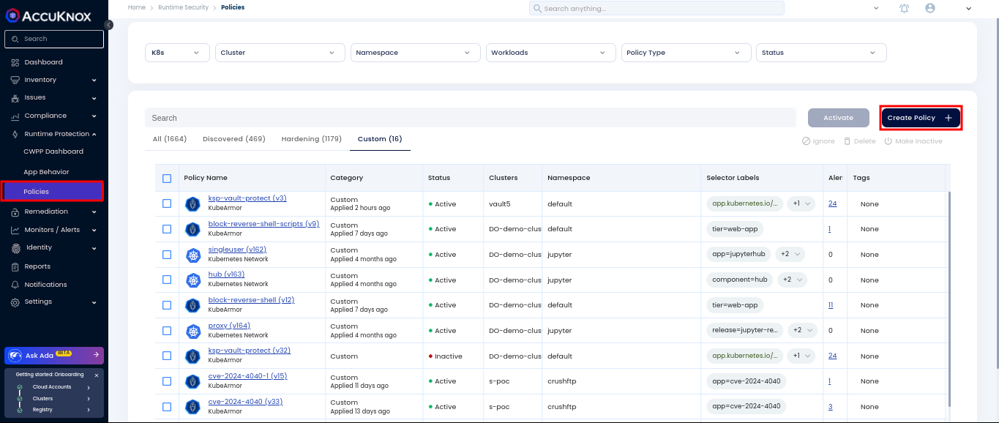
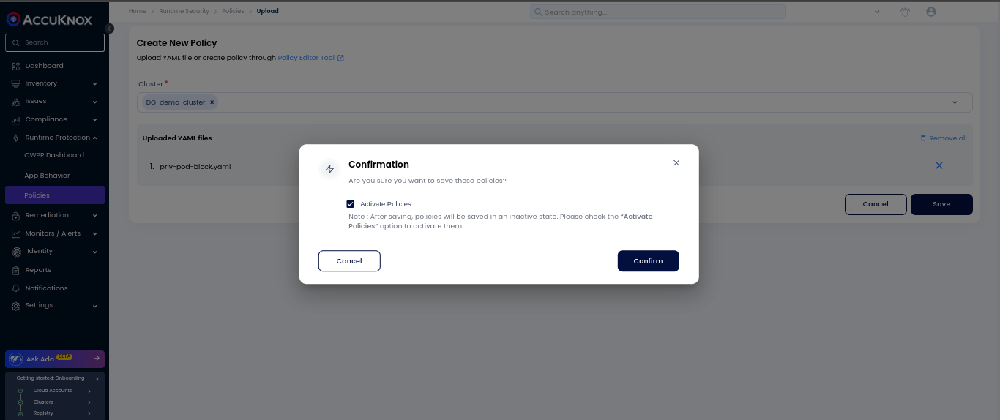
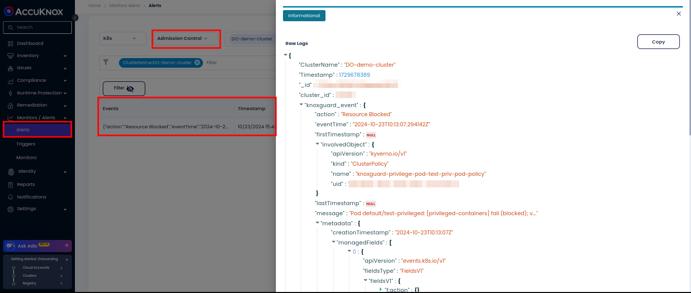

# Admission Controller Support Using Knoxguard

As Kubernetes adoption continues to surge, securing your clusters becomes critical. Knoxguard, the latest security feature, aims to bolster Kubernetes environment security and compliance through robust policy enforcement. Knoxguard operates independently of any policy engine, offering the flexibility to integrate with your preferred enforcement add on. Currently, Knoxguard supports **Kyverno** as the policy enforcement engine.

## Introduction

### Key Features of Knoxguard/Admission Controller

#### 1. **Registry Restrictions**

Registry Restrictions allow you to define rules that either restrict or whitelist specific container registries or patterns at the **cluster** and **namespace** levels. This feature ensures that only trusted images are deployed within your Kubernetes clusters, reducing the risk of deploying vulnerable or malicious containers.

#### 2. **Vulnerability Scan Thresholds** (Pipeline Feature)

Knoxguard enables you to set thresholds for the maximum number of **critical** or **high-level vulnerabilities** that an image can have. This feature will block the deployment of images with known vulnerabilities, maintaining a high security posture for your applications.

!!! info note
    This feature is in the pipeline and will be available soon.

#### 3. **Security Posture Rules**

Enforcing security policies like **privileged container restrictions** and **capabilities constraints** helps maintain a secure Kubernetes environment. Knoxguard currently supports **denying privileged mode containers**, with more security rules expected to be added soon.

## Prerequisite for Knoxguard Admission Controller

Before deploying Knoxguard in your Kubernetes environment, ensure the following prerequisite is met:

- **Accuknox Agent Installation**: Install Accuknox Agents on your Kubernetes cluster. These agents facilitate SaaS integration, alerting, and enforcement.

!!! info note
    Refer to [Cluster On-boarding](https://help.accuknox.com/how-to/cluster-onboarding/) guide for Accuknox Agents Installation.

Verify the agents' status using the following command:

```bash
userx@fedora:~$ kubectl get pods -n accuknox-agents
NAME                                      READY   STATUS    RESTARTS           AGE
agents-operator-d8585d594-55s29           1/1     Running   0                  72d
discovery-engine-59c69ff787-scrrj         4/4     Running   0                  72d
feeder-service-765d8f7d65-d4vq2           1/1     Running   13 (2d21h ago)     4d
policy-enforcement-agent-f5c5f87b-9fw79   1/1     Running   84 (2d21h ago)     40d
shared-informer-agent-77569db588-c944p    1/1     Running   1090 (2m36s ago)   40d
```

## Deployment of Knoxguard

### **Step 1: Deploy Kyverno:**

First, you need to deploy Kyverno, a policy engine for Kubernetes, which Knoxguard utilizes for policy enforcement.

```bash
helm repo add kyverno https://kyverno.github.io/kyverno/
helm repo update
helm install kyverno kyverno/kyverno -n kyverno --create-namespace
```

### **Step 2: Deploy Knoxguard:**

Next, deploy Knoxguard in your Kubernetes cluster. Knoxguard will work in tandem with Kyverno to enforce the defined policies.

```bash
helm upgrade --install knoxguard oci://public.ecr.aws/k9v9d5v2/knoxguard-chart --version=v0.2.0 -n knoxguard --create-namespace
```

Verify the deployments:

```bash
userx@fedora:~$ kubectl get deployments -n knoxguard
NAME                                    READY   UP-TO-DATE   AVAILABLE   AGE
accuknox-knoxguard-controller-manager   1/1     1            1           16s
userx@fedora:~$ kubectl get pods -n kyverno
NAME                                                       READY   STATUS      RESTARTS      AGE
kyverno-admission-controller-78d5464dbc-p2248              1/1     Running     1 (49m ago)   52m
kyverno-background-controller-5f96748b4c-mrcxm             1/1     Running     0             52m
kyverno-cleanup-admission-reports-28796130-mzg8t           0/1     Completed   0             4m2s
kyverno-cleanup-cluster-admission-reports-28796130-9nkb7   0/1     Completed   0             4m2s
kyverno-cleanup-cluster-ephemeral-reports-28796130-drsmn   0/1     Completed   0             4m2s
kyverno-cleanup-controller-7b5fb595d6-x57g7                1/1     Running     0             52m
kyverno-cleanup-ephemeral-reports-28796130-mxnxk           0/1     Completed   0             4m2s
kyverno-reports-controller-76cd67fb8d-v66wm                1/1     Running     1 (49m ago)   52m
```

## Policy Enforcement

Once Knoxguard is deployed, you can start enforcing policies within your cluster. This involves Creating, uploading and activating your custom admission policies.

To enforce the admission policy, follow these steps with example:

1. **Define the Admission Policy:** Create an **AdmissionPolicy** resource based on the requirement. Below is the configuration to block privileged pod admission in the default namespace:

```yaml
apiVersion: admission.accuknox.com/v1
kind: AdmissionPolicy
metadata:
  labels:
    app.kubernetes.io/name: admission-controller
    app.kubernetes.io/managed-by: kustomize
  name: test-priv-pod-policy
spec:
  denyPrivilegedPod:
    action: Block
    targetNamespaces:
    - default
```

2. **Upload and Activate Admission Policies:**

Use the upload YAML feature to upload your custom admission policies by clicking on Create Policy. This allows you to define and enforce policies specific to your security requirements.





After uploading and activating the policy, you can verify its status with the following command:

```bash
userx@fedora:~$ kubectl get admissionpolicy
NAME                   READY   MESSAGE                                       OWNED_PPLICIES
test-priv-pod-policy   True    clusterpolicy has been updated successfully   ["knoxguard-privilege-pod-test-priv-pod-policy"]
```

## Policy Violation and Alerts

In the event of a policy violation, Accuknox provides detailed alerts to help you understand and mitigate security issues.

First, attempt to deploy a privileged pod using the following configuration:

```yaml
apiVersion: v1
kind: Pod
metadata:
  name: test-privileged
  namespace: default
spec:
  containers:
  - name: nginx
    image: nginx:latest
    securityContext:
      privileged: true  # Should be blocked
```

Upon execution, you will receive an error message indicating that the request has been denied due to policy enforcement.

```bash
userx@fedora:~$ kubectl apply -f privpod.yaml
Error from server: error when creating "privpod.yaml": admission webhook "validate.kyverno.svc-fail" denied the request:

resource Pod/default/test-privileged was blocked due to the following policies

knoxguard-privilege-pod-test-priv-pod-policy:
  privileged-containers: "validation error: Privileged mode is disallowed. The fields
    spec.containers[].securityContext.privileged,\n\t\t\t\tspec.initContainers[].securityContext.privileged,
    and spec.ephemeralContainers[*].securityContext.privileged must be unset or set
    to false. rule privileged-containers failed at path /spec/containers/0/securityContext/privileged/"
```

Navigate to **Monitors > Alerts** in the AccuKnox dashboard. Change the alert type to **Admission Controller** to view alerts related to admission policy violations. The system provides comprehensive logging to help you quickly identify and address any security concerns.

!!! info note
    These logs can be forwarded to SIEM tools or notification tools by setting up triggers for improved security monitoring. Refer to the guide [here](https://help.accuknox.com/integrations/splunk/ "https://help.accuknox.com/integrations/splunk/") for more details.


