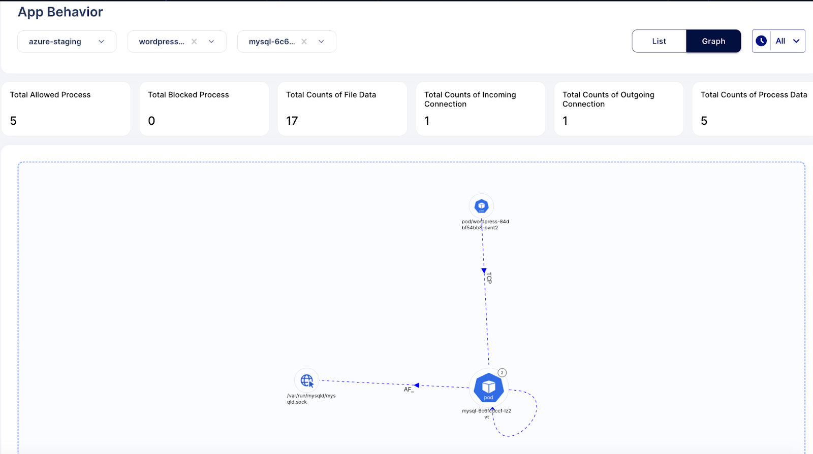
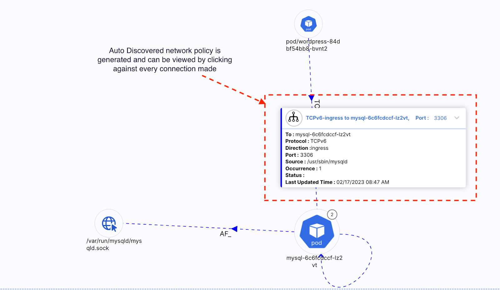
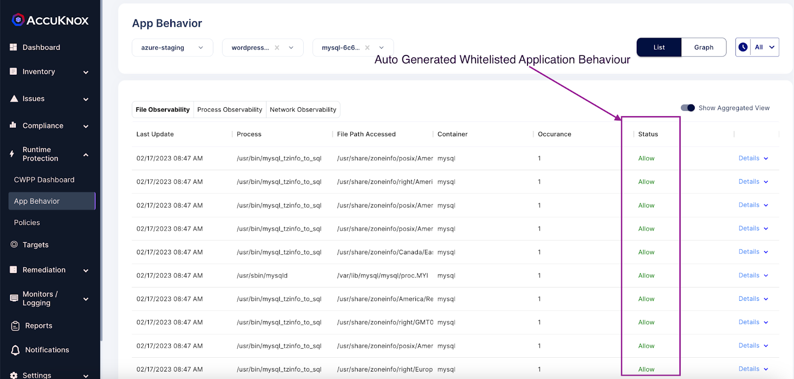
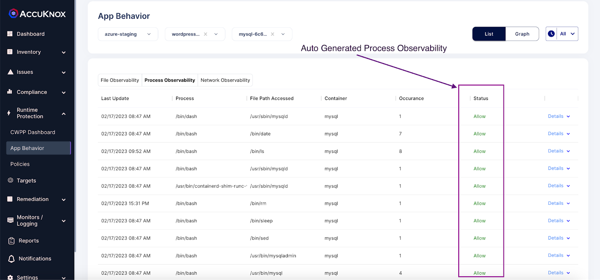
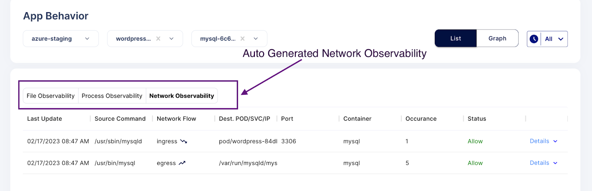

# Application Behavior

Zero-Trust security model is such that it advocates for deny by default and only allow tailored whitelisted activities to ensure the smooth functionality with security. In order to do that, AccuKnox’s Cloud Workload Protection Platform (CWPP) achieves runtime security by leveraging CNCF sandbox project, KubeArmor, which is a cloud-native runtime security enforcement system by AccuKnox. It does that by having a more granular control over the application behavior (such as process execution, file access, and networking operation). With KubeArmor, a user can:

+ restrict file system access for certain processes

+ restrict what processes can be spawned within the pod

+ restrict the capabilities that can be used by the processes within the pod

Lets understand this by following use-case example - **Auditing Application Behavior of MySQL application**

1.Install workload:
```sh  kubectl apply -f https://raw.githubusercontent.com/kubearmor/KubeArmor/main/examples/wordpress-mysql/wordpress-mysql-deployment.yaml```

2.Showing App behavior screen in the context of the wordpress-mysql application.

+ Network Graph





+ File Observability



+ Process Observability



+ Network Observability

 

 - - -
[SCHEDULE DEMO](https://www.accuknox.com/contact-us){ .md-button .md-button--primary }
