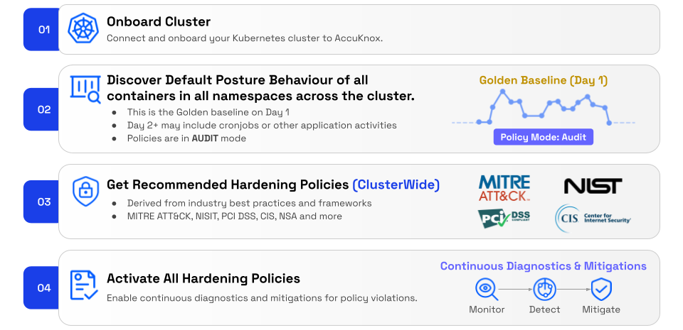
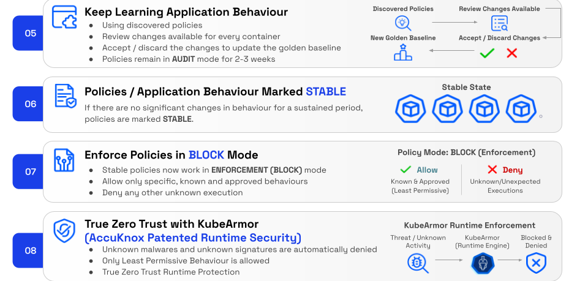
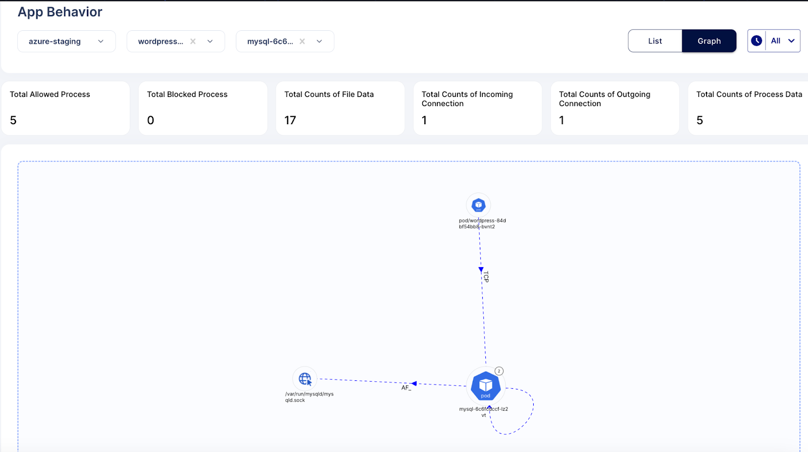
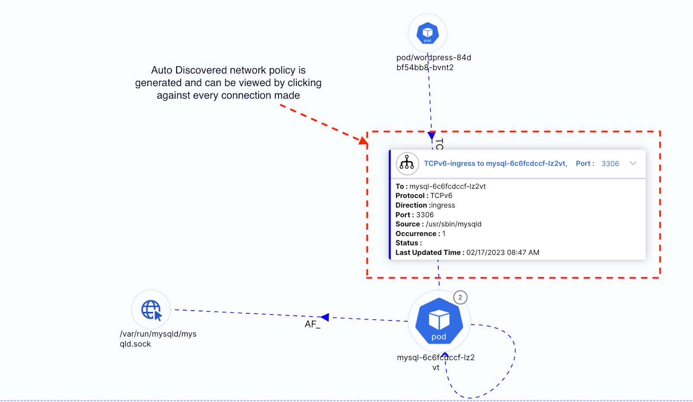
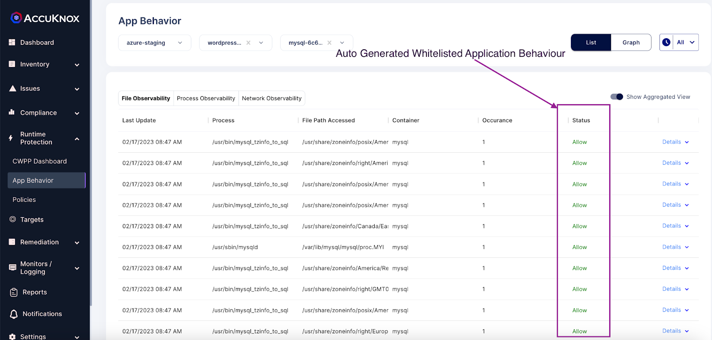
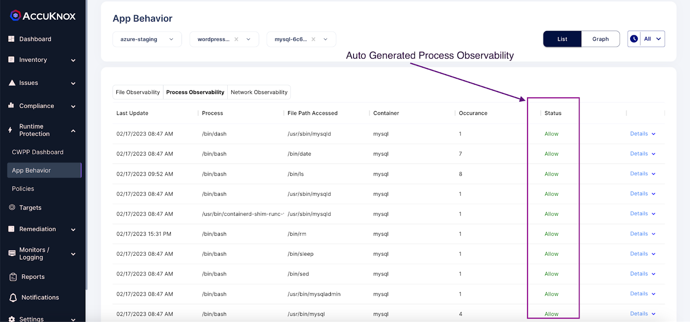
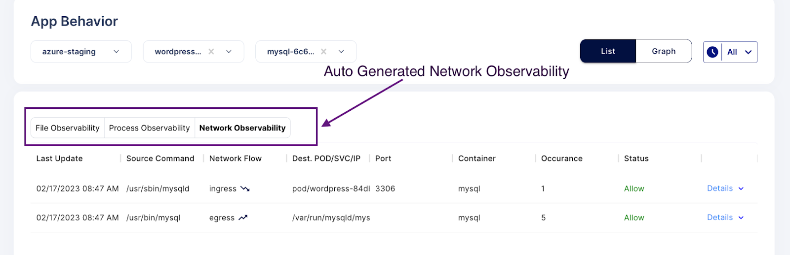

# Application Behavior

Zero Trust means deny by default, then allow only the whitelisted activity a workload actually needs. To get there, AccuKnox uses KubeArmor (a CNCF sandbox project) to control application behavior at runtime: process execution, file access, and networking. With KubeArmor a user can:

- restrict file system access for certain processes
- restrict what processes can be spawned within the pod
- restrict the capabilities that can be used by the processes within the pod

## The AccuKnox Runtime Security Journey

Application Behavior discovery is the engine that powers steps 2, 5, and 6 of the journey. AccuKnox watches every container, builds a golden baseline of normal activity, and keeps learning as new behavior appears.

!!! info "Discovery is continuous"
    Step 5 loops back to Step 2. Cronjobs, scale events, and new code paths produce fresh discovered policies. You accept or discard each change. Once behavior holds steady for 2-3 weeks, policies are marked **STABLE** and ready to move from **AUDIT** to **BLOCK** mode.

<iframe width="620" height="315" src="https://www.youtube.com/embed/HpCt-AlbxGU" frameborder="0" allowfullscreen></iframe>

Use case example: **Auditing Application Behavior of a MySQL workload**

1.Install workload:
`sh  kubectl apply -f https://raw.githubusercontent.com/kubearmor/KubeArmor/main/examples/wordpress-mysql/wordpress-mysql-deployment.yaml`

2.Showing App behavior screen in the context of the wordpress-mysql application.

- Network Graph

- File Observability

- Process Observability

- Network Observability

---

[SCHEDULE DEMO](https://www.accuknox.com/contact-us){ .md-button .md-button--primary }
