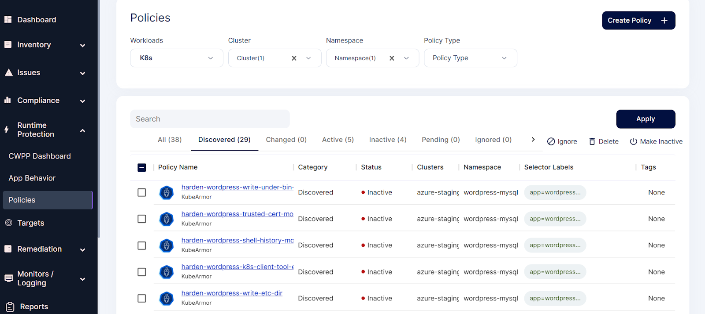
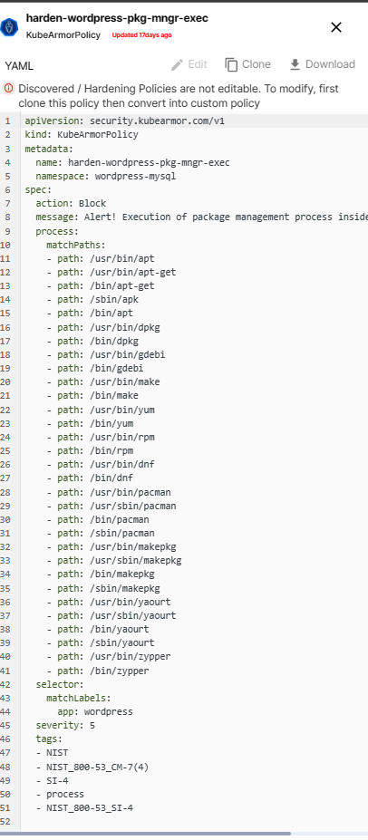
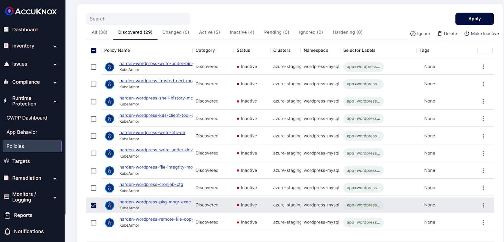
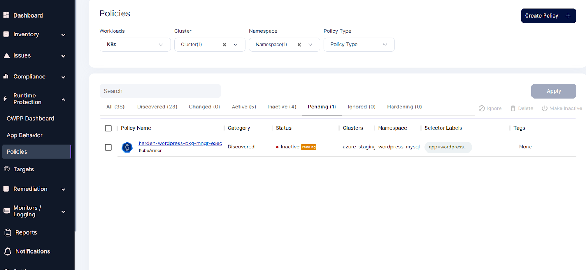
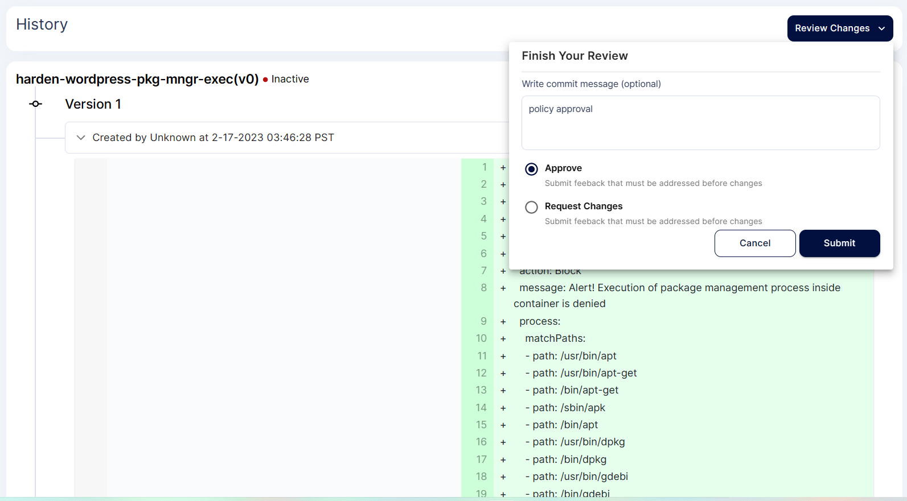
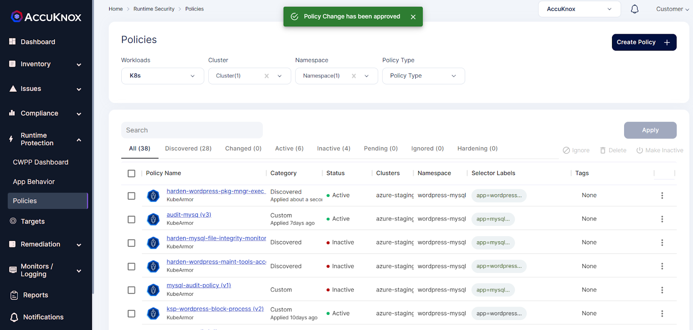

# App Hardening

One of the methods to achieve for a zero-trust environment is Application Hardening. KubeArmor is a security solution for the Kubernetes and cloud native platforms that helps protect your workloads from attacks and threats. It does this by providing a set of hardening policies which is a block based policies. It is based on industry-leading technical conformance to standard compliance and attack frameworks such as CIS, MITRE, NIST-800-53, and STIGs. These policies are designed to help you secure your workloads in a way that is compliant with these frameworks and recommended best practices.

Lets understand by taking an use-case example - **Disallowing any binaries execution to prevent from RCE Vulnerability**

1.Select your cluster and namespace from this Policies screen. We will be getting list of hardening policies for the selected Namespace.

2.Applying the hardening policies

3.Selecting the below hardening policy to apply

4.Select this policy and click on the apply option

5.After applying the above hardening policy, it goes into pending state

6.To make it active the user needs to approve

7.After approval policy goes into active state.

- - -
[SCHEDULE DEMO](https://www.accuknox.com/contact-us){ .md-button .md-button--primary }
