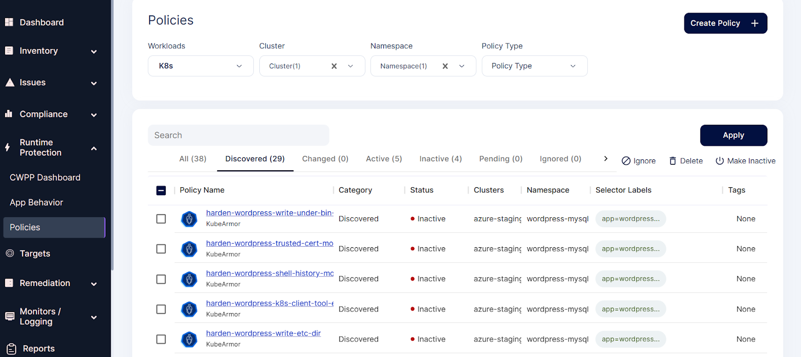
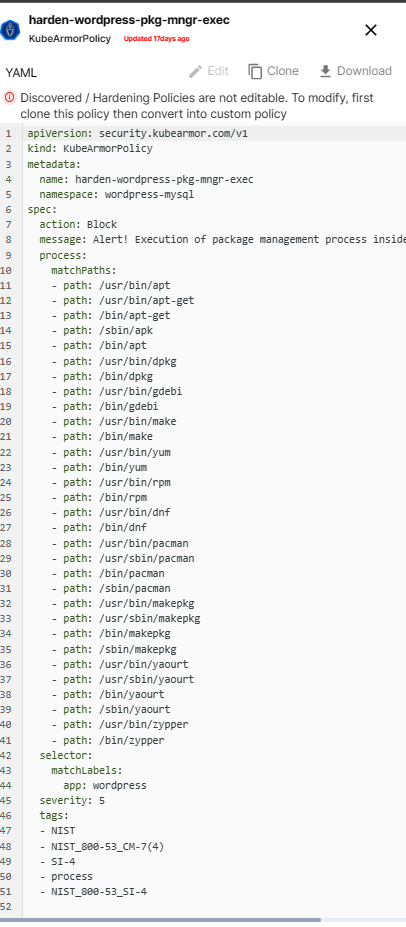
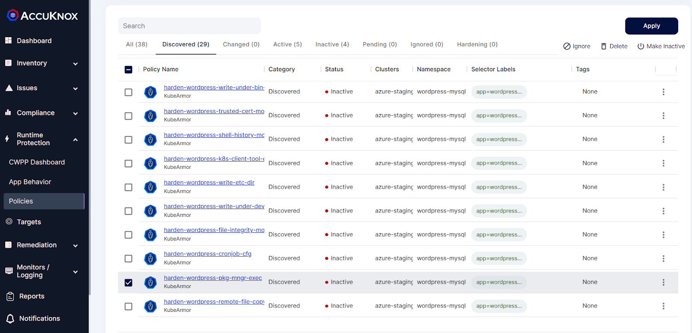
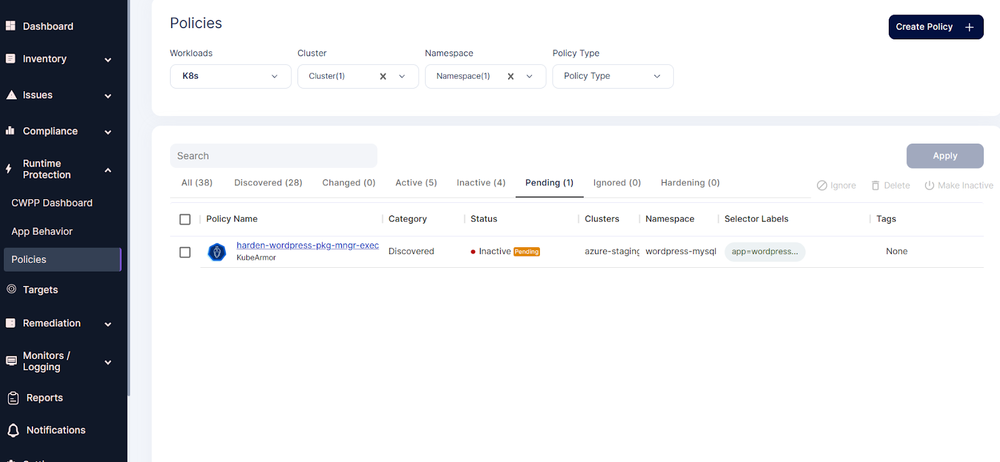
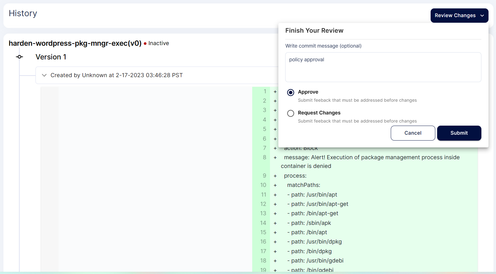
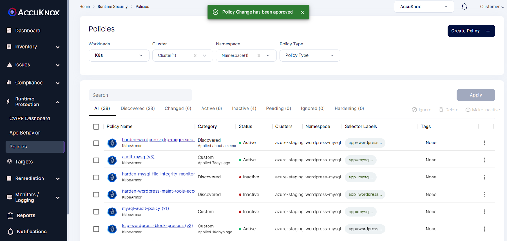

# App Hardening

Application Hardening is one path to a Zero Trust environment. KubeArmor ships a curated set of block-based hardening policies derived from CIS, MITRE ATT&CK, NIST 800-53, PCI DSS, and STIG, so you can pick the controls that match your compliance posture and apply them at runtime.

## Where Hardening Fits in the Runtime Security Journey

Hardening policies cover steps 3, 4, and 7 of the AccuKnox Runtime Security Journey: you pull recommended policies from industry frameworks, activate them in AUDIT mode for continuous diagnostics, and promote them to BLOCK mode once stable.

!!! info "Hardening sits on top of a learning loop"
    Step 5 loops back to Step 2. Discovered policies keep refining the baseline while hardening policies sit alongside in AUDIT for 2-3 weeks, then move to BLOCK once behavior is **STABLE**, locking in true Zero Trust runtime protection.

Use case example: **Disallowing arbitrary binary execution to prevent RCE**

1.Select your cluster and namespace from this Policies screen. We will be getting list of hardening policies for the selected Namespace.

2.Applying the hardening policies

3.Selecting the below hardening policy to apply

4.Select this policy and click on the apply option

5.After applying the above hardening policy, it goes into pending state

6.To make it active the user needs to approve

7.After approval policy goes into active state.

- - -
[SCHEDULE DEMO](https://www.accuknox.com/contact-us){ .md-button .md-button--primary }
