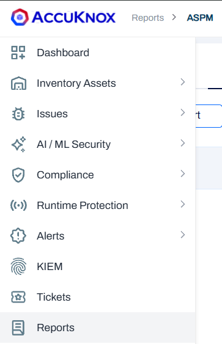
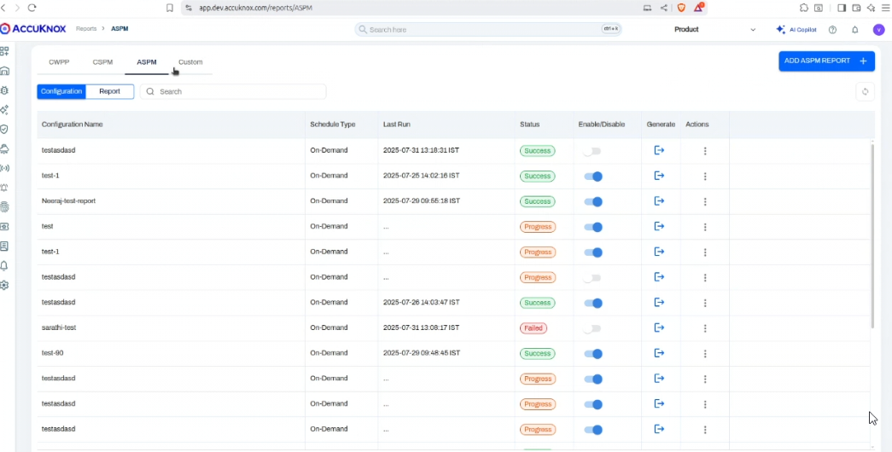
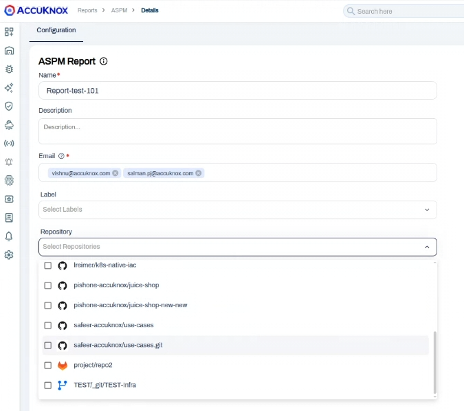
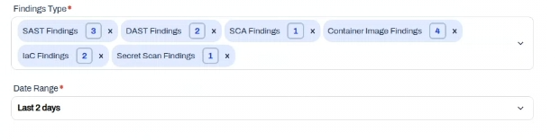
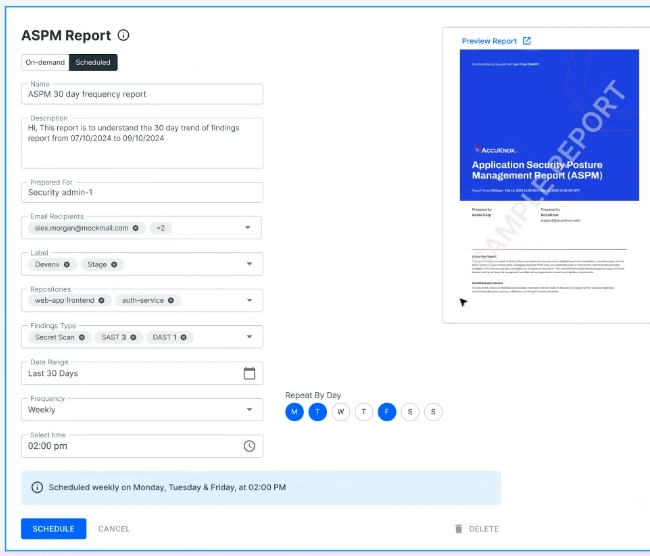
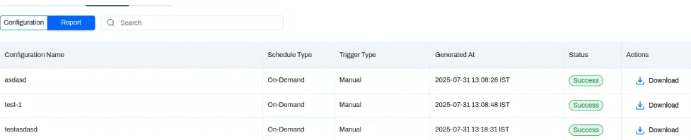

# ASPM Reporting Features

This document provides comprehensive guidance on utilizing the **Application Security Posture Management (ASPM)** reporting features within the platform. Learn how to generate, customize, and interpret your security posture reports.

> To view how a sample report looks, refer to the [ASPM Report Sample](https://help.accuknox.com/use-cases/aspm-report-sample.pdf).

## Overview & Report Access

The **ASPM reporting feature** allows users to generate detailed reports on their application security posture. These reports provide an in-depth analysis of critical vulnerabilities, compliance gaps, and risk factors across your cloud infrastructure.

To access the reporting features:

1. Navigate to the **Reports** section of the platform.
2. Here, you will find a **dashboard** listing all your report configurations and generated reports.

## Available Report Types & Purpose

### On-Demand Reports

Designed for **immediate insights** into your current security posture. They provide a **snapshot** of findings based on the specified date range and configurations.

### Scheduled Reports

These reports are generated automatically and recurring in nature at defined intervals (e.g., daily, weekly, monthly) to keep stakeholders informed about ongoing security status and trends.

## Generating & Customizing Reports

To create a new ASPM report:

1. Click on the **Add ASPM Report** button from the Reports dashboard.
2. You will be directed to the **report configuration page**, where you can customize your report.

### Report Configuration Options

- **Report Name**: Assign a unique and descriptive name (e.g., `"Monthly SAST Scan Report"`).
- **Description**: Provide an optional, brief explanation of the report’s purpose.
- **Email**: Add one or more email addresses to send the report to.
- **Label**: Filter scope by asset labels (e.g., specific projects, teams, or environments).
- **Repository**: Select one or more repositories (supports GitHub, Bitbucket, GitLab, or self-hosted).
- **Finding Categories**: Choose categories to include:
    - **SAST** (Static Application Security Testing)
    - **DAST** (Dynamic Application Security Testing)
    - **SCA** (Software Composition Analysis)
    - **IaC** (Infrastructure as Code)
    - **Secret Scan**

- **Tool**: Filter results by specific tools (e.g., include only Trivia or CX Containers).
- **Date Range**: Choose a reporting period (up to **30 days**; **60-day support** coming soon).

After configuration, click **Save** to trigger the on-demand report generation.

### Export Options

- **Download**: Export PDF via the **Download** button.
- **Generate (New Version)**: Refresh report with updated data using existing configuration.
- **Retry (Failed Reports)**: Retry generation for failed reports.

## Interpreting Report Data & Drill-Downs

The generated **PDF report** contains:

- **Report Summary**: Totals for findings, critical issues, and top vulnerable assets.
- **Findings by Severity**: Bar charts visualizing critical, high, medium, and low severity findings.
- **Findings Trend by Severity**: Line graphs showing how severity counts have changed.
- **Top Findings/Assets**: Tables highlighting top findings and most affected assets.
    

## Report Data Summary

The report breaks down findings by **category** with severity and trend data:

- **SAST Findings:** Details on code vulnerabilities, including a severity breakdown, historical trends, the top 5 findings, and the most vulnerable repositories.
- **DAST Findings:** A summary of domain-level vulnerabilities, their severity distribution and trends, and a list of the top 5 findings, vulnerable domains, and endpoints.
- **Container Image Findings:** A summary of scan results, a severity trend chart, and a list of the top CVEs, vulnerable packages, and affected images.
- **IaC Findings:** Information on code-based vulnerabilities, including the top 5 findings and the repositories and frameworks they affect.
- **Secret Scan Findings:** A summary of exposed secrets, a breakdown by severity and verification status, and a list of the top repositories and contributors with leaked secrets.
