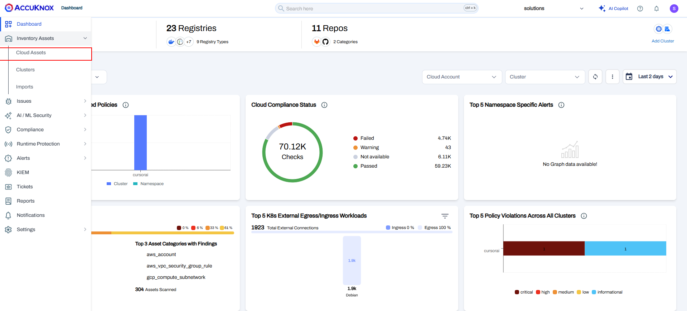
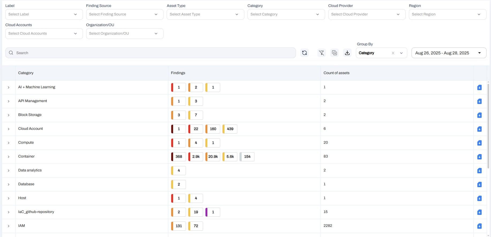
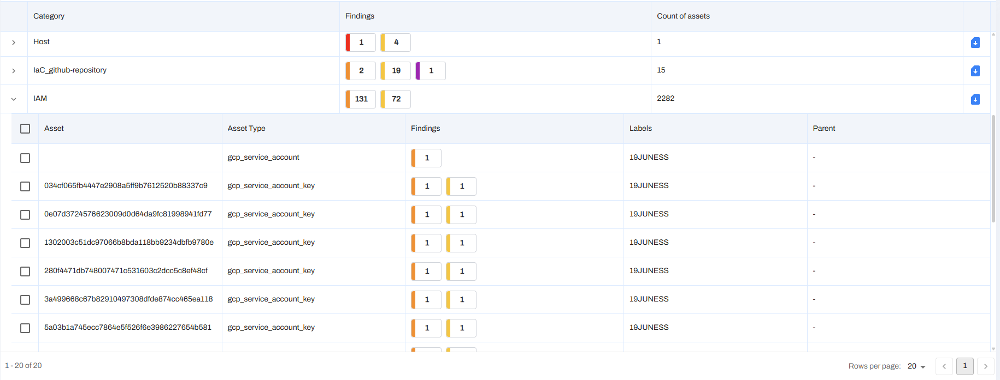

title: Asset Inventory
description: AccuKnox CSPM scans cloud accounts to track assets like hosts, apps, and clusters, ensuring accurate and up-to-date inventory management.

# Asset Inventory Guide

Users with multiple cloud accounts and workloads across various public clouds often face challenges in getting a comprehensive view of their cloud assets in a single place. Switching between various cloud provider consoles to monitor these assets becomes a huge problem.

AccuKnox solves this user problem by providing a **single pane of view** for cloud accounts, assets, and workloads present across multiple cloud platforms.

Once the user onboards the cloud account, the **AccuKnox CSPM tool scans** the cloud account for assets like hosts, applications, Web APIs, containers, clusters, and more. Asset count will increase or decrease based on changes in the onboarded cloud account. This is handled by **periodic scans** that the AccuKnox CSPM tool runs at fixed time intervals.

AccuKnox gives users the ability to view their assets from **two different perspectives**.

## Step 1: Accessing Asset Inventory

To access the **‘Asset Inventory’**, the first step is to:

- Click on **‘Inventory’**
- Then click on **‘Cloud Assets’**
  

## Step 2: List Perspective

Inside **‘Cloud Assets’**, users have the assets displayed in the **list perspective**, which separates them by **‘Asset Category’** and provides other useful information such as the findings associated with that category.

### Update Assets View

If desired, the user can click the asset category to view in more detail:

- The specific asset
- Its type
- Findings
- And more

## Step 3: Hierarchy Perspective

The second perspective is the **hierarchy view**, which can be accessed by clicking on the **blue button** on the right side of the screen.

The **hierarchical perspective** provides users with a different view of their onboarded assets, giving **versatility and options** that satisfy their needs.

## Step 4: Using Dashboard Widgets

Widgets on the main dashboard are another opportunity to get useful insights about assets. **Asset findings** will be listed along with a **graphical view** of asset findings that can be explored further.

## 🔍 Step 5: Asset Details

When the user clicks one of the assets from the list, they will get detailed information such as:

- Asset name
- Asset type
- Vulnerability findings associated with the asset
- Vulnerability name
- Message
- Risk factor
- Description
- When the vulnerability was scanned
- Cloud account
- Cloud Type
- Asset location
- Associated compliance
- Status of the finding
- Asset label
- A boolean to indicate if the vulnerability should be ignored or not

AccuKnox SaaS provides the **vulnerability findings** that have **passed or failed** the **baseline compliance** set for the cloud account.

---

[SCHEDULE DEMO](https://www.accuknox.com/contact-us){ .md-button .md-button--primary }
