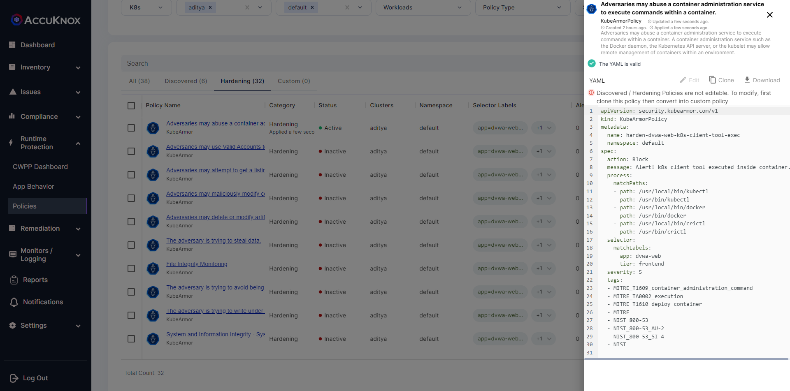
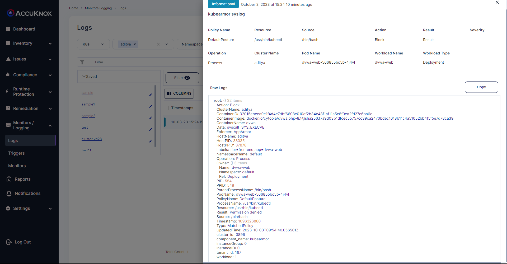

# Admin tools
Do not allow execution of administrative/maintenance tools inside the pods.

## Description
Adversaries may abuse a container administration service to execute commands within a container. A container administration service such as the Docker daemon, the Kubernetes API server, or the kubelet may allow remote management of containers within an environment.

## Attack Scenario
Attackers with permissions could run ‘kubectl exec’ to execute malicious code and compromise resources within a cluster.

## Tags
- NIST_800-53_AU-2
- MITRE_T1609_container_administration_command
- NIST_800-53_SI-4

## Policy Templates
### Admin tools
```yaml
apiVersion: security.kubearmor.com/v1
kind: KubeArmorPolicy
metadata:
  name: harden-dvwa-web-k8s-client-tool-exec
  namespace: default
spec:
  action: Block
  message: Alert! k8s client tool executed inside container.
  process:
    matchPaths:
    - path: /usr/local/bin/kubectl
    - path: /usr/bin/kubectl
    - path: /usr/local/bin/docker
    - path: /usr/bin/docker
    - path: /usr/local/bin/crictl
    - path: /usr/bin/crictl
  selector:
    matchLabels:
      app: dvwa-web
      tier: frontend
  severity: 5
  tags:
  - MITRE_T1609_container_administration_command
  - MITRE_TA0002_execution
  - MITRE_T1610_deploy_container
  - MITRE
  - NIST_800-53
  - NIST_800-53_AU-2
  - NIST_800-53_SI-4
  - NIST
```
#### Simulation
```sh
kubectl exec -it dvwa-web-566855bc5b-4j4vl -- bash
root@dvwa-web-566855bc5b-4j4vl:/var/www/html# kubectl
bash: /usr/bin/kubectl: Permission denied
root@dvwa-web-566855bc5b-4j4vl:/var/www/html#
```

#### Expected Alert
```
Action:Block
ClusterName:aditya
ContainerID:32015ebeea9e1f4d4e7dbf6608c010ef2b34c48f1af11a5c6f0ea2fd27c6ba6c
ContainerImage:docker.io/cytopia/dvwa:php-8.1@sha256:f7a9d03b1dfcec55757cc39ca2470bdec1618b11c4a51052bb4f5f5e7d78ca39
ContainerName:dvwa
Data:syscall=SYS_EXECVE
Enforcer:AppArmor
HostName:aditya
HostPID:38035
HostPPID:37878
Labels:tier=frontend,app=dvwa-web
NamespaceName:default
Operation:Process
Owner:{} 3 items
Name:dvwa-web
Namespace:default
Ref:Deployment
PID:554
PPID:548
ParentProcessName:/bin/bash
PodName:dvwa-web-566855bc5b-4j4vl
PolicyName:DefaultPosture
ProcessName:/usr/bin/kubectl
Resource:/usr/bin/kubectl
Result:Permission denied
Source:/bin/bash
Timestamp:1696326880
Type:MatchedPolicy
UpdatedTime:2023-10-03T09:54:40.056501Z
cluster_id:3896
component_name:kubearmor
instanceGroup:0
instanceID:0
tenant_id:167
workload:1
```

## References
[MITRE ATT&CK execution in k8s](https://cloud.redhat.com/blog/protecting-kubernetes-against-mitre-attck-execution#:~:text='kubectl%20exec'%20allows%20a%20user,compromise%20resources%20within%20a%20cluster)

## Screenshots
### Hardening Policy


### Policy violation


