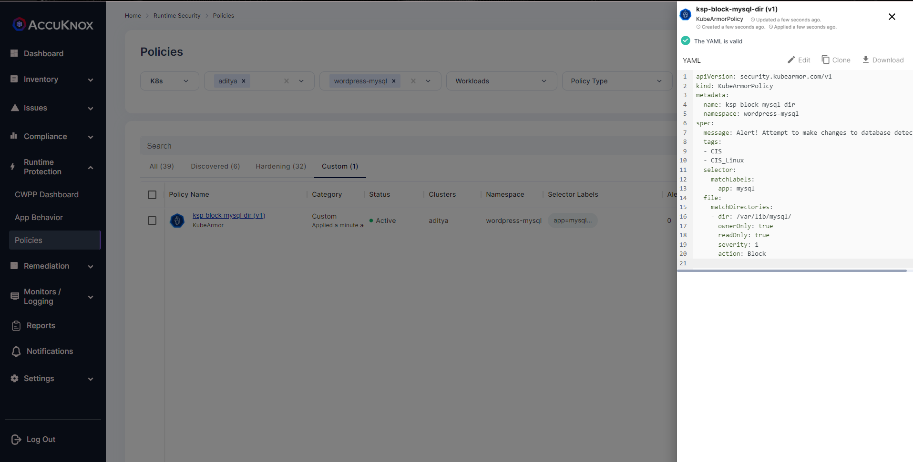
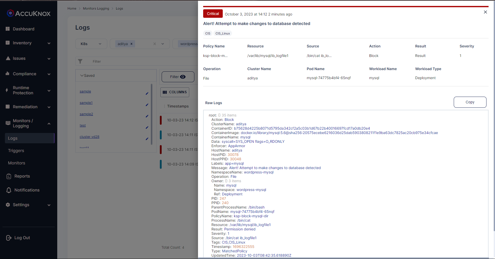

# Database access
Protect read/write access to raw database tables from unknown processes.

## Description
Applications use databases to store all the information such as posts, blogs, user information, etc. WordPress applications almost certainly use a MySQL database for storing their content, and those are usually stored elsewhere on the system, often /var/lib/mysql/some_db_name. 

## Attack Scenario
Adversaries have used techniques to steal information from databases, Information can be user credentials, posts, blogs, etc. Later using this information Adversaries can gain access to user accounts and perform a full-account takeover.

## Tags
- CIS Distribution Independent Linuxv2.0
- Control-Id: 6.14.4

## Policy Templates
### Database Access
```yaml
apiVersion: security.kubearmor.com/v1
kind: KubeArmorPolicy
metadata:
  name: ksp-block-mysql-dir
  namespace: wordpress-mysql
spec:
  message: Alert! Attempt to make changes to database detected
  tags:
  - CIS
  - CIS_Linux
  selector:
    matchLabels:
      app: mysql
  file:
    matchDirectories:
    - dir: /var/lib/mysql/
      ownerOnly: true
      readOnly: true
      severity: 1
      action: Block
```
#### Simulation
```sh
kubectl exec -it mysql-74775b4bf4-65nqf -n wordpress-mysql -- bash
root@mysql-74775b4bf4-65nqf:/# cd var/lib/mysql
root@mysql-74775b4bf4-65nqf:/var/lib/mysql# cat ib_logfile1
cat: ib_logfile1: Permission denied
root@mysql-74775b4bf4-65nqf:/var/lib/mysql#
```

#### Expected Alert
```
Action:Block
ClusterName:aditya
ContainerID:b75628d4225b8071d5795da342cf2a5c03b1d67b22b40016697fcd17a0db20e4
ContainerImage:docker.io/library/mysql:5.6@sha256:20575ecebe6216036d25dab5903808211f1e9ba63dc7825ac20cb975e34cfcae
ContainerName:mysql
Data:syscall=SYS_OPEN flags=O_RDONLY
Enforcer:AppArmor
HostName:aditya
HostPID:30078
HostPPID:30048
Labels:app=mysql
Message:Alert! Attempt to make changes to database detected
NamespaceName:wordpress-mysql
Operation:File
Owner:{} 3 items
Name:mysql
Namespace:wordpress-mysql
Ref:Deployment
PID:247
PPID:240
ParentProcessName:/bin/bash
PodName:mysql-74775b4bf4-65nqf
PolicyName:ksp-block-mysql-dir
ProcessName:/bin/cat
Resource:/var/lib/mysql/ib_logfile1
Result:Permission denied
Severity:1
Source:/bin/cat ib_logfile1
Tags:CIS,CIS_Linux
Timestamp:1696322555
Type:MatchedPolicy
UpdatedTime:2023-10-03T08:42:35.618890Z
cluster_id:3896
component_name:kubearmor
instanceGroup:0
instanceID:0
tenant_id:167
workload:1
```

## References
[MITRE Scan Databases](https://attack.mitre.org/techniques/T1596/005/)

## Screenshots
### Hardening Policy


### Policy violation


