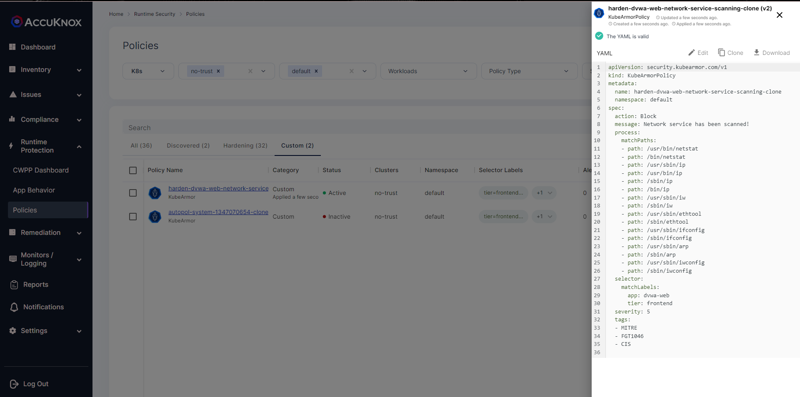
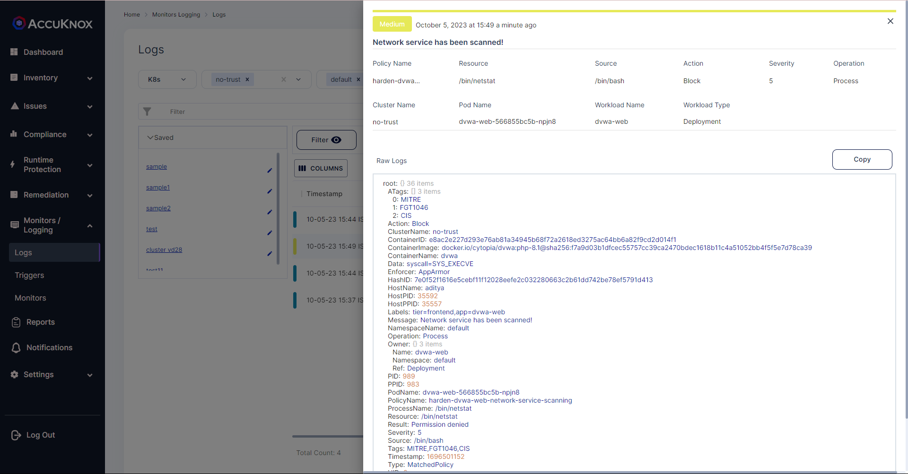

# Discovery tools
Do not allow discovery/search of tools/configuration.

## Description
Adversaries may attempt to get a listing of services running on remote hosts and local network infrastructure devices, including those that may be vulnerable to remote software exploitation. Common methods to acquire this information include port and/or vulnerability scans using tools that are brought onto a system

## Attack Scenario
Adversaries may use the information related to services, remote hosts and local network infrastructure devices, including those that may be vulnerable to remote software exploitation to perform malicious attacks like exploiting open ports, injecting payloads to get remote shells.

## Tags
- CIS Distribution Independent Linuxv2.0
- Control-Id: 6.3

## Policy Templates
### Discovery tools
```yaml
Version: security.kubearmor.com/v1
kind: KubeArmorPolicy
metadata:
  name: harden-dvwa-web-network-service-scanning
  namespace: default
spec:
  action: Block
  message: Network service has been scanned!
  process:
    matchPaths:
    - path: /usr/bin/netstat
    - path: /bin/netstat
    - path: /usr/sbin/ip
    - path: /usr/bin/ip
    - path: /sbin/ip
    - path: /bin/ip
    - path: /usr/sbin/iw
    - path: /sbin/iw
    - path: /usr/sbin/ethtool
    - path: /sbin/ethtool
    - path: /usr/sbin/ifconfig
    - path: /sbin/ifconfig
    - path: /usr/sbin/arp
    - path: /sbin/arp
    - path: /usr/sbin/iwconfig
    - path: /sbin/iwconfig
  selector:
    matchLabels:
      app: dvwa-web
      tier: frontend
  severity: 5
  tags:
  - MITRE
  - FGT1046
  - CIS
```
#### Simulation
```sh
kubectl exec -it dvwa-web-566855bc5b-xtgwq -- bash
root@dvwa-web-566855bc5b-xtgwq:/var/www/html# netstat
bash: /bin/netstat: Permission denied
root@dvwa-web-566855bc5b-xtgwq:/var/www/html# ifconfig
bash: /sbin/ifconfig: Permission denied
root@dvwa-web-566855bc5b-xtgwq:/var/www/html#
root@dvwa-web-566855bc5b-xtgwq:/var/www/html# arp
bash: /usr/sbin/arp: Permission denied
```

#### Expected Alert
```
ClusterName: default
HostName: aditya
NamespaceName: default
PodName: dvwa-web-566855bc5b-npjn8
Labels: tier=frontend,app=dvwa-web
ContainerName: dvwa
ContainerID: e8ac2e227d293e76ab81a34945b68f72a2618ed3275ac64bb6a82f9cd2d014f1
ContainerImage: docker.io/cytopia/dvwa:php-8.1@sha256:f7a9d03b1dfcec55757cc39ca2470bdec1618b11c4a51052bb4f5f5e7d78ca39
Type: MatchedPolicy
PolicyName: harden-dvwa-web-network-service-scanning
Severity: 5
Message: Network service has been scanned!
Source: /bin/bash
Resource: /bin/netstat
Operation: Process
Action: Block
Data: syscall=SYS_EXECVE
Enforcer: AppArmor
Result: Permission denied
ATags: [MITRE FGT1046 CIS]
HostPID: 35592
HostPPID: 35557
Owner: map[Name:dvwa-web Namespace:default Ref:Deployment]
PID: 989
PPID: 983
ParentProcessName: /bin/bash
ProcessName: /bin/netstat
Tags: MITRE,FGT1046,CIS
```

## References
[MITRE Network Service Discovery](https://attack.mitre.org/techniques/T1046/)

## Screenshots
### Hardening Policy


### Policy violation


