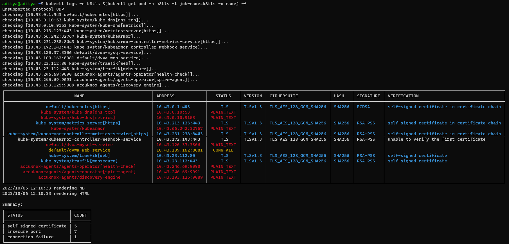

# Enforcing TLS Encryption for Secure Communications
Ensure that all service endpoints are using the right TLS and certificate configuration.

## Description
k8tls (pronounced cattles), to assess server port security by detecting its TLS and certificates configuration.k8tls has been used in the context of general k8s clusters to understand the security risk posture of exposed k8s service endpoints

## Attack Scenario
An attacker may perform reconnaissance to identify protocol without TLS to exploit those parameters. TLS ensures all the traffic flows in an encrypted manner to avoid the risk of MITM attacks.

**Attack Type** Man-in-the-middle(MITM)

## Tags
- Ensuring TLS

## Getting Started

### Scan k8s services
For k8s, the solution gets deployed as a job that scans the k8s service ports.

Clone the GitHub repo link: https://github.com/kubearmor/k8tls
```sh
Git clone https://github.com/kubearmor/k8tls.git
```

```sh
kubectl apply -f https://raw.githubusercontent.com/kubearmor/k8tls/main/k8s/job.yaml
kubectl logs -n k8tls $(kubectl get pod -n k8tls -l job-name=k8tls -o name) -f
```

## Output

```
┌─────────────────────────────────────────────────────────┬────────────────────┬────────────┬─────────┬────────────────────────┬────────┬───────────┬──────────────────────────────────────────────┐
│                           NAME                          │ ADDRESS            │   STATUS   │ VERSION │ CIPHERSUITE            │ HASH   │ SIGNATURE │ VERIFICATION                                 │
├─────────────────────────────────────────────────────────┼────────────────────┼────────────┼─────────┼────────────────────────┼────────┼───────────┼──────────────────────────────────────────────┤
│                default/kubernetes[https]                │ 10.43.0.1:443      │     TLS    │ TLSv1.3 │ TLS_AES_128_GCM_SHA256 │ SHA256 │ ECDSA     │ self-signed certificate in certificate chain │
│              kube-system/kube-dns[dns-tcp]              │ 10.43.0.10:53      │ PLAIN_TEXT │         │                        │        │           │                                              │
│              kube-system/kube-dns[metrics]              │ 10.43.0.10:9153    │ PLAIN_TEXT │         │                        │        │           │                                              │
│            kube-system/metrics-server[https]            │ 10.43.213.123:443  │     TLS    │ TLSv1.3 │ TLS_AES_128_GCM_SHA256 │ SHA256 │ RSA-PSS   │ self-signed certificate in certificate chain │
│                  kube-system/kubearmor                  │ 10.43.66.242:32767 │ PLAIN_TEXT │         │                        │        │           │                                              │
│ kube-system/kubearmor-controller-metrics-service[https] │ 10.43.231.238:8443 │     TLS    │ TLSv1.3 │ TLS_AES_128_GCM_SHA256 │ SHA256 │ RSA-PSS   │ self-signed certificate in certificate chain │
│     kube-system/kubearmor-controller-webhook-service    │ 10.43.172.143:443  │     TLS    │ TLSv1.3 │ TLS_AES_128_GCM_SHA256 │ SHA256 │ RSA-PSS   │ unable to verify the first certificate       │
│                default/dvwa-mysql-service               │ 10.43.120.37:3306  │ PLAIN_TEXT │         │                        │        │           │                                              │
│                 default/dvwa-web-service                │ 10.43.109.162:8081 │  CONNFAIL  │         │                        │        │           │                                              │
│                 kube-system/traefik[web]                │ 10.43.23.112:80    │     TLS    │ TLSv1.3 │ TLS_AES_128_GCM_SHA256 │ SHA256 │ RSA-PSS   │ self-signed certificate                      │
│              kube-system/traefik[websecure]             │ 10.43.23.112:443   │     TLS    │ TLSv1.3 │ TLS_AES_128_GCM_SHA256 │ SHA256 │ RSA-PSS   │ self-signed certificate                      │
│      accuknox-agents/agents-operator[health-check]      │ 10.43.246.69:9090  │ PLAIN_TEXT │         │                        │        │           │                                              │
│       accuknox-agents/agents-operator[spire-agent]      │ 10.43.246.69:9091  │ PLAIN_TEXT │         │                        │        │           │                                              │
│             accuknox-agents/discovery-engine            │ 10.43.193.125:9089 │ PLAIN_TEXT │         │                        │        │           │                                              │
└─────────────────────────────────────────────────────────┴────────────────────┴────────────┴─────────┴────────────────────────┴────────┴───────────┴──────────────────────────────────────────────┘
```


## Screenshots
### Zero Trust Policy


