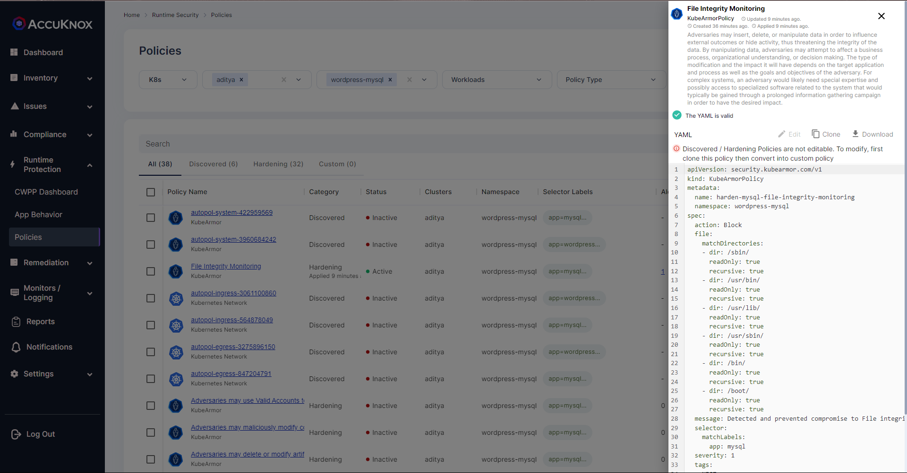
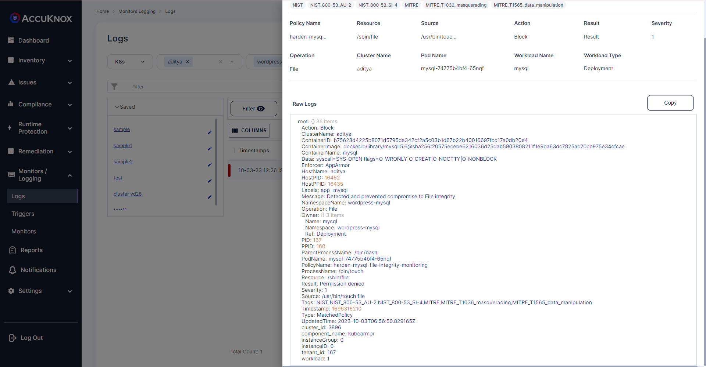

# FIM
File Integrity Monitoring

## Description
Changes to system binary folders, configuration paths, and credentials paths need to be monitored for change. With KubeArmor, one can not only monitor for changes but also block any write attempts in such system folders. Compliance frameworks such as PCI-DSS, NIST, and CIS expect FIM to be in place.

## Attack Scenario
An attacker might want to update the configuration so as to disable security controls or access logs.

## Tags
- CIS Distribution Independent Linuxv2.0, Control-Id:6.3.5
- PCI-DSS, Requirement: 6
- PCI-DSS, Requirement: 10
- NIST_800-53_AU-2

## Policy Templates
### File Integrity Monitoring
```yaml
apiVersion: security.kubearmor.com/v1
kind: KubeArmorPolicy
metadata:
  name: harden-mysql-file-integrity-monitoring
  namespace: wordpress-mysql
spec:
  action: Block
  file:
    matchDirectories:
    - dir: /sbin/
      readOnly: true
      recursive: true
    - dir: /usr/bin/
      readOnly: true
      recursive: true
    - dir: /usr/lib/
      readOnly: true
      recursive: true
    - dir: /usr/sbin/
      readOnly: true
      recursive: true
    - dir: /bin/
      readOnly: true
      recursive: true
    - dir: /boot/
      readOnly: true
      recursive: true
  message: Detected and prevented compromise to File integrity
  selector:
    matchLabels:
      app: mysql
  severity: 1
  tags:
  - NIST
  - NIST_800-53_AU-2
  - NIST_800-53_SI-4
  - MITRE
  - MITRE_T1036_masquerading
  - MITRE_T1565_data_manipulation
```
#### Simulation
```sh
kubectl exec -it mysql-74775b4bf4-65nqf -n wordpress-mysql -- bash
root@mysql-74775b4bf4-65nqf:/# cd sbin
root@mysql-74775b4bf4-65nqf:/sbin# touch file
touch: cannot touch 'file': Permission denied
root@mysql-74775b4bf4-65nqf:/sbin# cd ..
```


### Expected Alert
```
Action:Block
ClusterName:aditya
ContainerID:b75628d4225b8071d5795da342cf2a5c03b1d67b22b40016697fcd17a0db20e4
ContainerImage:docker.io/library/mysql:5.6@sha256:20575ecebe6216036d25dab5903808211f1e9ba63dc7825ac20cb975e34cfcae
ContainerName:mysql
Data:syscall=SYS_OPEN flags=O_WRONLY|O_CREAT|O_NOCTTY|O_NONBLOCK
Enforcer:AppArmor
HostName:aditya
HostPID:16462
HostPPID:16435
Labels:app=mysql
Message:Detected and prevented compromise to File integrity
NamespaceName:wordpress-mysql
Operation:File
Owner:{} 3 items
Name:mysql
Namespace:wordpress-mysql
Ref:Deployment
PID:167
PPID:160
ParentProcessName:/bin/bash
PodName:mysql-74775b4bf4-65nqf
PolicyName:harden-mysql-file-integrity-monitoring
ProcessName:/bin/touch
Resource:/sbin/file
Result:Permission denied
Severity:1
Source:/usr/bin/touch file
Tags:NIST,NIST_800-53_AU-2,NIST_800-53_SI-4,MITRE,MITRE_T1036_masquerading,MITRE_T1565_data_manipulation
Timestamp:1696316210
Type:MatchedPolicy
UpdatedTime:2023-10-03T06:56:50.829165Z
cluster_id:3896
component_name:kubearmor
instanceGroup:0
instanceID:0
tenant_id:167
workload:1
```

## References
[MITRE Data Manipulation](https://attack.mitre.org/techniques/T1565/)
[PCI DSS and FIM](https://pcidssguide.com/the-pci-dss-and-file-integrity-monitoring/)

## Screenshots
### Hardening Policy


### Policy violation


