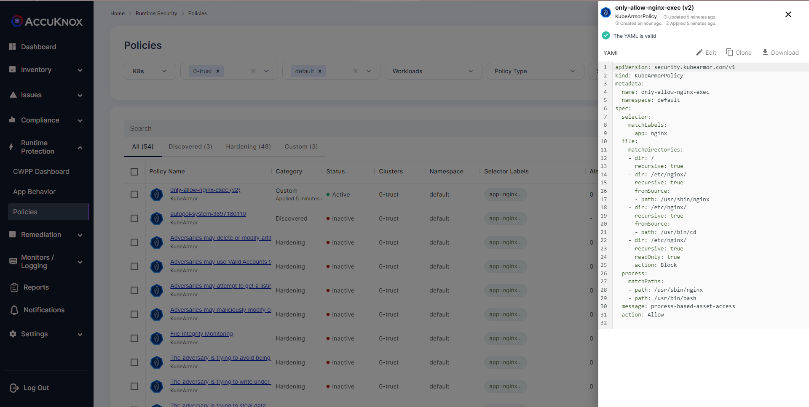
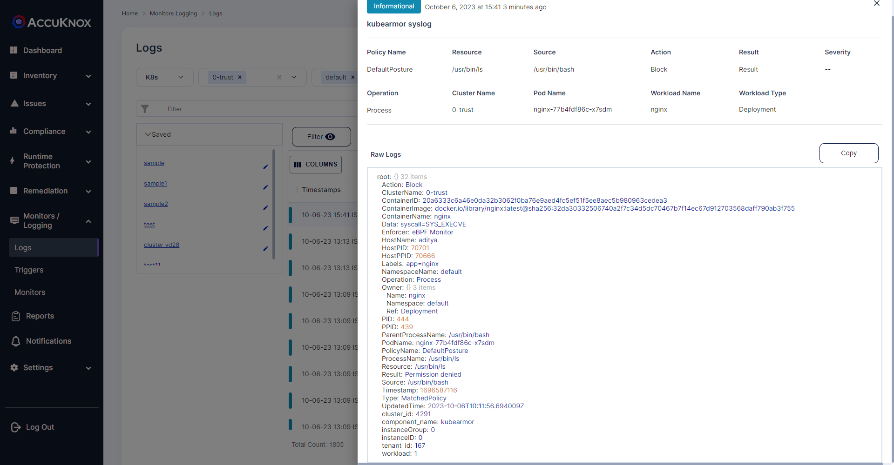

# Process based asset access
Allow only specific processes to access sensitive assets, deny/audit everything else.

## Description
You can use a security feature called "process isolation" or "process whitelisting" to set specific processes to access specific assets in a container or pod and deny everything else. This can help to secure a containerized environment by limiting the processes that can access the assets within it and preventing unauthorized processes from accessing those assets.

## Attack Scenario
An attacker uses different attack techniques to change configuration files. Process-based asset access will deny any unknown process from accessing the configuration files.

## Tags
- Process based asset access

## Policy Templates
### Process based asset access
```yaml
apiVersion: security.kubearmor.com/v1
kind: KubeArmorPolicy
metadata:
  name: only-allow-nginx-exec
  namespace: default
spec:
  selector:
    matchLabels:
      app: nginx
  file:
    matchDirectories:
    - dir: /
      recursive: true
    - dir: /etc/nginx/
      recursive: true
      fromSource:
      - path: /usr/sbin/nginx
    - dir: /etc/nginx/
      recursive: true
      fromSource:
      - path: /usr/bin/cd
    - dir: /etc/nginx/
      recursive: true
      readOnly: true
      action: Block
  process:
    matchPaths:
    - path: /usr/sbin/nginx
    - path: /usr/bin/bash
  message: process-based-asset-access
  action: Allow
```
#### Simulation
```sh
kubectl exec -it nginx-77b4fdf86c-x7sdm -- bash
root@nginx-77b4fdf86c-x7sdm:/# cd /etc/nginx/
root@nginx-77b4fdf86c-x7sdm:/etc/nginx# ls
bash: /usr/bin/ls: Permission denied
root@nginx-77b4fdf86c-x7sdm:/etc/nginx#
```

#### Expected Alert
```
ClusterName: default
HostName: aditya
NamespaceName: default
PodName: nginx-77b4fdf86c-x7sdm
Labels: app=nginx
ContainerName: nginx
ContainerID: 20a6333c6a46e0da32b3062f0ba76e9aed4fc5ef51f5ee8aec5b980963cedea3
ContainerImage: docker.io/library/nginx:latest@sha256:32da30332506740a2f7c34d5dc70467b7f14ec67d912703568daff790ab3f755
Type: MatchedPolicy
PolicyName: DefaultPosture
Source: /usr/bin/bash
Resource: /usr/bin/ls
Operation: Process
Action: Block
Data: syscall=SYS_EXECVE
Enforcer: eBPF Monitor
Result: Permission denied
HostPID: 70701
HostPPID: 70666
Owner: map[Name:nginx Namespace:default Ref:Deployment]
PID: 444
PPID: 439
ParentProcessName: /usr/bin/bash
ProcessName: /usr/bin/ls
```


## Screenshots
### Zero Trust Policy


### Policy violation


