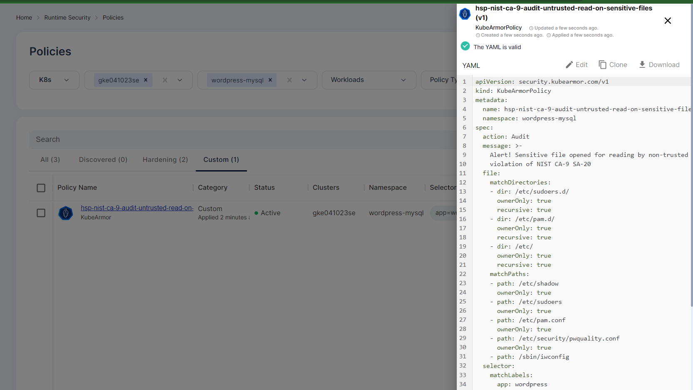

# Sensitive Asset audit
Audit any (read/write) accesses to sensitive assets.

## Description
KubeArmor helps the organization to protect their confidential files and directories  by continuous Monitoring and Alerting the access to that particular file or directory regarding the policy that we define.

## Attack Scenario
By modifying the file such as /etc/security/pwquality.conf , /etc/shadow, /etc/pam.d/, /etc/sudoers can bypass authentication or authorization checks,  gain access to user passwords, weaken password requirements and allow the attacker to run commands as root.  Using KubeArmor, Accuknox can do continuous auditing for every access.

## Tags
- NIS, NIST-800-53-r5
- NIST_SA
- NIST_SA-20
- NIST_SA-20-Customized Development of Critical Components
- SA

## Policy Templates
### Sensitive data Audit
```yaml
apiVersion: security.kubearmor.com/v1
kind: KubeArmorHostPolicy
metadata:
  name: hsp-nist-ca-9-audit-untrusted-read-on-sensitive-files
spec:
  tags: ["NIST","NIST-800-53-r5","CA-9","File Rules","Internal System Connections", "NIST_SA", "NIST_SA-20", "NIST_SA-20-Customized Development of Critical Components", "SA"]
  message: "Alert! Sensitive file opened for reading by non-trusted program! Possible violation of NIST CA-9 SA-20"
  nodeSelector:
    matchLabels:
     kubernetes.io/hostname: gke-ubuntu                                                                           # Change your matchLabels
  file:
    severity: 5
    matchDirectories:
    - dir: /etc/sudoers.d/
      ownerOnly: true
      recursive: true
    - dir: /etc/pam.d/ 
      ownerOnly: true
      recursive: true
    - dir: /etc/
      ownerOnly: true
      recursive: true
    action: Audit
    matchPaths:
    - path: /etc/shadow
      ownerOnly: true
    - path: /etc/sudoers
      ownerOnly: true
    - path: /etc/pam.conf
      ownerOnly: true
    - path: /etc/security/pwquality.conf
      ownerOnly: true
    action: Audit
```
#### Simulation
```sh
kubectl exec -it wordpress-7c966b5d85-wvtln -n wordpress-mysql -- bash
root@wordpress-7c966b5d85-wvtln:/var/www/html# cat /etc/shadow
root:*:17448:0:99999:7:::
daemon:*:17448:0:99999:7:::
bin:*:17448:0:99999:7:::
sys:*:17448:0:99999:7:::
sync:*:17448:0:99999:7:::
games:*:17448:0:99999:7:::
man:*:17448:0:99999:7:::
lp:*:17448:0:99999:7:::
```

#### Expected Alert
```
ClusterName: default
HostName: gke-cluster-1-default-pool-37f4c896-8cn6
NamespaceName: wordpress-mysql
PodName: wordpress-7c966b5d85-wvtln
Labels: app=wordpress
ContainerName: wordpress
ContainerID: 6d09394a988c5cf6b9fe260d28fdd57d6ff281618869a173965ecd94a3efac44
ContainerImage: docker.io/library/wordpress:4.8-apache@sha256:6216f64ab88fc51d311e38c7f69ca3f9aaba621492b4f1fa93ddf63093768845
Type: MatchedPolicy
PolicyName: hsp-nist-ca-9-audit-untrusted-read-on-sensitive-files
Severity: 5
Message: Alert! Sensitive file opened for reading by non-trusted program! Possible violation of NIST CA-9 SA-20
Source: /bin/cat /etc/shadow
Resource: /etc/shadow
Operation: File
Action: Audit
Data: syscall=SYS_OPEN flags=O_RDONLY
Enforcer: eBPF Monitor
Result: Passed
ATags: [NIST NIST-800-53-r5 CA-9 File Rules Internal System Connections NIST_SA NIST_SA-20 NIST_SA-20-Customized Development of Critical Components SA]
HostPID: 706899
HostPPID: 706810
Owner: map[Name:wordpress Namespace:wordpress-mysql Ref:Deployment]
PID: 251
PPID: 245
ParentProcessName: /bin/bash
ProcessName: /bin/cat
Tags: NIST,NIST-800-53-r5,CA-9,File Rules,Internal System Connections,NIST_SA,NIST_SA-20,NIST_SA-20-Customized Development of Critical Components,SA
```

## References
[NIST Security and Privacy Controls for Information Systems and Organizations](https://csrc.nist.gov/pubs/sp/800/53/r5/ipd)
[CSF Customized Development Of Critical Components](https://csf.tools/reference/nist-sp-800-53/r4/sa/sa-20/)

## Screenshots
### Hardening Policy


### Policy violation


