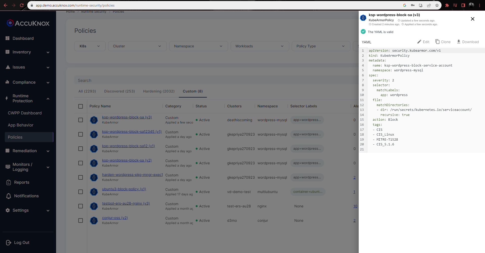
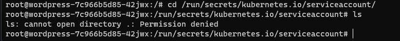

# Service Account token
Protect access to k8s service account token

## Description
K8s mounts the service account token as part of every pod by default. The service account token is a credential that can be used as a bearer token to access k8s APIs and gain access to other k8s entities. Many times there are no processes in the pod that use the service account tokens which means in such cases the k8s service account token is an unused asset that can be leveraged by the attacker.

## Attack Scenario
An attacker would check for credential accesses so as to do lateral movements. For example, in most K8s attacks, the attacker after gaining entry into the K8s pods tries to use a service account token and gain access to other entities.

## Tags
- CIS_v1.27
- Control-Id-5.1.6

## Policy Templates
### Service account token
```yaml
apiVersion: security.kubearmor.com/v1
kind: KubeArmorPolicy
metadata:
  name: ksp-wordpress-block-service-account
  namespace: wordpress-mysql
spec:
  severity: 2
  selector:
    matchLabels:
      app: wordpress
  file:
    matchDirectories:
      - dir: /run/secrets/kubernetes.io/serviceaccount/
        recursive: true
  action: Block
```
#### Simulation
```sh
root@wordpress-7c966b5d85-42jwx:/# cd /run/secrets/kubernetes.io/serviceaccount/ 
root@wordpress-7c966b5d85-42jwx:/run/secrets/kubernetes.io/serviceaccount# ls 
ls: cannot open directory .: Permission denied 
root@wordpress-7c966b5d85-42jwx:/run/secrets/kubernetes.io/serviceaccount# 
```

#### Expected Alert
```
ClusterName: default
HostName: aditya
NamespaceName: wordpress-mysql
PodName: wordpress-7c966b5d85-shn85
Labels: app=wordpress
ContainerName: wordpress
ContainerID: 872599a29401aae31d39251a24b3c0012724a4878df8c8e1d72fa592f5b4a494
ContainerImage: docker.io/library/wordpress:4.8-apache@sha256:6216f64ab88fc51d311e38c7f69ca3f9aaba621492b4f1fa93ddf63093768845
Type: MatchedPolicy
PolicyName: DefaultPosture
Source: /bin/ls serviceaccount/
Resource: /run/secrets/kubernetes.io/serviceaccount
Operation: File
Action: Block
Data: syscall=SYS_OPENAT fd=-100 flags=O_RDONLY|O_NONBLOCK|O_DIRECTORY|O_CLOEXEC
Enforcer: AppArmor
Result: Permission denied
HostPID: 35455
HostPPID: 34306
Owner: map[Name:wordpress Namespace:wordpress-mysql Ref:Deployment]
PID: 206
PPID: 193
ParentProcessName: /bin/bash
ProcessName: /bin/ls
```

## References
[MITRE Steal Application Access Token](https://attack.mitre.org/techniques/T1528/)

## Screenshots
### Hardening policy


### Policy violation


