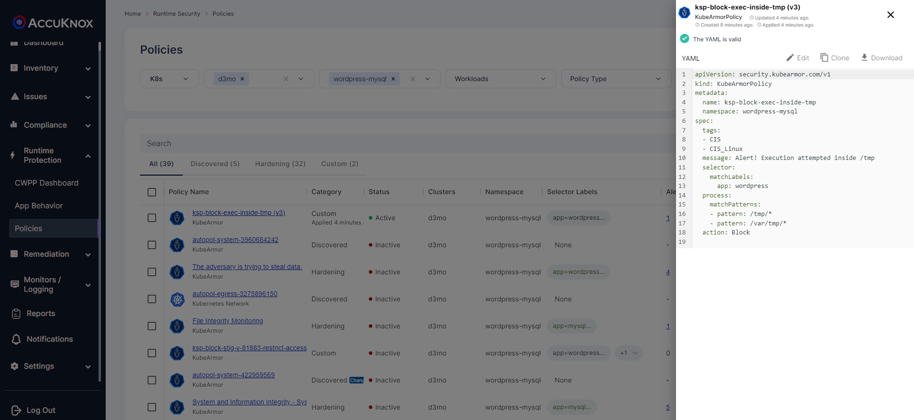
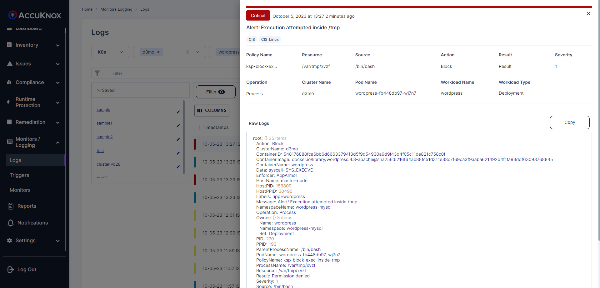

# /tmp/ noexec
Do not allow execution of binaries from /tmp/ folder.

## Description
If provided the necessary privileges, users have the ability to install software in organizational information systems. To maintain control over the types of software installed, organizations identify permitted and prohibited actions regarding software installation. Prohibited software installations may include, for example, software with unknown or suspect pedigrees or software that organizations consider potentially malicious.

## Attack Scenario
The hacker tries to inject malicious scripts into /tmp folder through the web application exploit and they try to execute this file on the server bringing it down. When we harden the /tmp folder, the user will not be able to execute the script and it will prevent these types of attacks.

## Tags
- CIS Distribution Independent Linuxv2.0
- Control-Id: 1.1.5
- Control-Id: 1.1.10

## Policy Templates
### /tmp/ noexec
```yaml
apiVersion: security.kubearmor.com/v1
kind: KubeArmorPolicy
metadata:
  name: ksp-block-exec-inside-tmp
  namespace: wordpress-mysql
spec:
  tags:
  - config-files
  message: Alert! Execution attempted inside tmp folder
  selector:
    matchLabels:
      app: wordpress
  process:
    matchPatterns:
    - pattern: /tmp/*
    - pattern: /var/tmp/*
  action: Block
```
#### Simulation
```sh
root@wordpress-fb448db97-wj7n7:/var/tmp# ls /var/tmp                                                                    xvzf                                                                                                                    
root@wordpress-fb448db97-wj7n7:/var/tmp# /var/tmp/xvzf                                                                  
bash: /var/tmp/xvzf: Permission denied                                                                                  
root@wordpress-fb448db97-wj7n7:/var/tmp#  
```

#### Expected Alert
```
Action:Block
ClusterName:d3mo
ContainerID:548176888fca6bb6d66633794f3d5f9d54930a9d9f43d4f05c11de821c758c0f
ContainerImage:docker.io/library/wordpress:4.8-apache@sha256:6216f64ab88fc51d311e38c7f69ca3f9aaba621492b4f1fa93ddf63093768845
ContainerName:wordpress
Data:syscall=SYS_EXECVE
Enforcer:AppArmor
HostName:master-node
HostPID:156809
HostPPID:30490
Labels:app=wordpress
Message:Alert! Execution attempted inside /tmp
NamespaceName:wordpress-mysql
Operation:Process
Owner:{} 3 items
 Name:wordpress
 Namespace:wordpress-mysql
 Ref:Deployment
PID:270
PPID:193
ParentProcessName:/bin/bash
PodName:wordpress-fb448db97-wj7n7
PolicyName:ksp-block-exec-inside-tmp
ProcessName:/var/tmp/xvzf
Resource:/var/tmp/xvzf
Result:Permission denied
Severity:1
Source:/bin/bash
Tags:CIS,CIS_Linux
Timestamp:1696492668
Type:MatchedPolicy
UpdatedTime:2023-10-05T07:57:48.022699Z
cluster_id:2302
component_name:kubearmor
instanceGroup:0
instanceID:0
tenant_id:167
workload:1
```

## References
[STIG no exec in /tmp](https://www.stigviewer.com/stig/red_hat_enterprise_linux_6/2016-12-16/finding/V-57569)

## Screenshots
### Hardening Policy


### Policy violation


