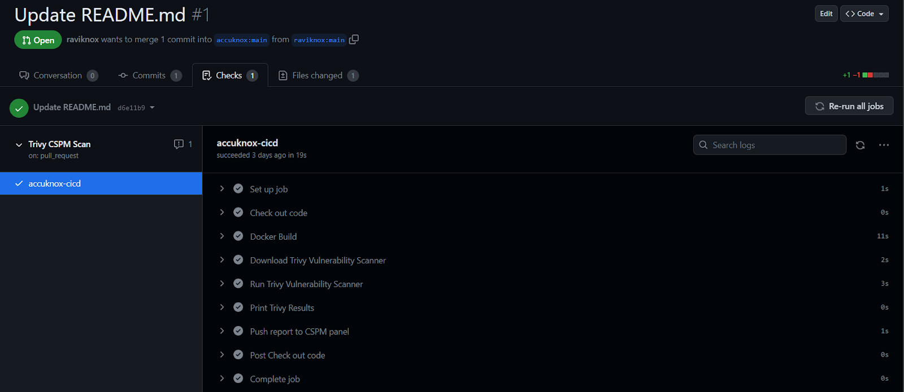
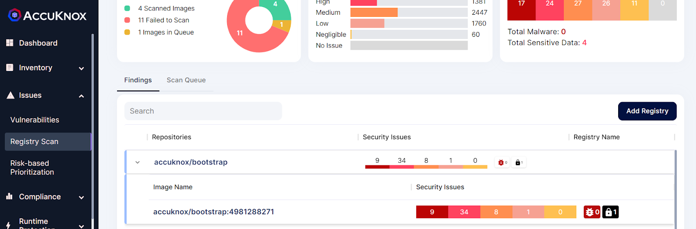
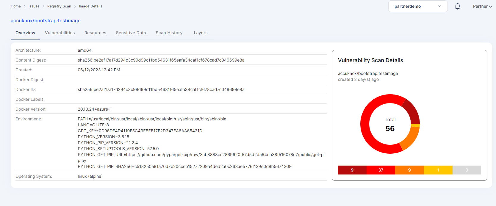
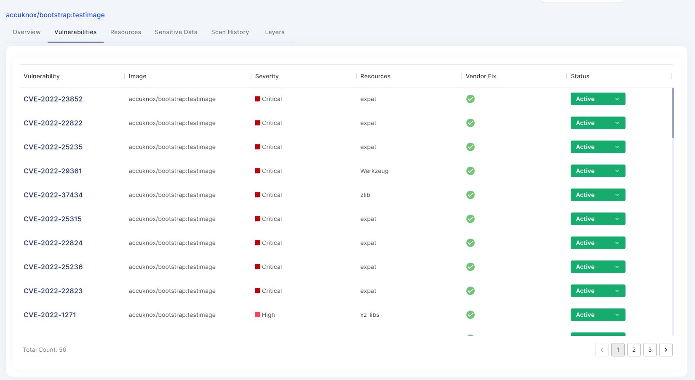
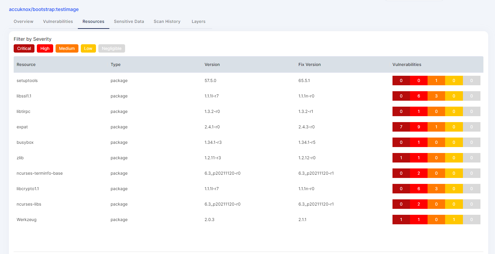
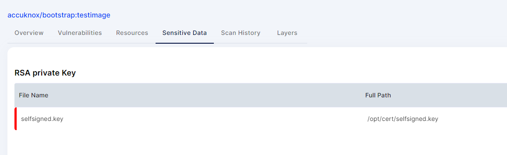

---
hide:
  - toc
---

It's crucial to find and patch vulnerabilities early in the software development life cycle to save costs, enhance security, reduce time to fix vulnerabilities, and promote a DevSecOps culture.

Consider the "Heartbleed" vulnerability (CVE-2014-0160) in OpenSSL. It allowed attackers to exploit a flaw, potentially accessing sensitive information. Similar vulnerabilities can affect different libraries or components used in applications. Regularly monitoring, updating dependencies, and applying security patches are crucial for mitigating risks and enhancing application security.

In the Static Security solution, AccuKnox has the ability to integrate with your CI/CD pipeline to automatically scan the software in different phases i.e. code, container images and deployment for such vulnerabilities.


Lets understand this by an example: **Automatically Scanning CI pipeline for vulnerabilities**

In software development, multiple engineers contribute to the same codebase. To ensure code security, it's important to automatically analyze it for flaws before merging into the main repository. Here, GitHub Repos are scanned for vulnerabilities during Pull Requests.

## Steps needed to be taken for integration:

**Step 1:** User needs to create a GitHub workflow file inside their GitHub repository using the following workflow Template:


```sh
name: CICD CSPM Scan

on:
  pull_request:
    branches:
    - "*"

env:
  DOCKER_IMAGE: "accuknox/bootstrap:testimage"
  DOCKERFILE_CONTEXT: "Dockerfile"
  CSPM_URL: <url>
  CSPM_TOKEN: "<token>"
  TENANT_ID: "<id>"

jobs:
  accuknox-cicd:
    runs-on: ubuntu-latest
    steps:
      - name: Check out code
        uses: actions/checkout@v2

      - name: Docker Build
        run: |
          docker build -t ${{ env.DOCKER_IMAGE }} -f ${{ env.DOCKERFILE_CONTEXT }} .

      - name: Download Vulnerability Scanner
        run: |
          curl -sfL https://raw.githubusercontent.com/aquasecurity/trivy/main/contrib/install.sh | sh -s -- -b /usr/local/bin

      - name: Run Vulnerability Scanner
        run: |
          'trivy image -f json ${{ env.DOCKER_IMAGE }} -o results.json'

      - name: Print Results
        run: cat results.json

      - name: Push report to CSPM panel
        run: |
          curl --location --request POST 'https://${{env.CSPM_URL}}/api/v1/artifact/?tenant_id=${{ env.TENANT_ID }}&data_type=TR&save_to_s3=false' --header 'Authorization: Bearer ${{ env.CSPM_TOKEN }}' --form 'file=@"./results.json"'
```


**Note:** In the above template user needs to change some variables including CSPM_URL, CSPM_TOKEN, TENANT_ID. Values for these variables can be fetched from AccuKnox SaaS. 

**Step 2:** Now when a user try to create a pull request from their repository, the workflow will run which will do the necessary steps for scanning and posting the results to Accuknox SaaS.



**Step 3:** Once the scan is complete user will be able to go in the Accuknox SaaS and navigate to Issues->RegistryScan where they can find their repository name and select it to see the findings associated with it.



**Step 4:** After clicking on the image name, user will be able to see the metadata for the image that was built during the workflow was executed.



**Step 5:** In Vulnerabilities section user can see the image specific vulnerabilities in a list manner that contains relevant information. This findings will also be available in issues->vulnerabilities section where user can manage these findings with others as well.



**Step 6:** Resources Section contains the information about packages and modules that were used to build the code base into an container image.



**Step 7:** Sensitive Data section contains the information about any secrets or credentials that might be exposed in the image.



**Step 8:** User can see the scan history of every scan that happened while creating a Pull Request of the GitHub repo. 


 - - - 
[SCHEDULE DEMO](https://www.accuknox.com/contact-us){ .md-button .md-button--primary }
