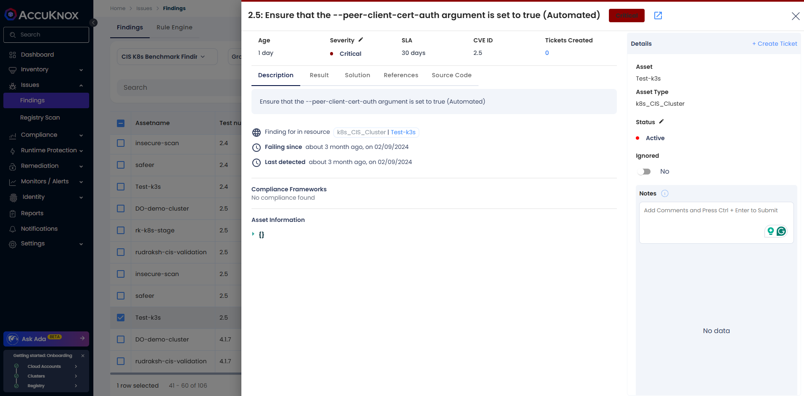

# CIS K8s Benchmark Findings

After the initial scan is completed, you can view the compliance results

!!!info
    Note: **etcd should be configured for peer authentication**

## Description

etcd is a highly available key-value store used by Kubernetes deployments to store all of its REST API objects persistently. These sensitive objects should be accessible only by authenticated etcd peers in the etcd cluster.

## Steps

1. Go to Issues > Findings in Accuknox.

2. Use the Findings dropdown to filter and select CIS k8s Benchmarking finding results

3. Apply the risk factor as Critical filter and select Failed from the Tool Output filter

4. Click on Apply

**Solution:**

All peers attempting to communicate with the etcd server will require a valid client certificate for authentication

!!!info
    Note: **Ensure that the --kubelet-certificate-authority argument is set as appropriate**

## Description

The connections from the apiserver to the kubelet are used for fetching logs for pods, attaching (through kubectl) to running pods and using the kubelet's port-forwarding functionality. These connections terminate at the kubelet's HTTPS endpoint. By default, the apiserver does not verify the kubelet's serving certificate, which makes the connection subject to man-in-the-middle attacks, and unsafe to run over untrusted and/or public networks.

## Steps

1. Go to Issues > Findings in Accuknox.

2. Use the Findings dropdown to filter and select CIS k8s Benchmarking finding results

3. Apply the risk factor as High filter and select Failed from the Tool Output filter

4. Click on Apply

## Solution

This will configure TLS on apiserver as well as kubelets to avoid MITM attacks