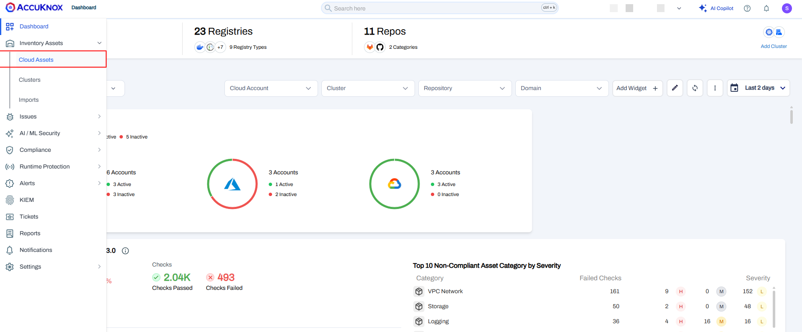
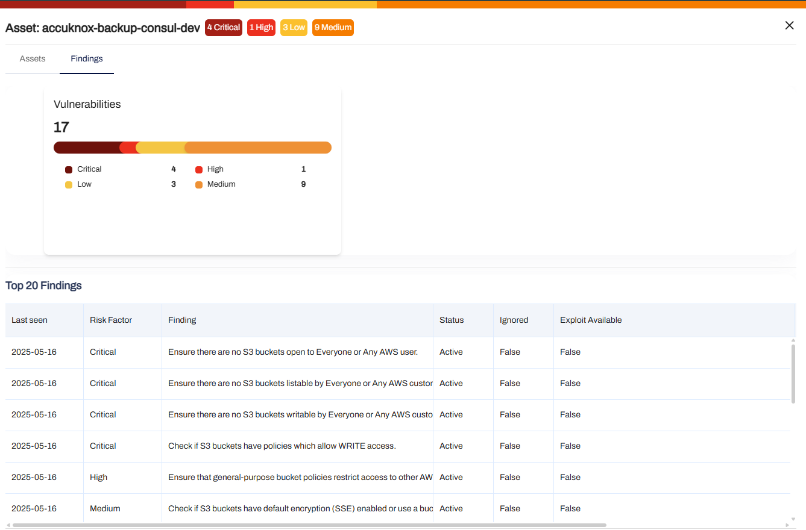
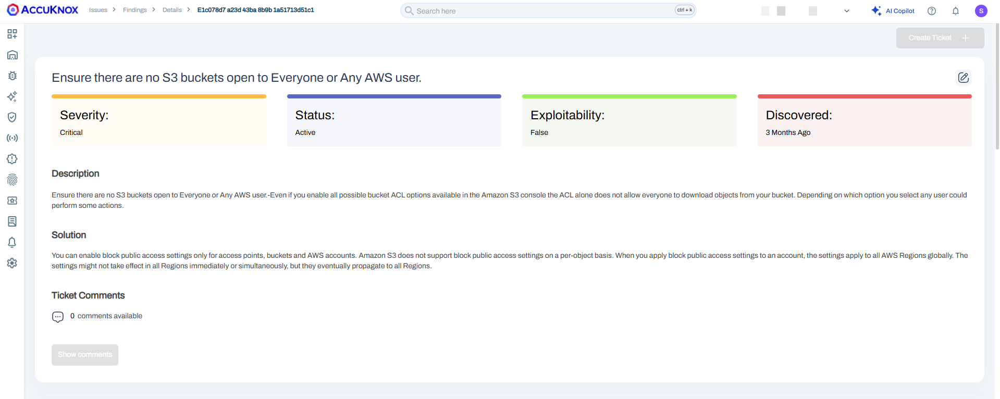

**Securing your most critical assets in Public Cloud**


To be able to detect misconfigurations and drift detection on onboarded Cloud Account. Misconfigurations is deemed by NSA as **leading vulnerability reason in a cloud environment** where the risk might be less sophisticated but their **implications are generally critical**. It could be any configuration that is deterring it from security best practices, gaps or errors which could be scrutinized through security breaches, hackers, ransomware, malware or insider threats that leverage these vulnerabilities to gain illegitimate access to your network.


AccuKnox provides you a single pane of glass view with clear action item and a tracking of these findings in a multi-cloud environment. You can also see the continuous compliance trends of the categorized assets of interest to see the conformance or deviation from the custom baselines or standard technical or governance framework in general.


After onboarding your account, we would scan your infrastructure on a scheduled interval as per requirement to show you **overall infrastructure security assessment**. The results would be vulnerabilities and findings which will always be associated to an asset. And you can auto-create, update and manage tickets to resolution of these findings. Also we can let you **group your assets** and apply a **baseline conformance** on a periodical manner for **drift detection**. For **proactive monitoring** of your specific assets, we enable you to do that with **Monitors** where you can see deviation in configuration and consequently an alerts whenever there is a change in configuration in those specific **critical assets** like s3 bucket, remote desktops such as bastions etc.


Lets understand this from a specific use-case example - **Misconfigured Amazon S3 Public Bucket**

**Step 1:** Click on Inventory → Assets




*Note:* After the scan is complete, the assets will be displayed shortly.

**Step 2:** To view the S3 bucket details, click on the filter by assets and select the s3 bucket.


**Step 3:** Here List of s3 buckets will be shown. Now click on any of the s3 assets to view the asset details.

We selected ```sh dev-blog-awsgoat-bucket-788471067825``` s3 bucket.


**Step 4:** You will find all the details related to the selected Asset here.

Click on ```sh vulnerabilities graph```, It will redirect to the ```sh vulnerabilities``` page.


**Step 5:** You can view the findings of s3 misconfigurations. Click on it to see detailed view.


**Step 6:** Here we can see the description of the s3 bucket which is publicly accessible and You can change the status, severity, and other details of the vulnerability. click on the top right corner arrow to get a more detailed view.




**Remediation:**

You can open a ticket and monitor the issue until it is fixed.

[Configuring block public access settings for your S3 buckets - Amazon Simple Storage Service](https://docs.aws.amazon.com/AmazonS3/latest/userguide/configuring-block-public-access-bucket.html)

- - -
[SCHEDULE DEMO](https://www.accuknox.com/contact-us){ .md-button .md-button--primary }
