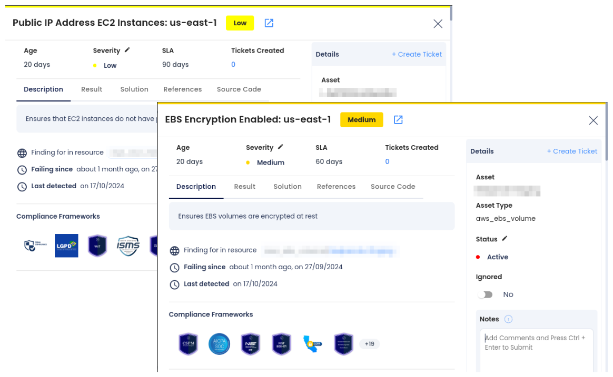
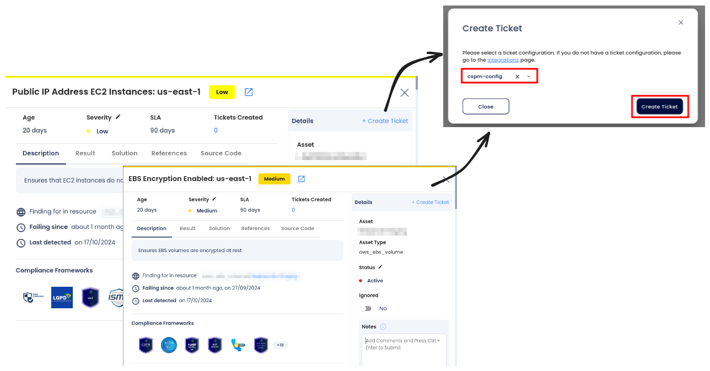
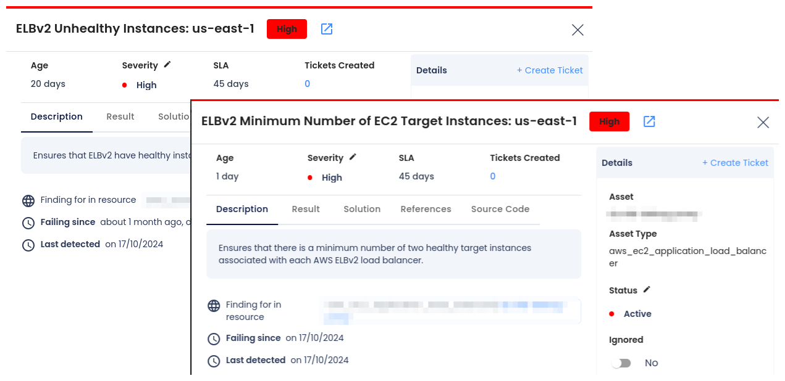
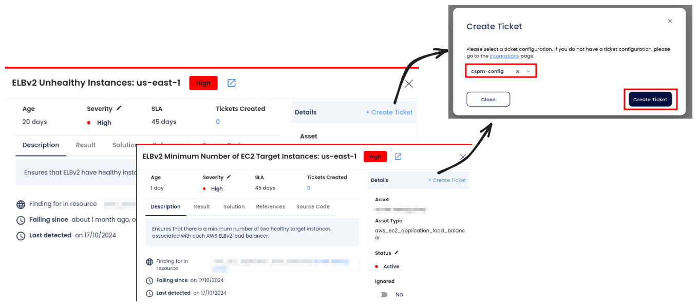

# AWS Compute Security

As organizations increasingly rely on Amazon EC2 (Elastic Compute Cloud) for scalable computing, securing these environments is essential. EC2 instances host critical applications and sensitive data, making them prime targets for cyber threats. Ensuring the security of EC2 instances helps protect against data breaches, unauthorized access, and application downtime.

## Why EC2 Security with AccuKnox

AccuKnox Cloud Security Posture Management (CSPM) offers continuous monitoring and real-time detection of misconfigurations and vulnerabilities in your EC2 environment. With AccuKnox, you can proactively identify and address security issues, ensuring that your EC2 instances remain secure and compliant with industry standards. AccuKnox helps simplify security management by providing actionable insights, automated ticketing for remediation, and seamless integration with your existing workflows.

## Attack Scenario

Securing EC2 instances is a multi-faceted challenge. Below are some examples of common security issues that can expose EC2 instances to attacks:

- **Public IP Address + Unencrypted EBS Volumes**: When EC2 instances are assigned public IP addresses, they become accessible over the internet, potentially exposing them to unauthorized access and attacks. If these instances also have unencrypted EBS volumes, sensitive data stored on these volumes is vulnerable. Attackers can gain access to the instance and exfiltrate unencrypted data, leading to a severe security breach.

- **ELBv2 Unhealthy Instances + ELBv2 Minimum Number of EC2 Target Instances**: Misconfigurations in the Elastic Load Balancer (ELB) can lead to availability issues. For example, if an ELB is configured to require a minimum number of healthy EC2 instances (e.g., two), and one of the instances becomes unhealthy, the remaining instance could fail, resulting in application downtime or poor performance.

It's crucial to address these issues proactively to prevent potential breaches.

## How to Identify and Remediate EC2 Security Issues

### **1. Public IP Address + Unencrypted EBS Volumes**

**Identification:**

- **Navigate to Findings:** Log into the AccuKnox portal and go to **Issues** > **Findings**.

- **Apply Filters:** Use the **Cloud Findings** filter and search for the keyword **Public IP** or **Unencrypted EBS** to highlight any findings related to exposed public IPs and unencrypted disks.

- **Review Findings:** Analyze the findings to identify any EC2 instances with a public IP address and unencrypted EBS volumes. Pay special attention to the risk severity of these issues.

- **Assess Risk:** Evaluate the potential risks of public exposure and unencrypted storage, which can lead to unauthorized access and data breaches.

**Remediation:**

- **Access Findings:** In the **Findings** section, select the specific finding related to **Public IP Address + Unencrypted EBS Volumes**.

- **Create a Ticket:** Create a ticket to track the remediation process and ensure the issue is addressed.

- **Follow Remediation Guidance:**

    - **For Public IP Exposure:** Remove public IP addresses where unnecessary or secure them using firewalls or security groups.

    - **For Unencrypted EBS Volumes:** Enable encryption on the identified EBS volumes to protect sensitive data.

- **Validate Remediation:** Confirm that public IP addresses have been removed or secured and EBS volumes are encrypted.

- **Monitor Continuously:** Regularly check for similar findings to ensure continuous protection.

### **2. ELBv2 Unhealthy Instances + ELBv2 Minimum Number of EC2 Target Instances**

**Identification:**

- **Navigate to Findings:** Go to the **Findings** section in the AccuKnox portal under **Issues** > **Findings**.

- **Apply Filters:** Use the **Cloud Findings** filter and search for **ELBv2** and **Unhealthy Instances** to identify any misconfigurations in load balancer setups.

- **Review Findings:** Examine the findings to detect any ELBv2 configurations with unhealthy instances or issues related to the minimum number of healthy target instances.

- **Assess Risk:** Understand the availability risk if the minimum number of healthy instances is not met, which could cause downtime or application unresponsiveness.

**Remediation:**

- **Access Findings:** From the **Findings** section, select the finding related to **ELBv2 Unhealthy Instances + ELBv2 Minimum Number of EC2 Target Instances**.

- **Create a Ticket:** Open a ticket to monitor and track the remediation efforts for fixing ELBv2 health configurations.

- **Follow Remediation Guidance**

- **Validate Remediation:** Check the status of the EC2 instances and ELBv2 configurations to verify that all instances are healthy and the minimum target instances are configured correctly.

