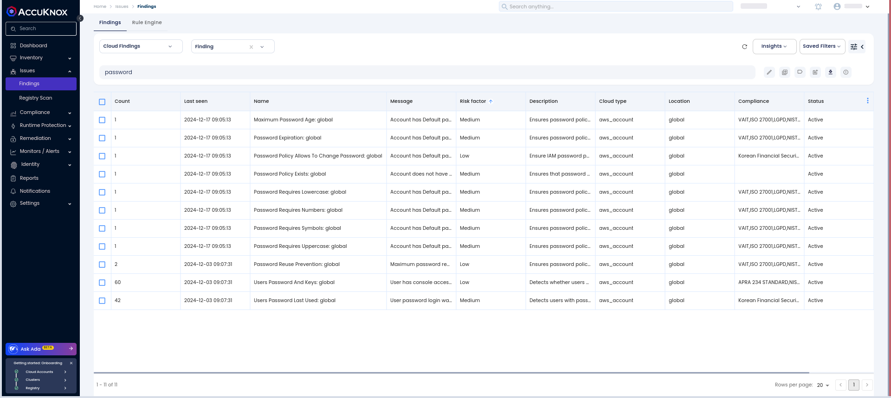
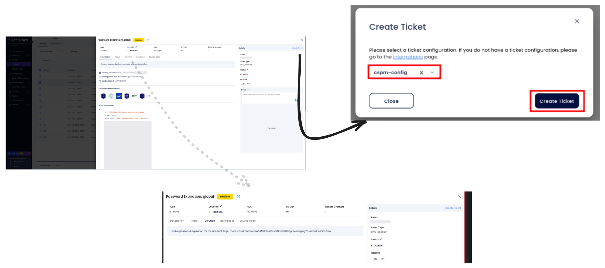

# AWS IAM Security

AWS Identity and Access Management (IAM) is crucial for managing access to AWS resources. Securing IAM configurations is vital to prevent unauthorized access, privilege escalation, and data breaches. Weak credentials, poor password policies, and improper IAM roles can expose your AWS environment to significant risks.

AccuKnox CSPM provides continuous monitoring and real-time detection of vulnerabilities and misconfigurations in AWS IAM configurations. It helps you identify weak credentials and misconfigured permissions, delivering actionable insights and automated remediation workflows to ensure compliance and robust security posture.

One common IAM misconfiguration is the use of **weak passwords** or **lack of multi-factor authentication** (MFA) for critical user accounts. Without strong credentials and MFA in place, attackers can easily compromise IAM accounts, gaining unauthorized access to sensitive AWS resources. This highlights the importance of enforcing robust password policies and enabling MFA for all users with access to critical infrastructure.

## Why Weak IAM Credentials are a Risk

When IAM credentials are weak, attackers can easily exploit them to gain unauthorized access to AWS resources. This opens the door to various security threats, including:

- **Unauthorized Access:** Weak passwords or improper credential management can allow attackers to gain control of critical resources.

- **Privilege Escalation:** Attackers can leverage weak credentials to escalate privileges and gain broader access within the AWS environment.

- **Data Breaches:** Attackers exploiting weak IAM credentials can access, steal, or manipulate sensitive data, resulting in significant operational and financial damage.

## Attack Scenario

An attacker scans for weak IAM credentials and attempts to brute-force passwords using tools like Hydra. If the password is weak or default, the attacker can gain unauthorized access to the AWS environment. Once inside, they could escalate privileges to access more sensitive resources or launch attacks, such as data exfiltration or manipulation.

## How to Identify and Remediate Weak IAM Credentials with AccuKnox

1. **Navigate to Findings**: Go to the AccuKnox portal and access `Issues > Findings`.

2. **Apply Filters**: Use the **cloud findings** filter and search for the keyword **password** to list relevant findings.

3. **Review Findings:** Assess the severity of findings related to weak credentials, including lack of multi-factor authentication (MFA) or poor password complexity requirements.

4. **Take Action:** Follow the remediation guidance provided within the platform to enforce strong IAM credentials and ensure MFA is enabled.

## Remediation Steps

1. **Navigate to Issues > Findings** in the AccuKnox portal.

2. **Select the finding related to weak IAM credentials** or non-compliance with password policies.

3. **Create a ticket** to track the remediation process.

4. **Follow recommended steps** and security references linked within the findings to strengthen IAM credential security, including implementing MFA and enforcing complex password policies.

## Best Practices to Avoid Weak IAM Credential Risks

- **Enforce Strong Password Policies:** Ensure that IAM users follow strict password length, complexity, and expiration rules.

- **Enable MFA:** Require multi-factor authentication for all IAM users and accounts.

- **Regularly Audit IAM Permissions:** Continuously review and audit IAM user roles and permissions to ensure least-privilege access.

- **Monitor IAM Security Continuously:** Use AccuKnox CSPM to monitor IAM configurations for real-time detection and remediation of misconfigurations.

By addressing weak IAM credentials proactively and following best practices, you can significantly reduce the risk of unauthorized access and maintain a secure AWS environment.
