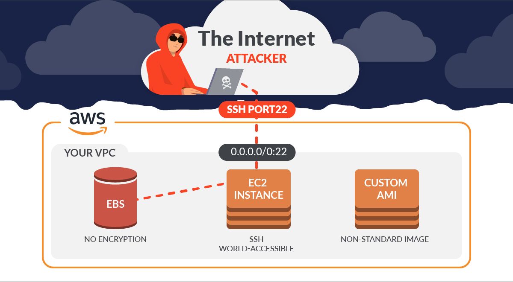
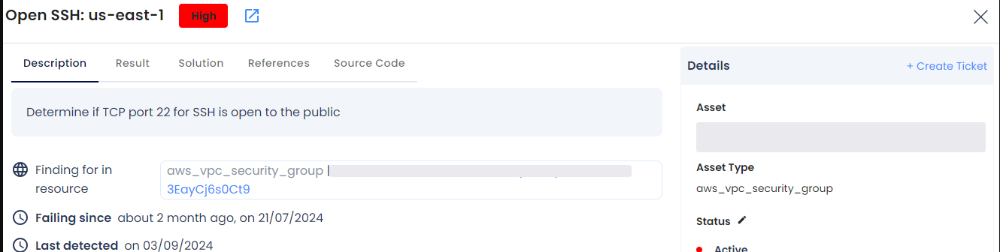
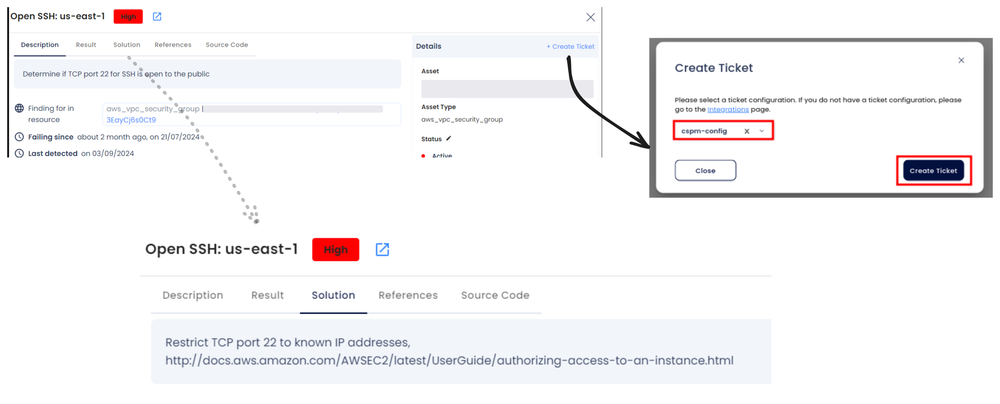

# AWS Network Security

As organizations increasingly rely on AWS for their cloud infrastructure, securing network configurations is critical to safeguarding cloud resources. Misconfigurations in network security settings, such as publicly exposed ports, open security groups, or misconfigured VPC security settings, can serve as potential entry points for attackers. Ensuring a robust AWS network security posture is essential to protect resources, prevent unauthorized access, and secure cloud applications from threats.

AccuKnox Cloud Security Posture Management (CSPM) helps identify misconfigurations in AWS network settings and provides actionable recommendations to mitigate risks, ensuring compliance with security standards and enhancing overall network security.

One major security challenge with AWS Network Security is the exposure of **Open SSH ports**. Misconfigurations in security group settings or improperly secured SSH access can allow attackers to exploit these open ports, potentially gaining unauthorized access to critical systems. It is essential to address these vulnerabilities proactively to safeguard your environment from brute force attacks, unauthorized access, and lateral movement within your network.

## **Why Open SSH Ports are a Risk**

When SSH ports are publicly exposed, attackers can exploit them to:

- **Brute Force Attacks**: Attackers use tools to guess SSH credentials, gaining unauthorized access.

- **Resource Hijacking**: Compromised machines can be used for malicious activities like crypto mining or botnets.

- **Lateral Movement**: Once inside, attackers can move laterally within your environment to access more systems.

## **Attack Scenario**

An attacker scans for publicly exposed SSH ports using tools like **Nmap** or **Shodan**. If the SSH configuration lacks strong authentication, they launch brute-force attacks using tools like **Hydra** or **Medusa** to crack credentials. Once successful, the attacker gains control over the EC2 instance, compromising its resources and potentially infiltrating the entire network.

## **How to Identify and Remediate Open SSH Ports with AccuKnox**

1. **Navigate to Findings**: Go to the **AccuKnox portal** and access **Issues > Findings**.

2. **Apply Filters**: Use the **Cloud Findings** filter and search for the keyword **"ssh"** to locate findings related to open SSH ports.

3. **Group Findings**: Group the findings to identify all publicly exposed SSH ports for efficient analysis.

4. **Review Findings** Analyze the severity of each finding and assess the potential risk

### **Remediation Steps**

1. **Identify Open SSH Ports**: Select the findings related to **publicly exposed SSH ports**.

2. **Create a Ticket**: Create a ticket to track the resolution process.

3. **Follow Guidance**: Follow the recommended security steps provided within the platform to restrict access to SSH ports.

4. **Verify Configuration**: Ensure that SSH ports are no longer publicly accessible and have strong authentication mechanisms enabled.

### **Best Practices to Avoid Open SSH Port Risks**

- Restrict SSH access to **trusted IP addresses** using security groups.

- Use **key-based authentication** instead of passwords to secure SSH access.

- Monitor SSH login attempts and set up **fail2ban** or similar tools to prevent brute-force attacks.

- Continuously monitor your environment with **AccuKnox CSPM** for real-time detection and remediation of misconfigurations.
