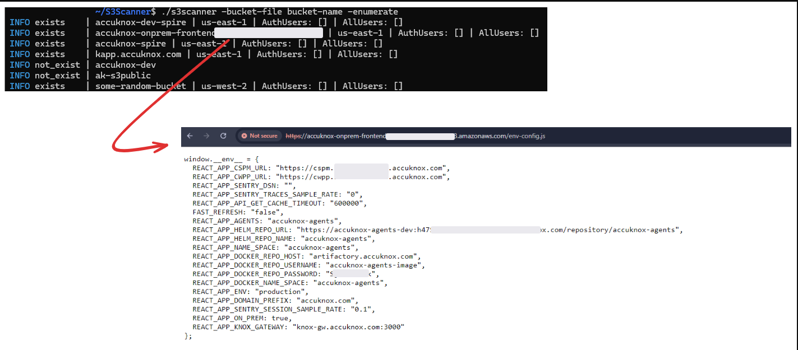

# AWS Storage Security

Amazon Web Services (AWS) offers a wide range of storage solutions, including S3, EBS, and EFS, which are essential for securing and storing data in the cloud. Securing these storage services is crucial to protect sensitive information and maintain the integrity of your applications. AWS Storage Security involves identifying and addressing vulnerabilities, misconfigurations, and threats that can expose data to unauthorized access or compromise.

AccuKnox Cloud Security Posture Management (CSPM) helps provide continuous monitoring and real-time detection of misconfigurations and vulnerabilities across your AWS storage resources. It delivers actionable insights and automated remediation workflows to ensure compliance with security best practices.

One common security challenge in AWS storage is the **public exposure of S3 buckets** or unencrypted EBS volumes. These misconfigurations can leave sensitive data vulnerable to unauthorized access and exploitation, making it essential to address them proactively.

## **Why S3 Public Exposure is a Risk**

Public exposure to S3 buckets can lead to data breaches, information leakage, and regulatory non-compliance. Attackers can exploit publicly accessible buckets to download, modify, or delete data. This can result in significant financial and reputational damage, as well as legal consequences if sensitive data is leaked.

## **Attack Scenario**

An attacker can enumerate publicly accessible S3 buckets to check for sensitive data. If they find a misconfigured bucket with public access, they may steal confidential files, such as customer information, financial data, or proprietary business information. This could lead to identity theft, fraud, or intellectual property theft.

## **How to Identify and Remediate S3 Public Exposure with AccuKnox**

1. **Navigate to Findings**: Access the **AccuKnox portal** and go to **Issues > Findings**.

2. **Apply Filters**: Use the **Cloud Findings** filter and search for the keyword **"s3"** or **"public"** to list relevant findings for publicly exposed S3 buckets.

3. **Review Findings**: Analyze the identified findings to check for any publicly exposed S3 buckets and evaluate the associated risks.

**Remediation Steps**

1. **Identify the Finding**: Locate the finding related to **S3 Public Exposure**.

2. **Create a Ticket**: Create a ticket to track the resolution process.

3. **Follow Remediation Guidance**: Follow the recommended steps within the platform to properly configure the S3 bucket access, ensuring it's no longer publicly accessible.

4. **Verify Resolution**: Confirm that the S3 bucket access has been restricted and the issue has been resolved.

### **Best Practices to Avoid S3 Public Exposure**

- Regularly audit the access control settings of S3 buckets to ensure they are not publicly accessible.

- Implement **bucket-level policies** to restrict access only to authorized users.

- Enable **logging** and **versioning** on S3 buckets to monitor access and recover data in case of a breach.

- Continuously monitor your cloud environment with **AccuKnox CSPM** for real-time detection and remediation of misconfigurations.
