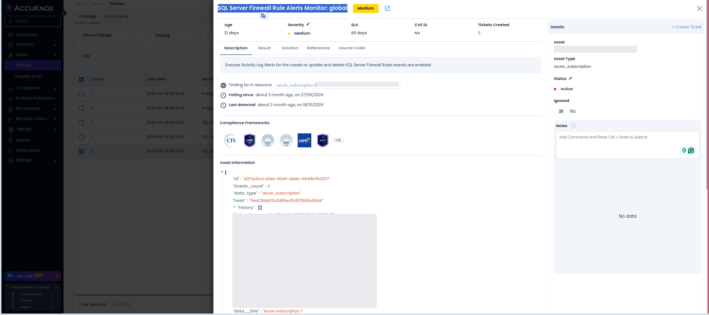
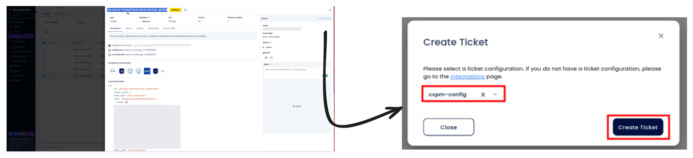
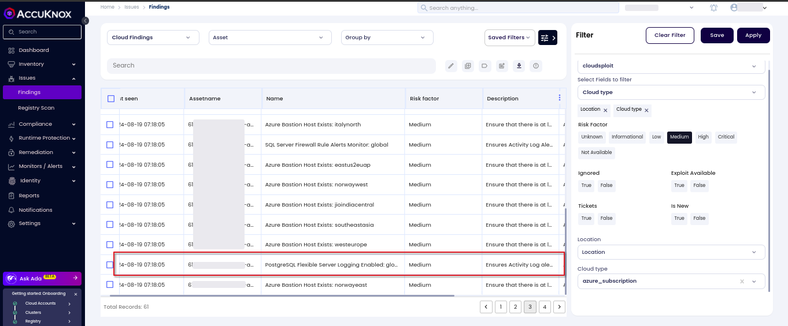
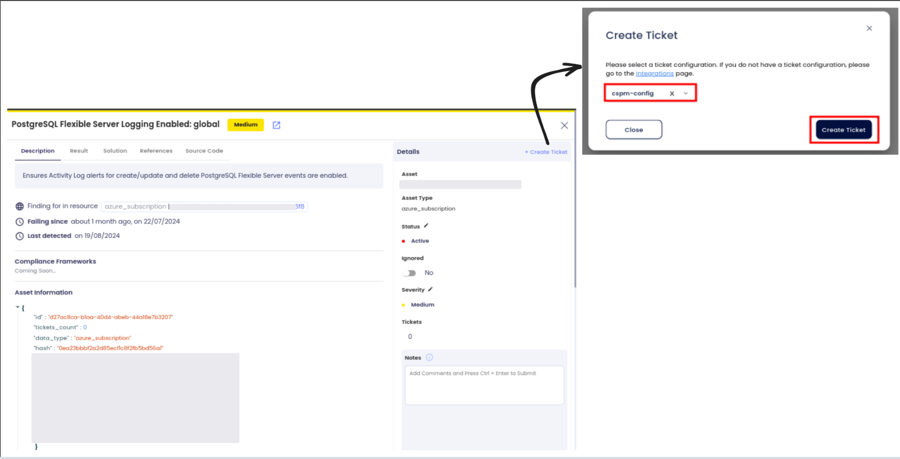

# Azure Database Security

As organizations continue to move their data to the cloud, securing Azure databases is crucial to protect sensitive data and maintain the integrity of applications. Misconfigurations in database security settings can expose critical data to unauthorized access, data breaches, and potential exploitation. Ensuring that Azure databases are properly configured and secured is a key aspect of a comprehensive cloud security strategy.

## **Why Azure Database Security with AccuKnox**

AccuKnox Cloud Security Posture Management (CSPM) provides continuous monitoring of Azure database configurations to identify misconfigurations, vulnerabilities, and non-compliance with security best practices. With AccuKnox, organizations can proactively remediate database security risks, ensuring that their databases are secure, compliant, and protected against potential threats.

## **Common Misconfiguration**

Common misconfigurations in Azure Database Security can expose databases to risks such as unauthorized access, data leakage, and compliance violations. Below are some typical vulnerabilities:

- **SQL Server Firewall Rule Alerts:** Misconfigured firewall rules can leave SQL Server databases exposed to the internet, allowing attackers to gain unauthorized access or launch attacks.

- **PostgreSQL Flexible Server Logging:** If logging is not enabled, database activities like unauthorized access or data modifications may go undetected, increasing the potential for security breaches.

## **How to Identify and Remediate SQL Server Firewall Rule Alerts with AccuKnox**

- **Access the Dashboard:** Log in to the AccuKnox portal and navigate to Issues > Findings.

- **Apply Filters:** Use the cloud findings filter and search for the keyword "SQL Server firewall" to list relevant findings.

- **Review Findings:** Analyze the identified SQL Server firewall rule misconfigurations and assess the severity and associated risks.

- **Remediate:** Follow the detailed remediation steps to secure the firewall rules.

**Remediation Steps for SQL Server Firewall Rule Alerts**

1. Review the identified SQL Server firewall rule misconfigurations in the AccuKnox findings.

2. Create a ticket to track the resolution process.

3. Follow the recommended steps and security references linked within the findings to properly configure the firewall rules.

4. Verify remediation by checking the updated firewall settings in the AccuKnox portal.

**Best Practices to Avoid SQL Server Firewall Rule Issues**

- Restrict SQL Server firewall rules to only necessary IP addresses.

- Regularly audit firewall settings to ensure they align with security best practices.

- Continuously monitor firewall configurations using AccuKnox CSPM for real-time detection of misconfigurations.

## How to Identify if PostgreSQL Flexible Server Logging is Enabled in Azure

1. **Navigate to Findings**: Go to the AccuKnox portal and access **Issues** > **Findings**.

2. **Apply Filters**: Use the **Cloud Findings** filter in the findings-type filter and search for **PostgreSQL** findings.

3. **Review Findings**: Analyze the identified findings to see if logging is disabled or improperly configured. The status of PostgreSQL Flexible Server logging will be highlighted in the findings.

4. **Search Specific Assets/Findings**: You can directly search for PostgreSQL-related assets or findings using the search field.

### Remediation Steps

1. **Navigate to Issues > Findings** in the AccuKnox portal.

2. **Select the finding related to PostgreSQL Flexible Server Logging** to identify misconfigurations.

3. **Create a Ticket** to track the resolution process.

4. **Follow the Recommended Steps**: Check the remediation guidance provided within the platform to enable or configure logging properly.

### Best Practices

- Ensure logging is enabled for PostgreSQL Flexible Server to capture all relevant database activities.

- Regularly audit PostgreSQL configurations and logging settings for compliance with security standards.

- Monitor PostgreSQL-related findings continuously for security risks using AccuKnox CSPM.
