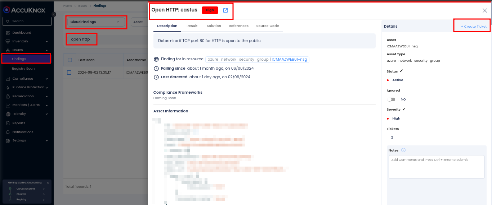
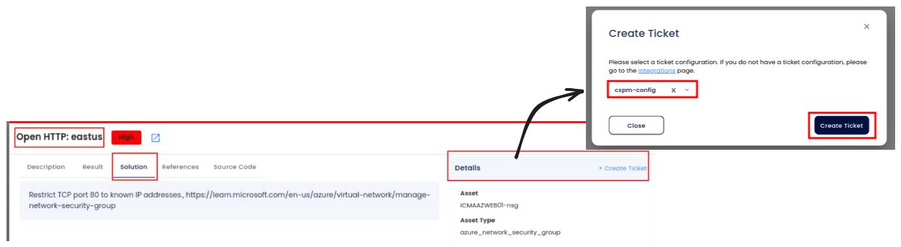
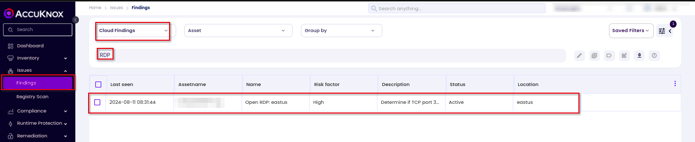
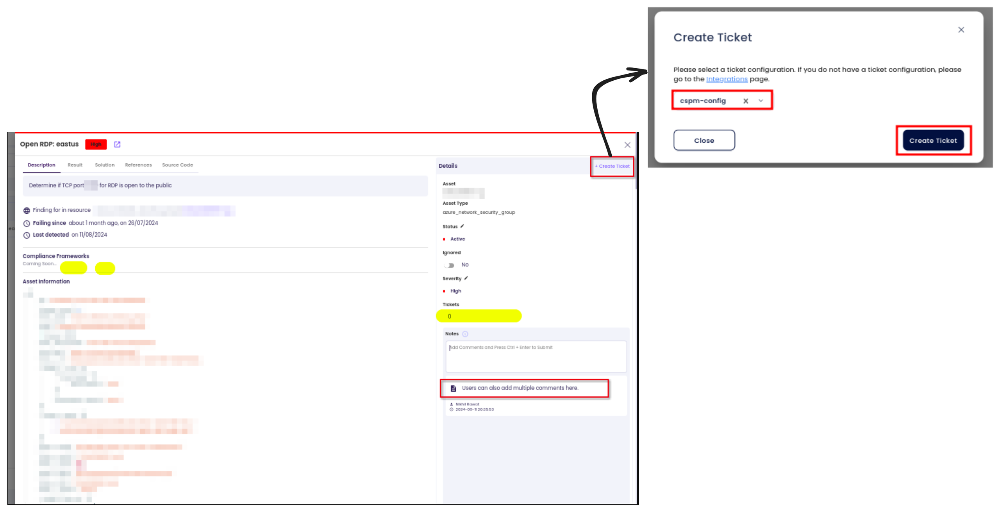

# Azure Network Security

As organizations increasingly adopt cloud services, securing their cloud networks is essential. In Azure, misconfigurations in network security settings can lead to significant security risks. Publicly exposed network ports, misconfigured security groups, or open firewall rules can all serve as entry points for attackers. Ensuring a robust Azure Network Security posture is crucial for protecting resources, preventing unauthorized access, and ensuring the overall security of cloud applications.

## Why Azure Network Security with AccuKnox

AccuKnox Cloud Security Posture Management (CSPM) continuously monitors Azure environments for misconfigurations and vulnerabilities in network security settings. By leveraging AccuKnox, organizations can ensure that their Azure network configurations are compliant with security best practices, minimize exposure to threats, and receive actionable insights to remediate potential risks proactively.

## Attack Scenario

Azure Network Security misconfigurations present various vulnerabilities. Below are some common issues:

1. **Open HTTP Ports**: Publicly exposed HTTP ports, like port 80, expose Azure resources to the internet, potentially allowing unauthorized access or data interception.

2. **Exposed RDP Ports**: Leaving Remote Desktop Protocol (RDP) ports (default port 3389) open in Azure Network Security Groups (NSGs) increases the risk of brute-force attacks, unauthorized entry, and malware deployment.

## **How to Identify and Remediate Open HTTP Ports with AccuKnox**

1. **Access the Dashboard**: Log in to the AccuKnox portal and navigate to `Issues > Findings`.

2. **Apply Filters**: Use the **cloud findings** filter and search for the keyword **port 80** or **open HTTP** to list relevant findings.

3. **Review Findings**: Analyze each open port finding and assess its severity and associated risks.

4. **Remediate**: Follow the detailed remediation steps to close or secure open ports.

### **Remediation Steps**

1. Review the identified open HTTP port in the AccuKnox findings.

2. Create a ticket to track the resolution process.

3. Follow the recommended steps and security references linked within the findings for precise remediation.

4. HTTP access, close the firewall or security group-level port.

5. Verify remediation in the AccuKnox portal.

### **Best Practices to Avoid Open HTTP Ports**

- Use **HTTPS** instead of HTTP to ensure secure, encrypted communication.

- Regularly audit firewall rules and security group configurations to identify and close unnecessary open ports.

- Continuously monitor cloud environments using AccuKnox CSPM for real-time detection of open ports.

## **How to Identify and Remediate Open RDP Ports in Azure NSGs**

1. **Navigate to Findings**: Go to the AccuKnox portal and access `Issues > Findings`.

2. **Apply Filters**: Use the **cloud findings** filter and search for the keyword **RDP** to list relevant findings.

3. **Review Findings**: Analyze identified Open RDP access and assess the associated risk severity.

4. **Take Action**: Follow the remediation guidance provided within the platform

### **Remediation Steps**

1. Navigate to `Issues > Findings` in the AccuKnox portal.

2. Select the finding related to **Open RDP**

3. Create a ticket to track the resolution process.

4. Follow the recommended steps and security references linked within the findings for precise remediation.

### **Best Practices**

- Avoid exposing RDP ports directly to the public internet; use VPNs or Azure Bastion for secure access.

- Regularly audit NSG rules to identify and remove unnecessary open ports.

- Monitor all port configurations using **AccuKnox CSPM** for real-time detection and remediation.
