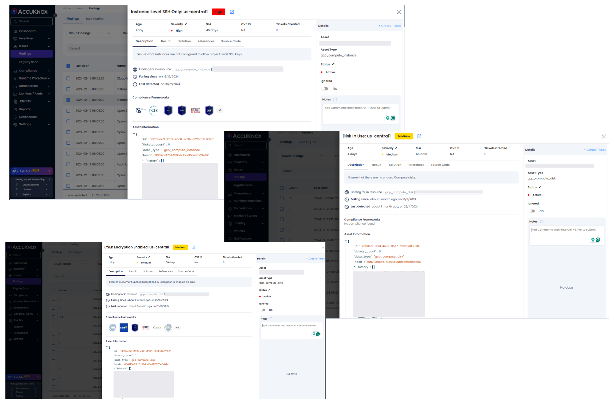
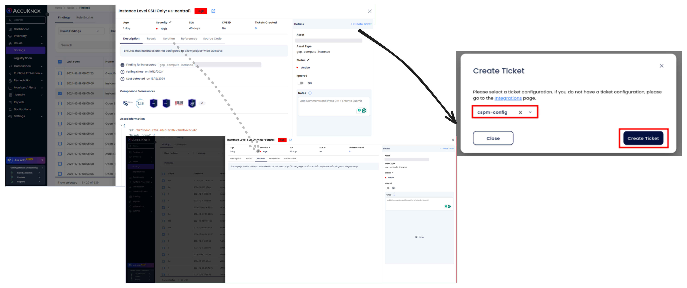

# GCP Compute Security

Securing compute resources in Google Cloud Platform (GCP) is essential to protect sensitive data, prevent unauthorized access, and maintain a robust security posture. Misconfigurations such as unused disks, improper encryption practices, and weak SSH configurations can lead to data breaches and operational risks. Ensuring compute resources are configured securely is a cornerstone of cloud security.

**AccuKnox Cloud Security Posture Management (CSPM)** helps identify misconfigurations in GCP network settings and provides actionable recommendations to mitigate risks, ensuring compliance with security standards and enhancing overall network security.

## **Common Compute Misconfigurations in GCP**

1. **Unused Compute Disks**
    Unused disks are a potential risk and unnecessary cost in your GCP environment. These disks can contain sensitive data and remain vulnerable to unauthorized access if not properly managed. Deleting unused disks reduces the attack surface and optimizes costs.

2. **Customer Supplied Encryption Key (CSEK) Not Enabled**
    Without CSEK, disks rely on Google-managed keys for encryption. While secure, enabling CSEK provides an additional layer of control by allowing you to manage your encryption keys.

3. **Project-Wide SSH Keys Enabled**
    Allowing project-wide SSH keys for instances introduces significant risk by potentially enabling unauthorized access to all instances in a project. Enforcing instance-specific SSH keys ensures that access is limited and controlled.

## **Why These Misconfigurations Are a Risk**

- **Data Breach:** Unused or improperly encrypted disks can lead to unauthorized data access, risking compliance violations and operational damage.

- **Unauthorized Access:** Weak SSH configurations, such as project-wide keys, allow attackers to gain access to multiple instances in your project.

- **Cost Inefficiencies:** Unused compute disks incur unnecessary costs while offering no operational benefit.

## **How to Identify and Remediate Compute Misconfigurations with AccuKnox**

1. **Navigate to Findings:** Access the AccuKnox portal and go to Issues > Findings.

2. **Filter Results:** Use keywords like "disk," "encryption," or "SSH" to locate findings related to unused disks, encryption settings, and SSH access.

3. **Review Findings:** Analyze the findings for severity and potential impact. Prioritize issues like unencrypted disks and weak SSH configurations for remediation.

### **Remediation Steps for Compute Security Issues**

1. **Unused Compute Disks:**

    - Review and identify unused compute disks.

    - Delete unused disks to reduce the attack surface and optimize costs.

2. **CSEK Not Enabled:**

    - Delete the disk and recreate it with Customer Supplied Encryption Key (CSEK) enabled.

    - Refer to [Google Cloud Documentation](https://cloud.google.com/compute/docs/disks/customer-supplied-encryption "https://cloud.google.com/compute/docs/disks/customer-supplied-encryption") for CSEK configuration.

3. **Project-Wide SSH Keys:**

    - Disable project-wide SSH keys by configuring instances to allow only instance-level SSH keys.

    - Use IAM roles and policies to enforce strict SSH access controls.

### **Best Practices for Compute Security in GCP**

- **Regularly Audit Compute Resources:**
    Continuously monitor and audit compute disks to ensure no unused disks are present in the environment.

- **Enable CSEK:**
    Use Customer Supplied Encryption Keys for all compute disks to maintain control over encryption and decryption processes.

- **Secure SSH Access:**
    Restrict SSH access to instances by disabling project-wide keys and allowing only instance-specific SSH access. Use IAM roles and policies for granular access control.

- **Monitor Compute Security Continuously:**
    Leverage AccuKnox CSPM to monitor compute resource configurations and detect misconfigurations in real-time.

By addressing compute security misconfigurations and following best practices, you can significantly reduce the risk of unauthorized access and ensure a secure, compliant GCP environm
