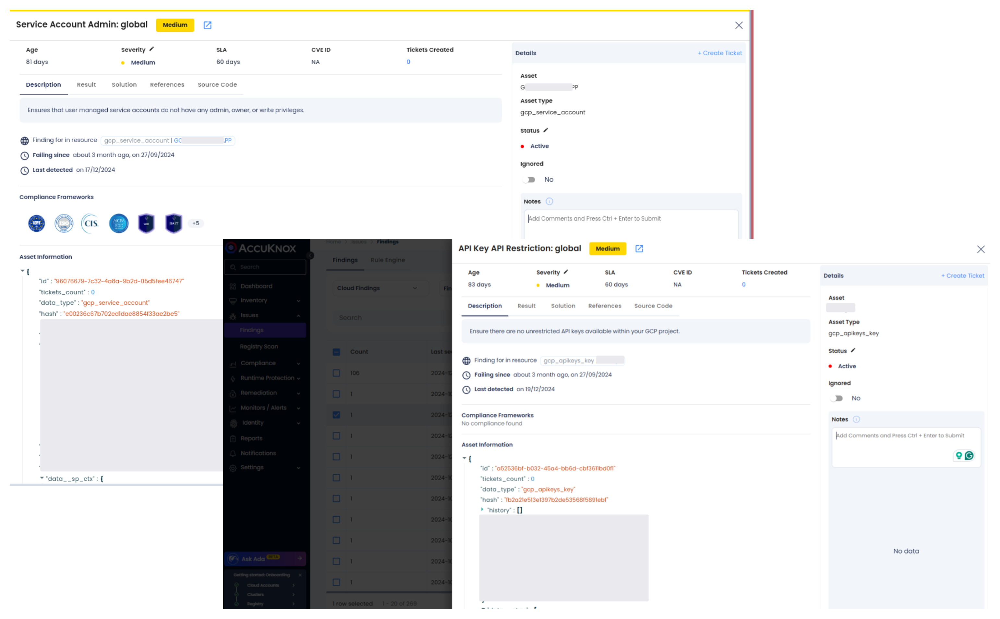
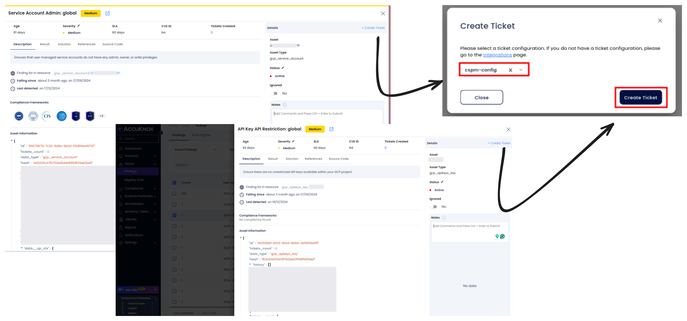

# GCP IAM Security

Securing Identity and Access Management (IAM) configurations is essential for preventing unauthorized access, privilege escalation, and data breaches in Google Cloud Platform (GCP). Misconfigurations in IAM roles, service accounts, and API keys can expose GCP environments to significant risks, including unauthorized access, misuse of resources, and compliance violations.

**AccuKnox CSPM** provides continuous monitoring and real-time detection of misconfigurations in GCP IAM settings. It helps organizations proactively identify excessive permissions, misconfigured service accounts, and improper API key restrictions, ensuring a secure and compliant cloud environment.

## **Common Misconfigurations in GCP IAM**

1. **Service Account Admin: Global**
    Service accounts with overly broad permissions (admin or owner roles) pose significant security risks. These accounts may have more privileges than required for their purpose, making them prime targets for attackers. Misconfigured service accounts can be exploited to escalate privileges, manipulate resources, or exfiltrate sensitive data.

2. **API Key API Restriction: Global**
    API keys without proper restrictions allow attackers to use the keys for unauthorized access to GCP resources. Unrestricted API keys expose services to abuse, increasing the risk of unauthorized interactions with GCP APIs.

## **Why Excessive Permissions in IAM and Service Accounts Are a Risk**

Excessive IAM permissions and improperly configured service accounts can lead to:

- **Unauthorized Access:** Service accounts with admin, owner, or write permissions can be exploited by attackers to gain control over GCP resources.

- **Privilege Escalation:** Misconfigured IAM roles can allow attackers to escalate privileges within the environment, gaining broader access to critical resources.

- **Resource Misuse:** Compromised service accounts can manipulate, delete, or steal sensitive data and resources, leading to operational disruptions.

- **Compliance Violations:** Excessive permissions can result in violations of frameworks such as GDPR, HIPAA, or ISO, leading to legal and financial penalties.

## **Attack Scenario**

An attacker identifies a service account with admin privileges, either through direct access or exploiting weak security practices like weak credentials or lack of MFA. The attacker uses these privileges to escalate access, modify GCP configurations, or exfiltrate sensitive data. Similarly, an API key without restrictions is compromised, and the attacker uses it to interact with GCP APIs, causing potential misuse or data breaches.

## **How to Identify and Remediate Excessive Permissions with AccuKnox**

1. **Navigate to Findings:** Go to the AccuKnox portal and access Issues > Findings.

2. **Filter Results:** Use the cloud findings filter and search for "service account" or "API key" to identify misconfigured service accounts or unrestricted API keys.

3. **Review Findings:** Analyze the identified findings to assess the risk associated with excessive permissions in service accounts or API keys that are not restricted properly.

## **Remediation Steps for Service Account Admin and API Key Restrictions**

1. **Identify the Finding:**
    Locate the findings related to misconfigured service accounts with excessive permissions (e.g., Service Account Admin) or API keys without restrictions.

2. **Create a Ticket:**
    Create a ticket to track the remediation process and ensure visibility of the issue.

3. **Follow Remediation Guidance:**

    - **Service Account Admin:**
        Remove unnecessary admin, owner, or write privileges from service accounts. Apply the principle of least privilege to limit access only to the necessary resources.

    - **API Key Restrictions:**
        Ensure API keys are restricted to specific IP addresses, services, or resources. Apply API key restrictions to prevent unauthorized use.

4. **Verify Resolution:**
    Confirm that the issue has been remediated by reviewing updated IAM roles, service account configurations, and API key restrictions in the AccuKnox portal.

## **Best Practices for GCP IAM Security**

- **Apply Least Privilege:**
    Always ensure that service accounts and IAM roles are granted the minimum permissions required for their tasks. Avoid granting admin or owner roles unless absolutely necessary.

- **Restrict API Keys:**
    Ensure that API keys are restricted by IP addresses, specific services, or use cases to reduce the risk of unauthorized access.

- **Regularly Audit IAM Roles and Service Accounts:**
    Continuously review and audit IAM roles and permissions to ensure compliance with the principle of least privilege. Regularly check service account configurations to ensure they have appropriate, minimal access.

- **Monitor IAM Security Continuously:**
    Use **AccuKnox CSPM** to continuously monitor IAM configurations and detect any misconfigurations, excessive permissions, or unauthorized access attempts.

- **Enable Multi-Factor Authentication (MFA):**
    Enable MFA for all IAM users and service accounts with access to critical resources to add an extra layer of protection.

By proactively managing IAM configurations, limiting permissions, and applying security best practices, organizations can significantly reduce the risks associated with misconfigured IAM roles, service accounts, and API keys in GCP, ensuring a secure and compliant cloud environment.