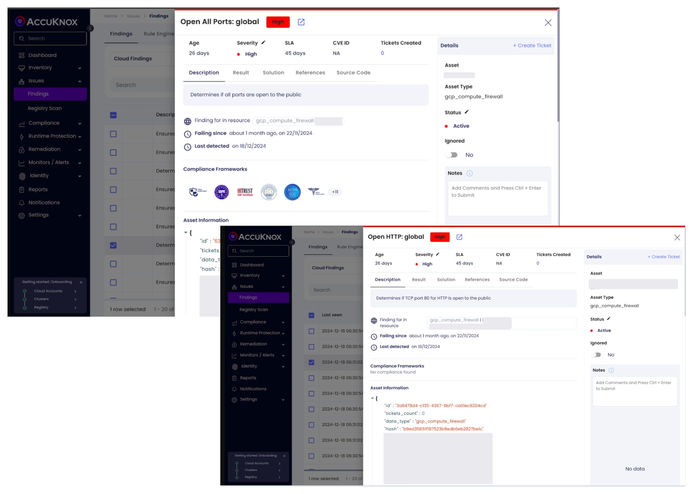
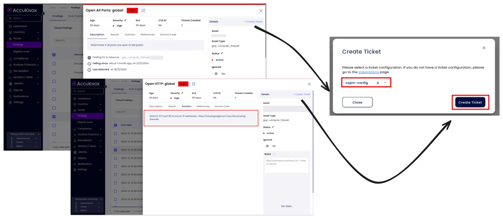

# GCP Network Security

Network security is vital to protecting your Google Cloud Platform (GCP) environment from unauthorized access, data exfiltration, and malicious attacks. Misconfigured network settings, such as open ports or unrestricted SSH access, can expose your instances to significant security risks. Ensuring proper network configurations, including restricted access and closed ports, is crucial for maintaining a secure GCP environment.

AccuKnox Cloud Security Posture Management (CSPM) helps identify misconfigurations in GCP network settings and provides actionable recommendations to mitigate risks, ensuring compliance with security standards and enhancing overall network security.

## **Common Network Misconfigurations in GCP**

1. **Publicly Exposed HTTP Server (TCP Port 80)**
    Publicly accessible HTTP servers with TCP port 80 open expose sensitive services to the internet. If not restricted, attackers can exploit vulnerabilities in your server to gain unauthorized access or compromise services.

2. **All Ports Open to the Public**
    Allowing all ports to be open to the public creates an attack surface that hackers can exploit. Restricting access to only necessary ports, and ensuring that unused ports are closed or restricted, minimizes exposure and reduces the risk of attacks.

## **Why These Network Misconfigurations Are a Risk**

- **Unauthorized Access:** Unrestricted SSH access or open ports allow attackers to exploit vulnerabilities, potentially gaining control over your instances.

- **Data Exfiltration or Malicious Use:** Public-facing HTTP servers or open ports can be targeted for attacks such as DDoS, data theft, or data interception.

- **Compliance Violations:** Exposing sensitive services to the public internet can violate data protection regulations like GDPR, HIPAA, or ISO standards, leading to penalties.

## **Attack Scenario**

1. **Public HTTP Server Exposure:**
    Publicly exposed HTTP ports, like port 80, expose resources to the internet, potentially allowing data interception.

2. **Open Ports Vulnerability:**
    All ports are open to the public, allowing an attacker to probe the environment and exploit exposed services. The attacker could target vulnerable services running on unused ports, gaining unauthorized access to sensitive resources.

## **How to Identify and Remediate Network Misconfigurations with AccuKnox**

1. **Navigate to Findings:** Go to the AccuKnox portal and access Issues > Findings.

2. **Filter Results:** Use the cloud findings filter and search for keywords like port 80, or open ports to identify instances with misconfigurations.

3. **Review Findings:** Analyze the identified findings related to open ports, public HTTP servers, and SSH misconfigurations. Assess the risk associated with each finding.

### **Remediation Steps for Network Security Issues**

1. **Identify the Finding:**
    Locate the findings related to publicly exposed HTTP servers, or open ports.

2. **Create a Ticket:**
    Create a ticket to track the remediation process and assign the appropriate team for resolution.

3. **Follow Remediation Guidance:**

    - **Public HTTP Server Exposure:**
        Restrict access to TCP port 80 (HTTP) to known IP addresses or trusted sources. Avoid exposing sensitive services like HTTP to the public unless necessary.

    - **All Ports Open to the Public:**
        Restrict unnecessary ports, allowing access only from specific, trusted IP addresses or networks. Review the firewall and network access control lists (ACLs) regularly.

4. **Verify Resolution:**
    Confirm that the misconfigurations have been remediated by reviewing updated firewall rules and network configurations access settings.

### **Best Practices for GCP Network Security**

- **Limit Public Access to Critical Ports:**
    Restrict access to sensitive ports (e.g., HTTP, HTTPS) to known IP addresses or trusted networks. Ensure that only necessary services are exposed to the internet.

- **Use Firewalls and ACLs:**
    Continuously configure and audit firewall rules and network access control lists (ACLs) to block unnecessary ports and limit access based on IP address or range.

- **Monitor Network Security Continuously:**
    Use AccuKnox CSPM to monitor your network security continuously for any misconfigurations or unauthorized access attempts, ensuring timely remediation.

- **Implement Zero Trust Networking:**
    Adopt a zero-trust model for your network by verifying every connection, ensuring that only authenticated and authorized users or devices can access resources.
