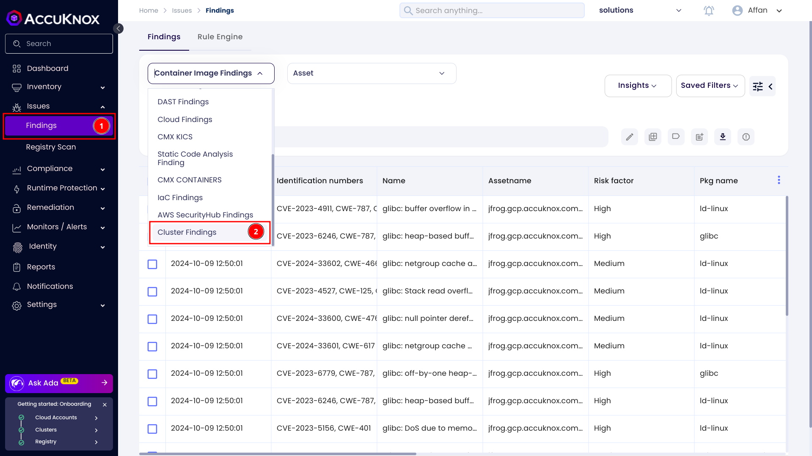
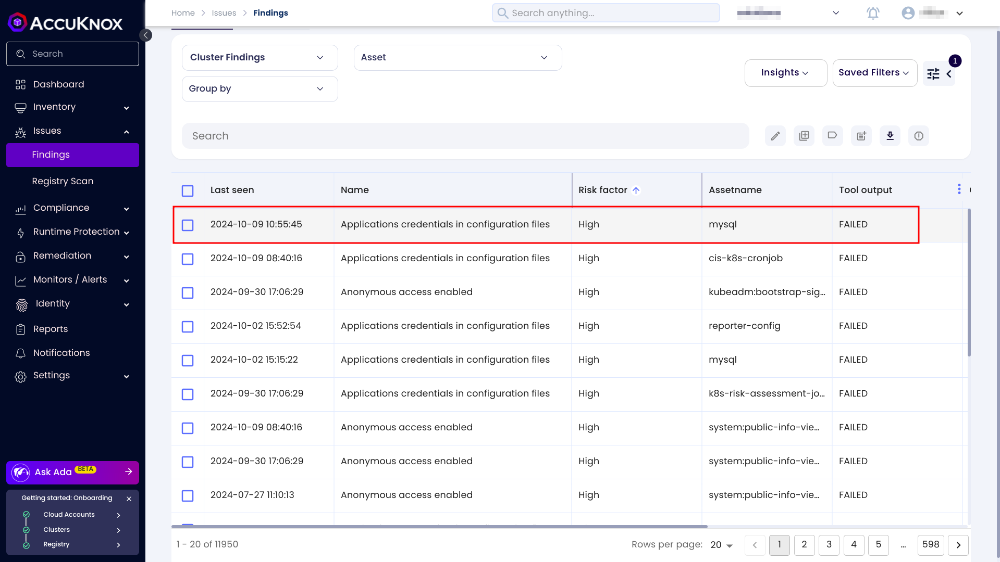
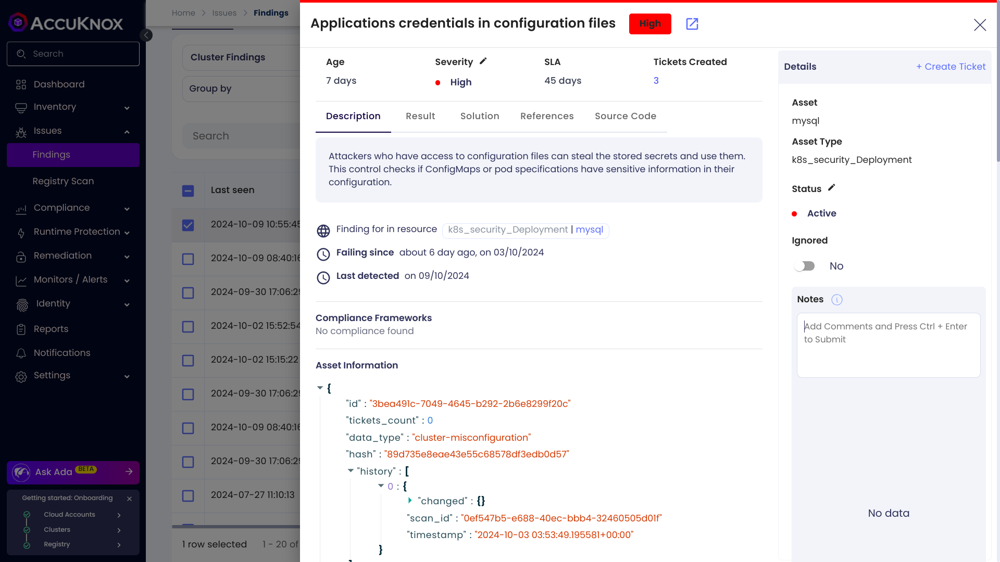
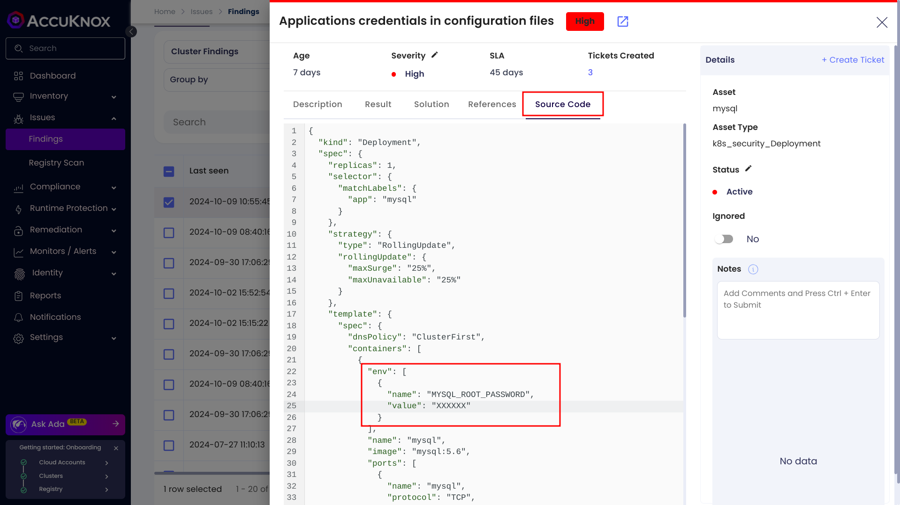
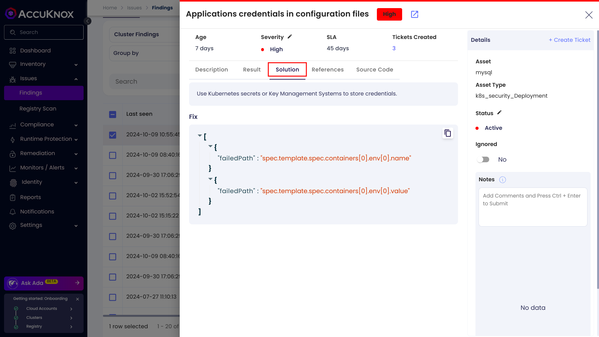
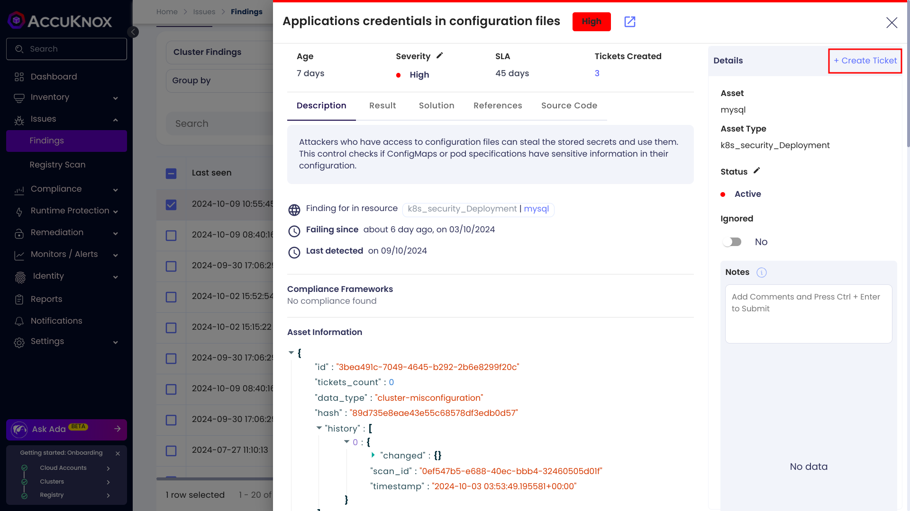
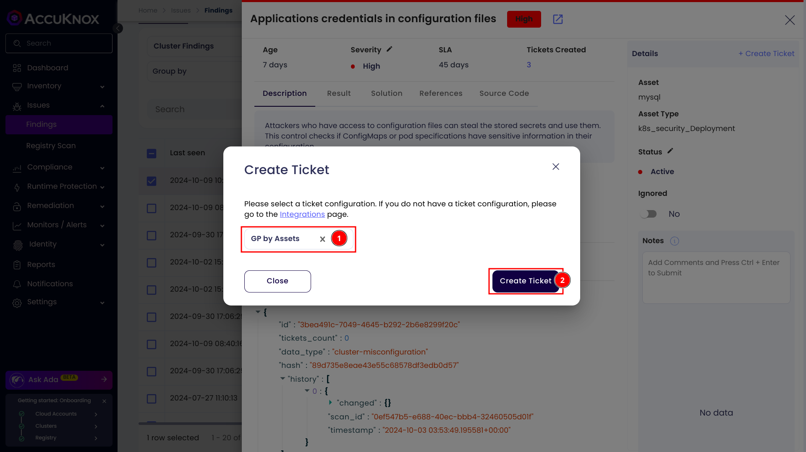
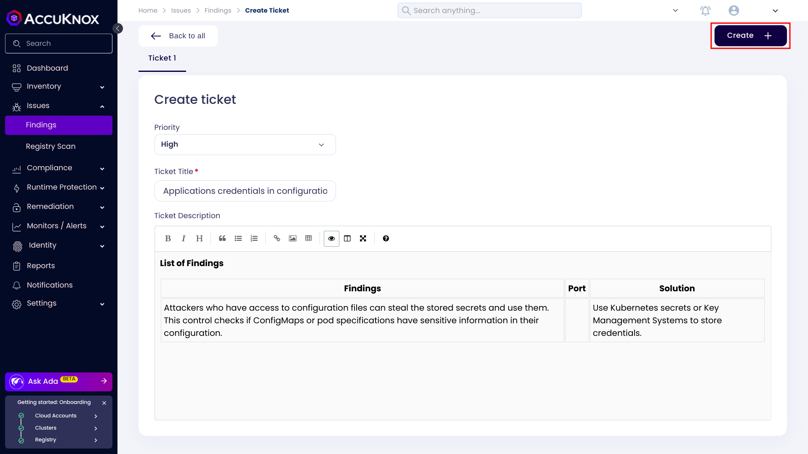

# Cluster Misconfiguration Scanning

Cyber attacks frequently occur due to security misconfigurations in applications and infrastructure. Preventing these vulnerabilities is crucial for maintaining a secure environment. AccuKnox empowers you to identify and remediate security misconfigurations within your Kubernetes clusters, ensuring that your applications and infrastructure are fully protected from potential threats.

In AccuKnox you can go to findings page and select the cluster findings to list all of the cluster misconfiguration findings.

You can click on a finding to see more details about it.

Here AccuKnox detected the application credentials leaked in the Kubernetes configuration. By clicking on the source code tab you can see that there is a hard coded password in a deployment manifest.

An attacker can use these credentials and access your database. These sort of Kubernetes misconfigurations might get unnoticed by developers or DevOps engineers. By leveraging AccuKnox a user can detect vulnerabilities in time.

## Remediation

AccuKnox provides you assistive remediation. Click on the solution tab and you will see what action can be preformed to remediate this issue.

## Vulnerability Management Lifecycle

You can streamline vulnerability remediation and lifecycle management by creating Jira tickets directly from the AccuKnox UI.

Follow these steps for creating a ticket.

**Step 1.** Select a vulnerability and click on the create ticket button.

**Step 2.** Select your ticket configuration and click on the create ticket button.

**Step 3.** It will open up a new tab where you can review and modify the ticket details. Once you have reviewed the ticket click on the create button.

In conclusion, AccuKnox helps you to detect, remediate and manage the lifecycle of Kubernetes security misconfiguration vulnerabilities.
