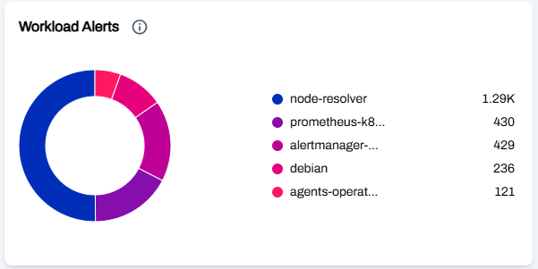
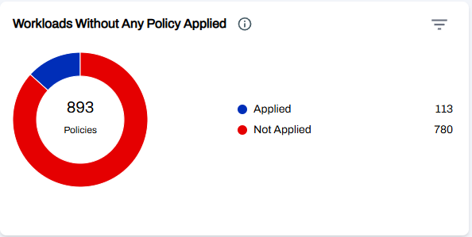
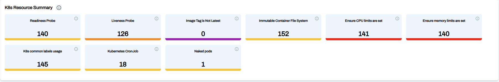
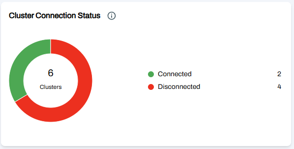
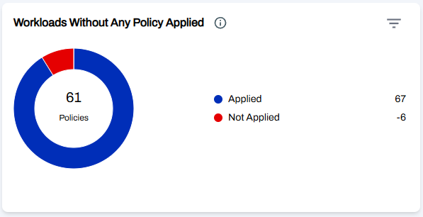
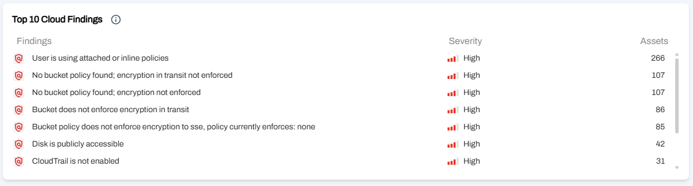
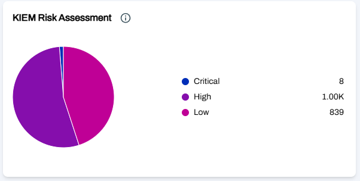
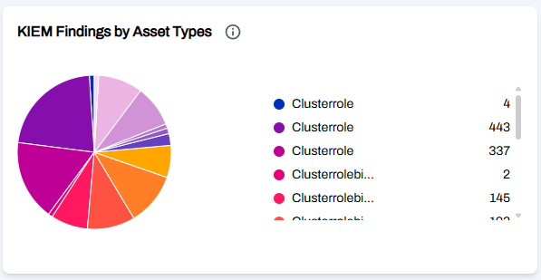
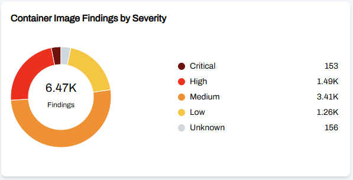

# AccuKnox CNAPP Dashboard Widgets

## **CWPP Widgets**

In CWPP, Accuknox has 32 widgets to visualize the findings. Some of them are shown below.

### **1. Top 5 cluster findings Widget**

This widget provides an overview of the top findings and the number of affected resources.

### **2. Findings by Asset Categories Widget**

This widget categorizes failed findings by asset type and includes severity details, aiding users in pinpointing which asset categories have severe issues that need immediate attention.

### **3. K8S Security Metrics Widgets**

This widget highlights key security metrics related to misconfigurations and vulnerabilities within your Kubernetes clusters, helping to identify and mitigate potential security risks.

### **4. Workload Alerts Widgets**

Workload Alerts shows us the alerts generated by each container or VM.

### **5. Workloads without any Policy Applied Widget**

This widget shows us the total number of workloads with policies and the number of workloads policies which do not have a policy applied. The widget allows filtering based on clusters.

### **6. K8s Resource SummaryWidget**

This widget displays key metrics related to resource limits, label usage, health checks, and best practices in your Kubernetes clusters.

### **7. Cluster Connection Status Widget**

This widget will show us the connection status of Clusters which are onboarded.

### **8. Workloads without Network Policies Widget**

This widget displays the number of workloads that lack network policies. The aim is to help users quickly identify potential security gaps where network policies are not enforced.

### **9. Top 5 K8s CIS Findings Widget**

This widget highlights the top 5 CIS benchmark related findings in your Kubernetes clusters, sorted by criticality and affected assets. It helps prioritize remediation to improve cluster security and compliance.

### **10. Block based Policies with Associated Alerts Widget**

This widget shows all the block based policies which are of high severity and have alerts associated.

## **CSPM**

**There are 5 widgets under the CSPM section**

### **1. Top 3 cloud accounts with failed controls Widget**

This widget will show the top 3 cloud accounts based on the highest number of failed controls.

### **2. Top 10 risk associated to cloud accounts Widget**

This widget assesses and prioritizes risks associated with IAM policies, S3 bucket, security groups, load balancers, etc... across your cloud accounts.

### **3. Findings Trends Widget**

Trend analysis showing the status of findings and their changes over time in the environment.

### **4. Cloud Accounts Widget**

This widget shows the number of cloud accounts on boarded on the AccuKnox platform and the status of their connection, i.e: Active/Inactive.

### **5. Findings Widget**

This widget shows us the total number of Findings along with top 3 asset categories that have the highest number of Findings associated with them.

## **KIEM**

**The KIEM section consists of 3 widgets**

### **1. Kiem Risk Assessment Widget**

This widget shows us the distribution of KIEM findings by criticality.

### **2. KIEM Findings by Asset type Widget**

This widget shows the distribution of KIEM findings by the type of assets they were identified in.

### **3. Top 5 most critical findings Widget**

This widget shows the most critical findings with the highest number of occurrences or assets affected for prioritization.

## **Cloud Misconfiguration Widget**

This section currently contains the following widgets

### **Cloud Account Risk Assessment Widget**

This widget shows the total number of checks that were performed and their result in a pie chart. This can be further filtered to include only the checks for specific cloud accounts.

## **Images Widgets**

This section consists of two widgets

### **1. Image Severity Distribution Widget**

This widget shows the total number of vulnerable images along with the severity level of the vulnerability identified in them. Eg. In the above image, there are 138 images identified to contain a critical vulnerability

### **2. Image Risk Assessment Widget**

This widget shows the total number of vulnerabilities identified in all the images along with the severity levels.

## **Tickets Widgets**

Here, the following widget exists for visualization.

### **Tickets by status Widget**

This widget shows us the total number of tickets generated for the findings along with their current status.
