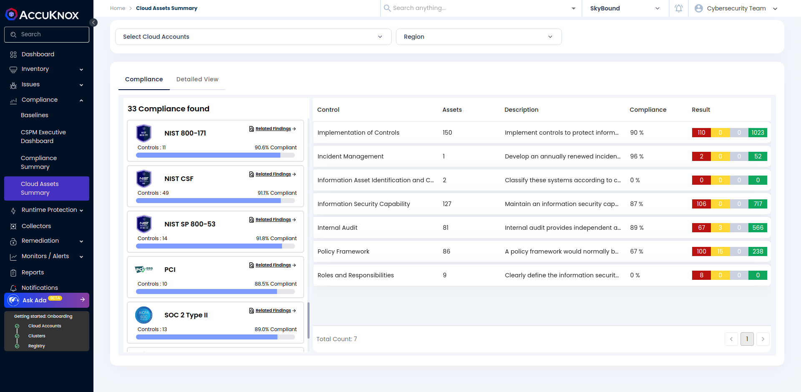
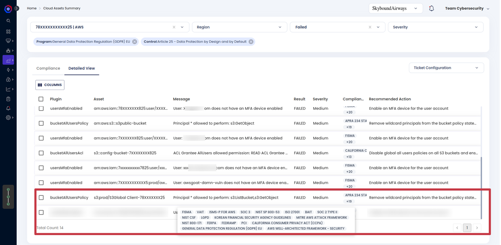

---
hide:
 - toc
---

# Compliance Posture with AccuKnox CSPM

CSPM Misconfigurations comes with more than 1,000 out-of-the-box compliance cheks that evaluate the configuration of your cloud resources and identify potential misconfigurations. Each compliance rule maps to one or more compliance programs and there sub-controls within a compliance standard or industry benchmarks.
Cloud security is a dynamic landscape, with ever-evolving threats and regulatory requirements. Compliance with various industry standards such as PCI DSS, HIPAA, GDPR, SOC, ISO, CIS, and many more are crucial for businesses across sectors. However, keeping track of these requirements and ensuring your cloud infrastructure aligns with them can be a daunting task.

This is where AccuKnox’s CSPM shines. There are over 30 new compliance programs, From healthcare to finance, retail to government, CSPM covers a wide range of industry-specific regulations, ensuring that your cloud environment meets the necessary security standards.

## View your compliance posture

View a high-level overview of your compliance posture for each framework on the Cloud Asset Summary page.

As soon as user onboards the cloud account and scan is done, User can navigate to the Compliance Section in Nav Bar and see the list of all compliance programs against which scan were done.
Each Compliance Program are divided into there Sub Controls and for each sub control user can see the percentage of compliance.

The percentage is calculated by the number of Passed Checks/Rules against the Total number of Passed, Failed, Warning and Not Available checks.

User can click on any Compliance Program or there Sub-control which will navigate to the list of misconfiguration. Further user can filter based on Cloud Account, Region, Severity, Checks, and many more on the **Detailed View** Tab.

-   **Compliance**: A  detailed report  that gives you insight into how you score against a framework’s requirements and rules.

-   **Detailed View**: A filtered view of the  **Misconfigurations**  page that shows resources with misconfigurations for the selected Compliance Program.

## Compliance Support Matrix

| AWS | Azure | GCP |
|-----|-------|-----|
1. APRA 234 STANDARD 2. AWS CIS Benchmark v 1 .4.0 3. AWS CIS Benchmark v 1 .5.0 4. AWS CIS Benchmark v 2.0.0 5. AWS Well-Architected Framework - Security 6. BAIT 7. California Consumer Privacy Act (CCPA) 8. COPPA 9. CSPM Encryption Program 10. FedRamp 11. FERPA 12. FISMA 13. General Data Protection Regulation (GDPR) EU 14. HIPAA 15. HITRUST CSF 16. ISMS-P for AWS 17. ISO 27001 18. ISO 27018 19. Korean Financial Security Agency Guidelines 20. LGPD 21. Mitre AWS Attack Framework 22. NIST 800-171 23. NIST CSF 24. NIST SP 800-53 25. PCI 26. SOC 2 Type II 27. SOC 3 28. VAIT  | 1. APRA 234 STANDARD 2. Azure CIS Benchmark v 2.0.0 3. Azure CIS Benchmark v 1.3.0 4. BAIT 5. California Consumer Privacy Act (CCPA) 6. COPPA 7. CSPM Encryption Program 8. FedRamp 9. FERPA 10. FISMA 11. General Data Protection Regulation (GDPR) EU 12. HIPAA 13. HITRUST CSF 14. ISO 27001 15. ISO 27018 16. Korean Financial Security Agency Guidelines 17. LGPD 18. ISO 27017 19. NIST 800-171 20. NIST CSF 21. NIST SP 800-53 22. PCI 23. SOC 2 Type II 24. SOC 3 25. VAIT | 1. APRA 234 STANDARD 2. BAIT 3. California Consumer Privacy Act (CCPA) 4. COPPA 5. CSPM Encryption Program 6. FedRamp 7. FERPA 8. FISMA 9. General Data Protection Regulation (GDPR) EU 10. HIPAA 11. HITRUST CSF 12. ISO 27001 13. ISO 27017 14. ISO 27018 15. Korean Financial Security Agency Guidelines 16. LGPD 17. NIST 800-171 18. NIST CSF 19. NIST SP 800-53 20. PCI 21. SOC 2 Type II 22. SOC 3 23. VAIT 24. GCP CIS Benchmarks V 1.2.O 25. GCP CIS Benchmarks V 2.0.0 |

