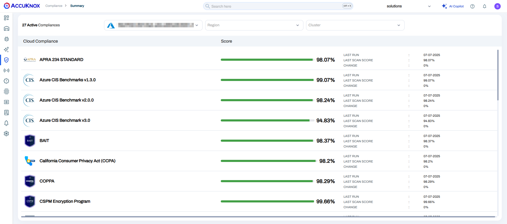
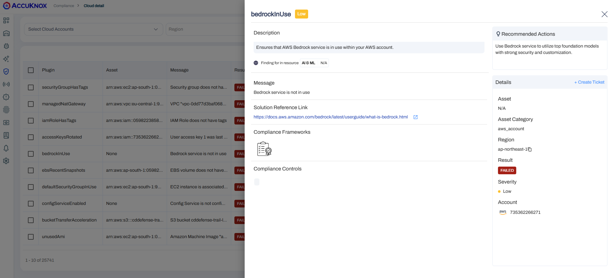

---  
hide:  
 - toc  
---  
  
# Compliance  
CSPM Misconfigurations comes with more than 1,000 out-of-the-box compliance cheks that evaluate the configuration of your cloud resources and identify potential misconfigurations. Each compliance rule maps to one or more compliance programs and there sub-controls within a compliance standard or industry benchmarks.
Cloud security is a dynamic landscape, with ever-evolving threats and regulatory requirements. Compliance with various industry standards such as PCI DSS, HIPAA, GDPR, SOC, ISO, CIS, and many more are crucial for businesses across sectors. However, keeping track of these requirements and ensuring your cloud infrastructure aligns with them can be a daunting task.

This is where AccuKnox’s CSPM shines. There are over 30 new compliance programs, From healthcare to finance, retail to government, CSPM covers a wide range of industry-specific regulations, ensuring that your cloud environment meets the necessary security standards. 

## View your compliance posture

View a high-level overview of your compliance posture for each framework on the Cloud Asset Summary page.

As soon as user onboards the cloud account and scan is done, User can navigate to the Compliance Section in Nav Bar and see the list of all compliance programs against which scan were done. 
Each Compliance Program are divided into there Sub Controls and for each sub control user can see the percentage of compliance. 

The percentage is calculated by the number of Passed Checks/Rules against the Total number of Passed, Failed, Warning and Not Available checks. 

User can click on any Compliance Program or there Sub-control which will navigate to the list of misconfiguration. Further user can filter based on Cloud Account, Region, Severity, Checks, and many more on the **Detailed View** Tab. 

-   **Compliance**: A  detailed report  that gives you insight into how you score against a framework’s requirements and rules.

-   **Detailed View**: A filtered view of the  **Misconfigurations**  page that shows resources with misconfigurations for the selected Compliance Program.


## Compliance Support Matrix
!!! Compliance

    === "AWS"

        ``` markdown
           1. APRA 234 STANDARD
           2. AWS CIS Benchmark v 1 .4.0
           3. AWS CIS Benchmark v 1 .5.0
           4. AWS CIS Benchmark v 2.0.0
           5. AWS Well-Architected Framework - Security
           6. BAIT
           7. California Consumer Privacy Act (CCPA)
           8. COPPA
           9. CSPM Encryption Program
           10. FedRamp
           11. FERPA
           12. FISMA
           13. General Data Protection Regulation (GDPR) EU
           14. HIPAA
           15. HITRUST CSF
           16. ISMS-P for AWS
           17. ISO 27001
           18. ISO 27018
           19. Korean Financial Security Agency Guidelines
           20. LGPD
           21. Mitre AWS Attack Framework
           22. NIST 800-171
           23. NIST CSF
           24. NIST SP 800-53
           25. PCI
           26. SOC 2 Type II
           27. SOC 3
           28. VAIT
        ```

    === "Azure"

         ``` markdown
           1. APRA 234 STANDARD
           2. Azure CIS Benchmark v 2.0.0
           3. Azure CIS Benchmark v 1.3.0
           4. BAIT
           5. California Consumer Privacy Act (CCPA)
           6. COPPA
           7. CSPM Encryption Program
           8. FedRamp
           9. FERPA
           10. FISMA
           11. General Data Protection Regulation (GDPR) EU
           12. HIPAA
           13. HITRUST CSF
           14. ISO 27001
           15. ISO 27018
           16. Korean Financial Security Agency Guidelines
           17. LGPD
           18. ISO 27017
           19. NIST 800-171
           20. NIST CSF
           21. NIST SP 800-53
           22. PCI
           23. SOC 2 Type II
           24. SOC 3
           25. VAIT
         ```

    === "GCP"

         ``` markdown
           1. APRA 234 STANDARD
           2. BAIT
           3. California Consumer Privacy Act (CCPA)
           4. COPPA
           5. CSPM Encryption Program
           6. FedRamp
           7. FERPA
           8. FISMA
           9. General Data Protection Regulation (GDPR) EU
           10. HIPAA
           11. HITRUST CSF
           12. ISO 27001
           13. ISO 27017
           14. ISO 27018
           15. Korean Financial Security Agency Guidelines
           16. LGPD
           17. NIST 800-171
           18. NIST CSF
           19. NIST SP 800-53
           20. PCI
           21. SOC 2 Type II
           22. SOC 3
           23. VAIT
           24. GCP CIS Benchmarks V 1.2.O
           25. GCP CIS Benchmarks V 2.0.0
         ```

