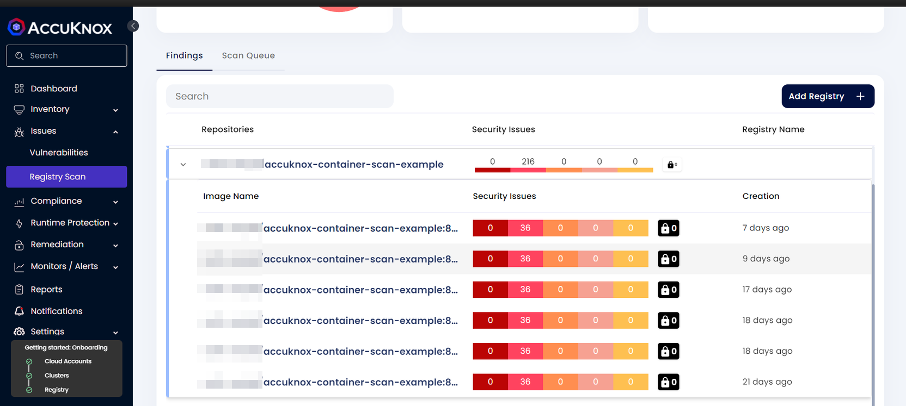
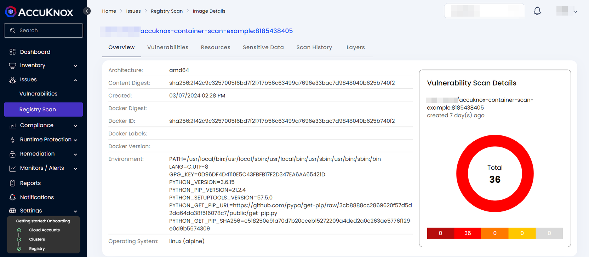
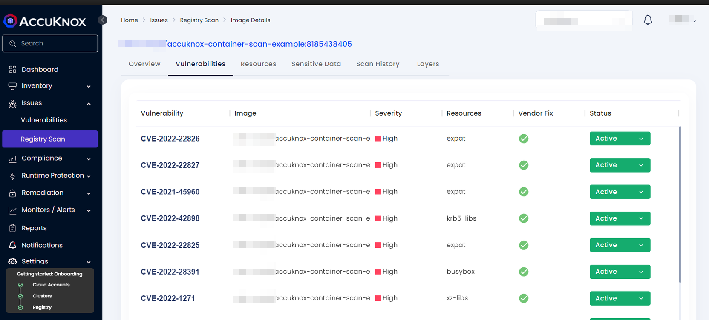
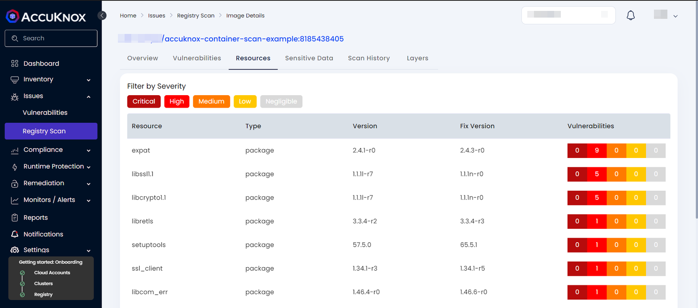
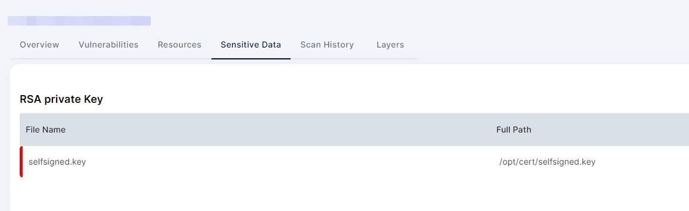
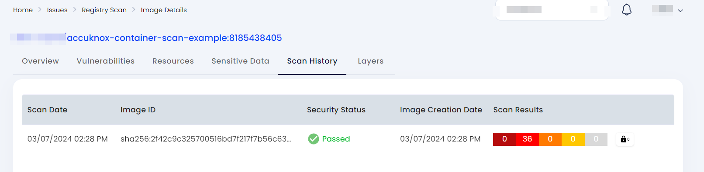

# How to do ASPM Container Scan

To show how incorporating AccuKnox into a CI/CD pipeline with GitHub Actions can improve security, let's look at a detailed example involving a Docker image that initially had known vulnerabilities. By running AccuKnox scanning in the pipeline, we can find and fix these vulnerabilities before deploying the image. The following narrative illustrates this process by comparing the situations before and after adding AccuKnox, as seen in the GitHub Actions logs.

**Check it out on GitHub Marketplace**: [here](https://github.com/marketplace/actions/accuknox-container-scan)

## Scenario Before Integrating AccuKnox

**Context:** We started with a Docker image built from a Dockerfile using an outdated base image (node:10.4) that contained many known security vulnerabilities. Using this old base image unintentionally introduced many security weaknesses into the Docker image.


**Dockerfile Example:**
```dockerfile
FROM node:10.4
# Further configuration and setup of the image
```

**Hypothetical GitHub Actions Log - Pre AccuKnox Scan:**
```
Building Docker image...
Image built successfully: your-image:latest
Pushing your-image:latest to Docker Hub...
Image pushed successfully.
```

Before using AccuKnox, our Docker image was sent to the registry without any vulnerability checks. This oversight could allow vulnerable images to be deployed, opening up potential security risks.

## Scenario After Integrating AccuKnox

**Enhancing the GitHub Actions Workflow:** We then added a step to our GitHub Actions workflow to run the AccuKnox vulnerability scan on the newly built Docker image.

**Updated GitHub Actions Workflow Snippet (Incorporating AccuKnox Scan):**


```yaml
      - name: Run AccuKnox CSPM Scan
        uses: accuknox/container-scan-action@v0.0.1
        with:
          token: ${{ secrets.TOKEN }}
          tenant_id: ${{ secrets.TENANT_ID }}
          repository_name: ${{ github.repository }}
          exit_code: 1
          dockerfile_context: Dockerfile
```


**GitHub Actions Log - Post AccuKnox Integration:**

```
Building Docker image...
Image built successfully: your-image:latest
Scanning your-image:latest with AccuKnox...
2023-01-01T00:00:00.000Z INF Scanning /path/to/your-image:latest
2023-01-01T00:00:05.000Z INF Number of language-specific files: 1
2023-01-01T00:00:10.000Z INF Detected vulnerabilities for your-image:latest
2023-01-01T00:00:10.000Z INF CRITICAL: 10 vulnerabilities
2023-01-01T00:00:10.000Z INF HIGH: 20 vulnerabilities
AccuKnox scan failed due to the presence of critical vulnerabilities.
```

AccuKnox carefully analyzed the image and found critical and high-severity vulnerabilities. Based on these findings, the workflow stopped and prevented the vulnerable image from being pushed to the Docker registry.

## Remediation and Rescan

**Fortifying the Dockerfile:** After seeing the vulnerabilities, we updated the Dockerfile to use a newer, more secure base image (node:14.17) instead, in order to fix the security issues.

**Dockerfile Post-Update:**
```dockerfile
FROM node:14.17
# Additional image enhancements and setup
```

**GitHub Actions Log - After Remediation:**
```
Building Docker image...
Image built successfully: your-image:latest
Scanning your-image:latest with AccuKnox...
2023-01-02T00:00:00.000Z INF Scanning /path/to/your-image:latest
2023-01-02T00:00:05.000Z INF Number of language-specific files: 1
2023-01-02T00:00:10.000Z INF No critical vulnerabilities found.
Image scan passed successfully.
Pushing your-image:latest to Docker Hub...
Image pushed successfully.
```

Once the vulnerabilities were resolved, the AccuKnox scan approved the updated image, allowing it to be safely pushed to the registry. This example clearly shows how important it is to have vulnerability scanning in the pipeline - it prevents insecure images from being deployed to production, ensuring only secure images make it through.

## Steps needed to be taken for integration:

**Step 1:** User needs to create a GitHub workflow file inside their GitHub repository using the following workflow Template:


```yaml
name: AccuKnox Scan Workflow

on:
  push:
    branches:
      - main
  pull_request:
    branches:
      - main

jobs:
  accuknox-cicd:
    runs-on: ubuntu-latest
    steps:
      - name: Checkout code
        uses: actions/checkout@main

      - name: Run AccuKnox container scan
        uses: accuknox/container-scan-action@v0.0.1
        with:
          token: ${{ secrets.TOKEN }}
          tenant_id: ${{ secrets.TENANT_ID }}
          repository_name: ${{ github.repository }}
```


Note: In the above template, the user needs to change some variables, including `TOKEN` and `TENANT_ID`. Values for these variables can be viewed from AccuKnox SaaS. For other inputs, refer to [AccuKnox Container Scan - GitHub Marketplace](https://github.com/marketplace/actions/accuknox-container-scan) to get the other input details according to your use case.

**Step 2:** Now, when a user attempts to create a pull request from their repository, the workflow will be triggered, performing the necessary steps for scanning and posting the results to AccuKnox SaaS.

Note: The user can configure the workflow according to their needs, setting it to trigger on events such as push, pull, etc.

**Step 3:** Once the scan is complete, the user will be able to go into the AccuKnox SaaS and navigate to `Issues → RegistryScan` where they can find their repository name and select it to see the findings associated with it.



**Step 4:** After clicking on the image name, the user will be able to see the metadata for the image that was built during the workflow execution.



**Step 5:** In the `Vulnerabilities` section, the user can see the image-specific vulnerabilities in a list manner that contains relevant information. These findings will also be available in `Issues → Vulnerabilities` section where the user can manage these findings with others as well.



**Step 6:** The `Resources` section contains the information about packages and modules that were used to build the code base into a container image.



**Step 7:** The `Sensitive Data` section contains the information about any secrets or credentials that might be exposed in the image.



**Step 8:** The user can see the scan history of every scan that happened while creating a Pull Request of the GitHub repo.


