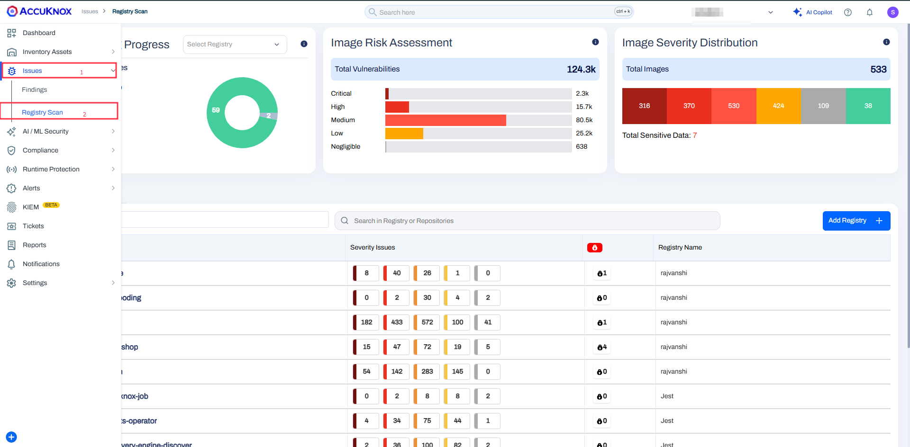
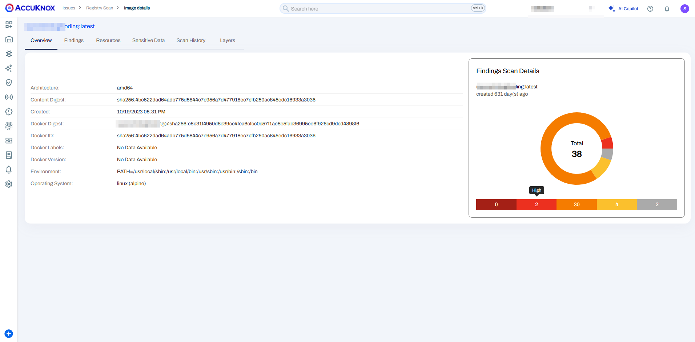
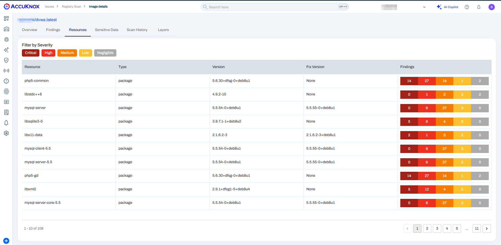
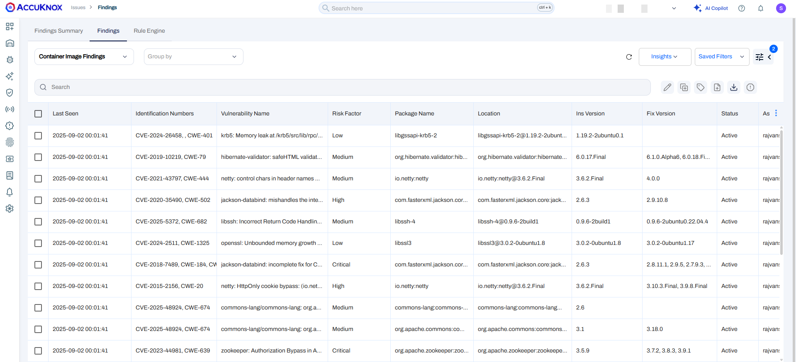
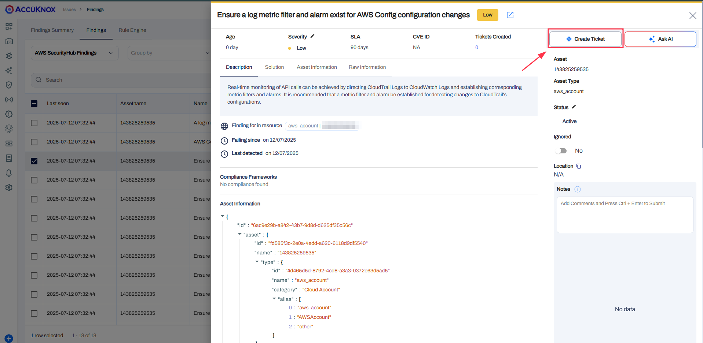
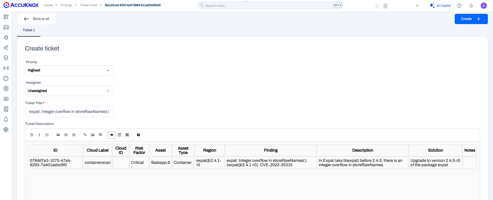

# Detecting and Blocking Vulnerable Docker Images with AccuKnox Container Scanning

This guide demonstrates how to integrate AccuKnox's container scanning into a CI/CD pipeline using GitHub Actions. The integration enables automated vulnerability detection and policy enforcement for container images, ensuring that insecure artifacts are never deployed to production environments.

By embedding AccuKnox container scans in your DevSecOps workflows, security validation becomes an automated gatekeeper, enabling early detection of vulnerabilities, rapid remediation, and compliance with security best practices.

## Scenario

Imagine a development team building a Node.js web application using an outdated base image (`node:18-alpine`). This image includes multiple known vulnerabilities. Without scanning, the image is pushed to production, exposing the system to exploitation. By integrating AccuKnox scanning into the CI/CD pipeline, these risks can be identified and blocked before deployment.

## Objective

This guide shows how to:

- Detect container vulnerabilities using AccuKnox's GitHub Actions plugin.
- Prevent deployment of insecure Docker images.
- Automate the scanning process for every code push or pull request.
- View scan results in the AccuKnox SaaS dashboard.
- Remediate vulnerabilities and verify fixes.

## Steps Overview

1. **Setup**
2. **Integrate AccuKnox's GitHub Action in CI/CD**
3. **Understand the risks before integration**
4. **Compare benefits after integration**
5. **Explore the AccuKnox SaaS dashboard**
6. **Remediate detected issues and rescan**
7. **Verify security posture improvements**

## Setup

Here's a Dockerfile using an outdated and vulnerable Node.js base image:

```sh
FROM node:18-alpine
# Additional setup commands
```

This image includes known CVEs. Without a security scan, these vulnerabilities would go unnoticed. When the image is built and pushed:

```sh
Building Docker image...
Image built successfully: your-image:latest
Pushing your-image:latest to Docker Hub...
Image pushed successfully.

```

At this stage, there's no safeguard preventing the release of insecure code.

### GitHub Actions Workflow Integration (AccuKnox Container Scan)

Now, let's integrate AccuKnox's container scan into the GitHub Actions workflow.

### Create a GitHub Actions workflow at `.github/workflows/container.yml`



```yaml
name: AccuKnox Scan Workflow

on:
  push:
    branches:
      - all

jobs:
  accuknox-cicd:
    runs-on: ubuntu-latest
    steps:
      - name: Checkout code
        uses: actions/checkout@main

      - name: Build Docker image
        run: |
          IMAGE_NAME="github-action-test"
          IMAGE_TAG="latest"
          docker build -t "$IMAGE_NAME:$IMAGE_TAG" .
          echo "Successfully built Docker image: $IMAGE_NAME:$IMAGE_TAG"

      - name: "Run Accuknox Container"
        uses: accuknox/container-scan-action@1.0.0
        with:
          endpoint: "<ACCUKNOX_ENDPOINT>"
          tenant_id: <ACCUKNOX_TENANT_ID>
          token: ${{ secrets.ACCUKNOX_TOKEN }}
          label: <ACCUKNOX_LABEL>
          image: "github-action-test"
          tag: "latest"
```


### Explanation

- **Build Docker Image**:
    - Sets `IMAGE_NAME` to `github-action-test` and `IMAGE_TAG` to `latest`.
    - Builds a Docker image from the Dockerfile in the repo.
    - Tag the image as `github-action-test:latest`.

- **Run AccuKnox Container Scan**:
    - Uses `AccuKnox Container Scan` to scan the built Docker image.
    - Sends scan data to `cspm.demo.accuknox.com` with the given `tenant_id` and secret `token`.
    - Applies a label `"SPOC"` for identification.
    - Scans the image tagged as `github-action-test:latest`.

## Before Integration
Without security automation:
- Vulnerable images are unknowingly pushed to production.
- Developers rely on manual checks or periodic scans.
- Security issues are detected late, increasing remediation costs.
- No centralized vulnerability tracking or compliance validation.

## After Integration

With AccuKnox integrated:
- Every push or pull request triggers a vulnerability scan.
- Insecure builds are blocked automatically.
- Findings are centralized in the AccuKnox dashboard.
- Developers are alerted in real-time and can act quickly.
- Continuous compliance with security baselines is maintained.


## Viewing Findings on AccuKnox SaaS

After a scan:

1. Log in to [AccuKnox SaaS](https://cloud.accuknox.com/ "https://cloud.accuknox.com/").

2. Navigate to **Issues → RegistryScan**.


3. Locate your repository and click on the scanned image.

4. Explore metadata, vulnerability list, and scan history.


### Vulnerabilities Tab

- Displays CVEs and affected packages.
- Includes severity (CRITICAL, HIGH, etc.) and remediation advice.


### Sensitive Data Tab

- Highlights secrets or credentials leaked into the image.

### Resources Tab

- Lists all software components, libraries, and dependencies detected.


### Remediating the Vulnerability

#### Create a Ticket

- You can **create a ticket directly from AccuKnox Findings** by integrating your organization's ticketing system (**Jira**, **ServiceNow**, etc.) with AccuKnox.

- This ensures vulnerabilities detected during scans are **automatically or manually ticketed** for tracking and resolution.

- Refer to the integration guide for setup:
  🔗 [**AccuKnox Jira Cloud Integration Guide**](https://help.accuknox.com/integrations/jira-cloud/ "https://help.accuknox.com/integrations/jira-cloud/")

- To create the ticket, go to Issues > Findings and select Container Image Findings to see identified vulnerabilities.


- Click on a vulnerability to view more details


- Create a Ticket for Fixing the Vulnerability


#### Fix the Code

Update the Dockerfile to a secure base image

#### Re-Scan

Push the code or re-run the workflow manually:

GitHub Actions will:

- Rebuild the image.

- Trigger the AccuKnox scan.

- Upload findings again to the SaaS portal.

#### Verification

Return to the AccuKnox dashboard:

- Confirm that previous CVEs are marked resolved.

- Ensure that new scan reports show "No Critical Vulnerabilities."

## Conclusion

Integrating AccuKnox's ASPM container scan into your CI/CD pipeline provides real-time, automated protection against known vulnerabilities. This shift-left security approach ensures that only hardened, production-ready images reach your container registry.

Benefits include:

- Faster feedback loops for developers.

- Stronger security posture.
