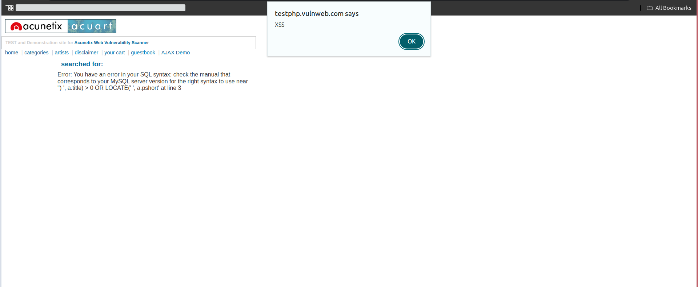
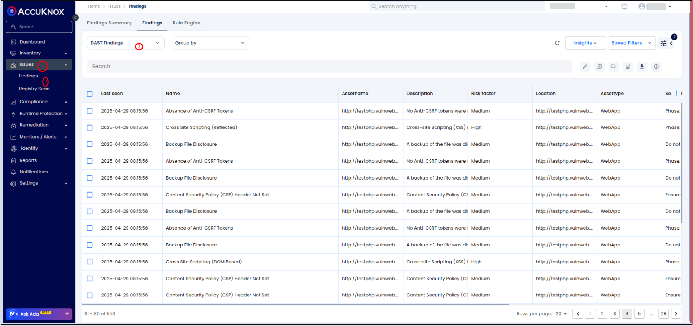

# Automated XSS Detection and Remediation with AccuKnox DAST

This guide demonstrates how to integrate **AccuKnox's DAST (Dynamic Application Security Testing) Scanner** into a **CI/CD pipeline** to automatically detect and remediate **Cross-Site Scripting (XSS)** vulnerabilities in web applications. By embedding security testing into the development workflow, organizations can proactively prevent exploitation of client-side injection flaws before they reach production.

🔗 **Check it out on GitHub Marketplace:** [**AccuKnox DAST Scanner**](https://github.com/marketplace/actions/accuknox-dast "https://github.com/marketplace/actions/accuknox-dast")

## Scenario: Real-World Attack Example

Imagine an attacker exploiting an XSS vulnerability on a live application. Our simulation will target a test environment using <http://testphp.vulnweb.com/>, a deliberately vulnerable web application. An attacker injects a malicious script payload (`<script>alert('XSS')</script>`) into a user input field, causing an unsuspecting visitor's browser to execute arbitrary JavaScript.

Such vulnerabilities can lead to session hijacking, sensitive data theft, or full account takeover.

## Objective

The purpose of this guide is to:

- Detect XSS vulnerabilities early using **AccuKnox DAST**.

- Automate **security validation** in the development pipeline.

- Reduce manual testing efforts and **prevent security breaches** before deployment.

## Tools

- **AccuKnox** -- CNAPP platform

- **GitHub Actions** -- CI/CD platform (similar to GitLab CI, Jenkins, etc.)

## Steps Overview

Here's a high-level overview of what we will implement:

- **Manual Setup**: Manually identify an XSS vulnerability.

- **Integrate DAST into GitHub Actions**: Automatically find vulnerabilities.

- **Before vs After Integration**: Understand the value gained by proactive security.

- **Viewing Findings**: Analyze results on the AccuKnox SaaS dashboard.

- **Remediation Workflow**: Fix issues, create tickets, and verify remediation.

### 1. Setup: Manual Identification of XSS

1.  Open <http://testphp.vulnweb.com/>.

2.  Locate a vulnerable input field (e.g., search bar, feedback form).

3.  Inject the payload:

    `<script>alert('XSS')</script>`

4.  Submit the form.

If the injected script executes and you see an alert pop-up saying "XSS", the site is vulnerable.


### 2. GitHub Actions Workflow Integration (AccuKnox DAST)

Now let's automate detection using **GitHub Actions**.

Create a GitHub Actions workflow at `.github/workflows/dast.yml`:


```yaml
name: AccuKnox DAST Scan Workflow

on:
  push:
    branches:
      - dast

jobs:
  tests:
    runs-on: ubuntu-latest
    steps:
      - name: Checkout code
        uses: actions/checkout@main

      - name: Accuknox DAST
        uses: accuknox/dast-scan-action@v1.0.0
        with:
          accuknox_token: ${{ secrets.ACCUKNOX_TOKEN }}
          accuknox_endpoint: ${{ secrets.ACCUKNOX_ENDPOINT }}
          tenant_id: ${{ secrets.ACCUKNOX_TENANT_ID }}
          label: ${{ secrets.ACCUKNOX_LABEL }}
          target_url: "http://testphp.vulnweb.com/"
          scan_type: "full-scan"
```


### 3. Before Integration: Challenges and Risks

Without integrating security scanning into CI/CD:

- Vulnerabilities go undetected until post-deployment.

- Attack surface grows over time.

- Manual pentesting becomes a bottleneck.

- Longer fix cycles after vulnerabilities are exploited.

### 4. After Integration: Benefits

After automating DAST scans with AccuKnox:

- **Immediate feedback** allows developers to fix issues faster.

- **Reduced time-to-fix** XSS and other vulnerabilities.

- **Continuous improvement** of your security posture.


### 5. Viewing Findings on AccuKnox SaaS

After a scan completes:

1.  Log into **AccuKnox** and navigate to **Issues → Findings**.

2.  Filter by **Data Type: DAST Scan** and search for the findings related to your repository.


1.  Review:

    - **Vulnerabilities Detected**: Including the XSS issue.

    - **Severity Ratings**: Critical, High, Medium, Low.

    - **Evidence**: Request/Response details showing the injected payload behavior.


**Tip**: Use the filtering options to prioritize Critical and High vulnerabilities first.

### 6. Remediating the Vulnerability

#### 6.1 Create a Ticket

- You can **create a ticket directly from AccuKnox Findings** by integrating your organization's ticketing system (**Jira**, **ServiceNow**, etc.) with AccuKnox.

- This ensures vulnerabilities detected during scans are **automatically or manually ticketed** for tracking and resolution.

- Refer to the integration guide for setup:
  🔗 [**AccuKnox Jira Cloud Integration Guide**](https://help.accuknox.com/integrations/jira-cloud/ "https://help.accuknox.com/integrations/jira-cloud/")


#### 6.2 Fix the Code

- Developers sanitize user inputs (e.g., using HTML escaping libraries).

- Implement input validation and output encoding best practices.

**Example in JavaScript**:

```js
function sanitizeInput(input) {
  return input.replace(/</g, "&lt;").replace(/>/g, "&gt;");
}
```

#### 6.3 Re-Scanning

- Trigger the GitHub Action for the DAST scan.

- Monitor if the XSS issue is no longer detected.

#### 6.4 Verification

- In AccuKnox SaaS, check the latest scan.

- Confirm the previous vulnerability has disappeared from the findings list.

- Mark the Jira ticket as **Resolved**.

## Conclusion

By integrating **AccuKnox DAST Scanning** into your CI/CD workflows, you achieve:

- **Fast and automatic detection** of XSS and other vulnerabilities.

- **Proactive security validation** at every stage of development.

- **Reduced risk** of web application breaches and compliance failures.

Integrating security into the pipeline ensures that vulnerabilities like XSS are caught early, remediated quickly, and prevented from ever reaching your production environments.
