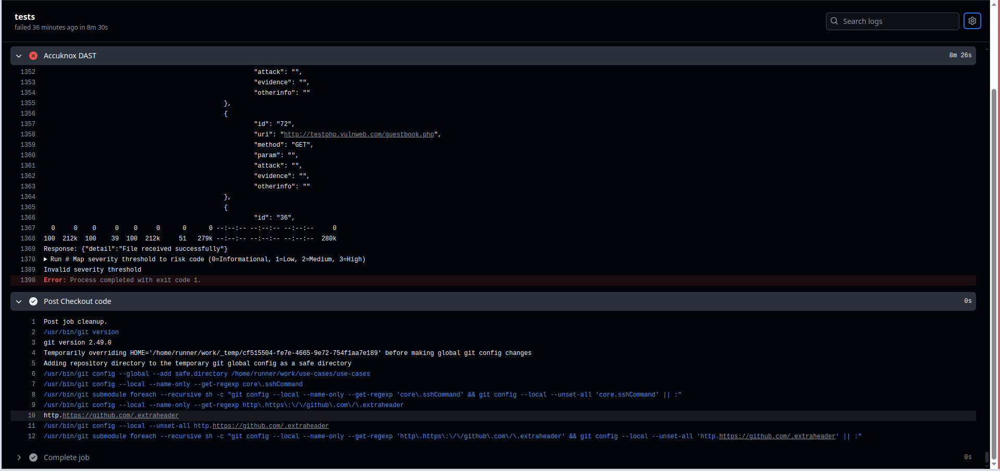

# DAST-Driven XSS Mitigation

Dynamic Application Security Testing (DAST) is an essential strategy for identifying vulnerabilities in live applications. This documentation demonstrates how AccuKnox can detect cross site scripting attack using DAST, and how you can remediate the cross site scripting vulnerability.

## Attack Scenario

In this example, we've used the [vulnweb.com](http://vulnweb.com/ "http://vulnweb.com"). It's a collection of vulnerable web applications for educating developers on the security vulnerabilities. On <http://testphp.vulnweb.com/> try pasting the following payload in the search box:

``````

The script gets injecting in the web page and you see an alert like this:


This vulnerability enables an attacker to execute arbitrary JavaScript code in the victim's browser, allowing them to steal sensitive data, hijack user sessions, or distribute malware to other users through a cross-site scripting attack.

## Integrating the Application with AccuKnox

To identify such vulnerabilities, the application can be integrated with AccuKnox's DAST scanning capabilities. This requires modifying the CI/CD pipeline to include AccuKnox's DAST integration.

Add the following stages to your CI/CD pipeline:

```yaml
stages:
  - DAST
  - upload-report

DAST:
  stage: DAST
  image: docker:latest
  services:
    - docker:dind
  script:
    - docker run --rm -v $(pwd):/zap/wrk -t zaproxy/zap-stable zap-baseline.py -t $SCAN_URL -J report.json -I
  artifacts:
    paths:
      - report.json

upload-report-to-accuknox:
  stage: upload-report
  image: curlimages/curl:latest
  dependencies:
    - DAST
  script:
    - |
      curl --location --request POST "https://$ACCUKNOX_URL/api/v1/artifact/?tenant_id=$TENANT_ID&label_id=dast&data_type=ZAP&save_to_s3=true" \
            --header "Tenant-Id: $TENANT_ID" \
            --header "Authorization: Bearer $ACCUKNOX_TOKEN" \
            --form "file=@report.json"
```

Once the scan is completed, users can view the security findings in the AccuKnox UI.


For more details you can click on the finding:


AccuKnox not only identifies vulnerabilities but also provides solutions for them. Additionally, you can create a ticket directly from the AccuKnox UI by simply clicking the "Create Ticket" button


After the Jira ticket is created, it can be assigned to a developer who will work on resolving the vulnerability. Once the vulnerability is fixed, it won't be detected in the next scan.
