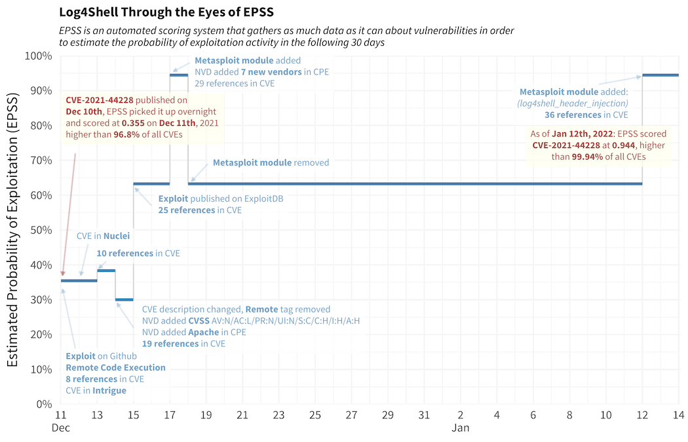

# Vulnerability Management with EPSS, CVSS, and CWE

## **Introduction to EPSS**

The **Exploit Prediction Scoring System (EPSS)** was developed by the **Forum of Incident Response and Security Teams (FIRST)** to provide a **predictive, data-driven score** for each vulnerability based on its likelihood of being exploited. Unlike CVSS, which primarily assesses the **severity** of a vulnerability, EPSS calculates the **probability** of exploitation. This is done by using a **machine learning model** that incorporates real-time data from multiple sources such as:

- **Exploit databases** (e.g., **Exploit-DB**, **Metasploit**)

- **Threat intelligence feeds**

- **Historical exploitation data**

- **Contextual information from security researchers**

## **The Limitations of CVSS**

The **Common Vulnerability Scoring System (CVSS)** is a widely used model that calculates the severity of a vulnerability based on factors like **attack complexity**, **impact on confidentiality**, **integrity**, and **availability**. While CVSS helps determine how dangerous a vulnerability is in theory, it doesn't answer how likely it is to be exploited in real-world scenarios. CVSS provides a **static severity score** but fails to incorporate the dynamic nature of real-world attacks.

- **False sense of security**: A vulnerability with a high CVSS score may not necessarily be exploited, especially if exploit code is not publicly available or if specific conditions need to be met for the exploit to work.

- **Ignoring threat intelligence**: CVSS does not consider the evolving nature of attack techniques or the availability of exploit tools that can simplify attacks.

## **How EPSS Complements CVSS**

EPSS adds an additional layer of **predictive analytics**, focusing not just on **how severe a vulnerability is** but also on **how likely it is to be actively exploited** in the short term. By analyzing data points such as the **availability of public exploits**, **exploitability in common attack chains**, and **historical exploitation trends**, EPSS provides a more comprehensive, real-time picture of risk.

| **Metric**               | **CVSS (Common Vulnerability Scoring System)**        | **EPSS (Exploit Prediction Scoring System)**              |
|--------------------------|-------------------------------------------------------|-----------------------------------------------------------|
| **Maintainer**           | FIRST                                                 | FIRST                                                     |
| **Score Range**          | 0-10                                                  | 0%-100%                                                   |
| **Score Meaning**        | Reflects the severity of a vulnerability               | Indicates the likelihood of a vulnerability being exploited within the next 30 days |
| **Data Sources**         | Based on base, temporal, and environmental metrics, which are incorporated into the score | Uses a variety of data sources, including historical vulnerability data and real-time exploit information |
| **Updates**              | Last updated in CVSS 3.1                              | Scores are updated daily through a machine learning-driven process; the model itself is periodically updated |

Consider a CVE in the **Apache Log4j** vulnerability (CVE-2021-44228). This vulnerability initially had a high CVSS score due to its severe impact on systems, but its **EPSS score** was even higher, reflecting the **urgency** with which it was being actively exploited. Security teams worldwide rushed to patch it due to its high likelihood of being targeted by attackers.

The **EPSS timeline for CVE-2021-44228 (Log4Shell)** begins in early December 2021, before the CVE was officially published on December 10. During this period, EPSS was unaware of the vulnerability. On December 11, EPSS initially recorded a score of 0.355, as the CVE was published with 8 URLs listed as references. By December 15, when the exploit code was published to ExploitDB, the EPSS score increased to 0.633. The score jumped to 0.944 on December 17 after a Metasploit module was added. However, when the Metasploit module was removed on December 18, the score dropped back to 0.633. The score stabilized at 0.944 on January 12, 2022, when a new Metasploit module was added.

Instead of solely relying on CVSS scores to prioritize vulnerabilities by severity, integrating EPSS allows you to focus on those with both high severity and a high likelihood of exploitation. This helps target the most immediate threats, ensuring more effective risk mitigation.

However, **EPSS does not account for additional environmental factors** or estimate the impact of a vulnerability if exploited. As stated by the EPSS Special Interest Group (SIG), it "is not, and should not be treated as a complete picture of risk." While EPSS is not fully transparent for closer evaluation, it remains a valuable tool to assess the risk posed by vulnerabilities and should be considered as one of the risk factors in prioritization decisions.

## **Enhancing Vulnerability Prioritization with CWE**

The Common Weakness Enumeration (CWE) is an essential resource for categorizing software and hardware weaknesses. Maintained by MITRE, CWE serves as an extensive glossary, helping security professionals systematically identify and address potential weaknesses before they lead to security issues. Entries like CWE-20 (Input Validation), CWE-125 (Out-of-Bounds Read), CWE-79 (Cross-Site Scripting), and CWE-200 (Information Disclosure) give insight into different types of vulnerabilities that could affect software security.

With CWEs, you not only understand the nature of a vulnerability but also have a framework for managing risks in web applications and other software systems. When time and resources are limited, prioritizing these weaknesses effectively becomes essential for targeted, high-impact risk mitigation.

### Key CWE Resources for Prioritization

- **CWE Top 25 Most Dangerous Software Weaknesses**
    A community-ranked list of the most common, high-impact software weaknesses, based on severity and exploitation potential. It's ideal for quickly identifying critical vulnerabilities when time is limited, prioritizing those with serious potential impact.

- **CWE Top 10 KEV (Known Exploited Vulnerabilities)**
    Highlights the most actively exploited CWEs from CISA's KEV Catalog, representing urgent risks. Prioritize these vulnerabilities to address known, real-world threats effectively.

## Integrating CWE, CVSS, and EPSS for Comprehensive Risk Assessment

For a holistic approach to vulnerability management, integrating CWE with CVSS and EPSS allows teams to assess vulnerabilities by severity, exploit likelihood, and underlying weakness. Prioritizing CWE weaknesses from the **CWE Top 25** and **CWE Top 10 KEV** lists provides additional weight to the most critical weaknesses:

- **CWE + CVSS**: Mapping CVSS scores to CWEs identifies which weaknesses lead to high-severity vulnerabilities, helping to prioritize those that pose the greatest potential impact.

- **CWE + EPSS**: Combining EPSS predictions with CWE classifications highlights weaknesses most likely to be exploited in real-world scenarios. Vulnerabilities with both high EPSS and CVSS scores, especially if they fall within CWE Top 25 or Top 10 KEV, should receive immediate attention.

**Example**: For a vulnerability with a high CVSS and EPSS score, if it's associated with a CWE from the Top 25 or KEV lists---such as CWE-79 (Cross-Site Scripting) or CWE-89 (SQL Injection)---it signals an urgent need for remediation.

Integrating CWE classifications with CVSS and EPSS scores provides a robust, structured approach to vulnerability prioritization. CWEs add a layer of context, helping teams understand not just the severity and likelihood of exploitation, but also the nature and cause of vulnerabilities. By addressing these weaknesses at their root, security teams can improve application security, reduce the recurrence of issues, and ensure more efficient risk management.
