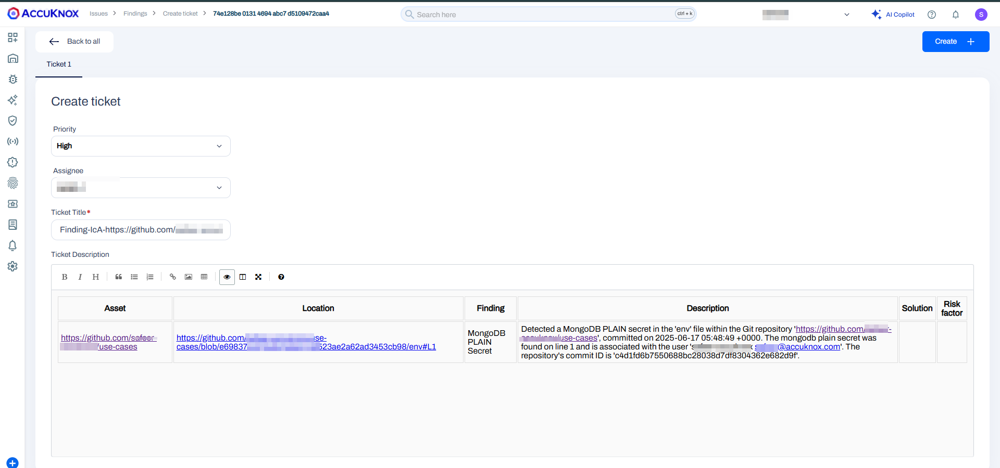

# GitHub Actions: Integrating AccuKnox Secret Scanning

This guide explains how to integrate **AccuKnox Secret Scanning** into your **GitHub Actions CI/CD** workflow. The integration detects hardcoded secrets and sensitive data in your codebase, forwarding findings to the **AccuKnox** platform for centralized analysis and remediation.

## Pre-requisites

- GitHub repository with Actions enabled

- AccuKnox platform access

## Steps for Integration

### Step 1: Generate AccuKnox API Token

Log in to AccuKnox. Navigate to Settings and select Tokens to create an AccuKnox token to forward scan results to SaaS. For details on generating tokens, refer to [How to Create Tokens](https://help.accuknox.com/how-to/how-to-create-tokens/?h=token "https://help.accuknox.com/how-to/how-to-create-tokens/?h=token").

### Step 2: Configure GitHub Secrets

Define the following secrets in GitHub. For details on configuring the secrets/variables, refer to [Using secrets in GitHub Actions](https://docs.github.com/en/actions/security-for-github-actions/security-guides/using-secrets-in-github-actions).

- **ACCUKNOX_TOKEN**: AccuKnox API token for authorization.

- **ACCUKNOX_TENANT**: Your AccuKnox tenant ID.F

- **ACCUKNOX_ENDPOINT**: The AccuKnox API URL (e.g., [cspm.demo.accuknox.com](http://cspm.demo.accuknox.com/ "http://cspm.demo.accuknox.com/")).

- **ACCUKNOX_LABEL**: The label for your scan.

### Step 3: GitHub Actions Workflow Setup

Create or edit `.github/workflows/secret-scan.yml`:



```yaml
name: AccuKnox Secret Scan Workflow

on:
  push:
    branches:
      - secret

jobs:
  tests:
    runs-on: ubuntu-latest
    steps:
      - name: Checkout code
        uses: actions/checkout@main

      - name: AccuKnox Secret Scan TEST
        uses: accuknox/secret-scan-action@v1.0.1
        with:
          token: ${{ secrets.ACCUKNOX_TOKEN }}
          tenant_id: ${{ secrets.ACCUKNOX_TENANT }}
          label: "SPOC"
          endpoint: "cspm.demo.accuknox.com"
          fail: true
          use_extended_ruleset: false
```



## Inputs for AccuKnox Secret Scan Action

| Input Name                | Description                                                                                                                | Optional/Required | Default Value            |
| ------------------------- | -------------------------------------------------------------------------------------------------------------------------- | ----------------- | ------------------------ |
| **token**                 | The token for authenticating with the CSPM panel.                                                                          | Required          | None                     |
| **tenant_id**             | The ID of the tenant.                                                                                                      | Required          | None                     |
| **label**                 | The label created in AccuKnox SaaS.                                                                                        | Required          | None                     |
| **endpoint**              | The URL of the CSPM panel to push the scan results to.                                                                     | Required          | `cspm.demo.accuknox.com` |
| **secret_scan_type**      | Source type for scanning (`git`, `huggingface`, `s3`).                                                                     | Required          | `git`                    |
| **branch**                | Branch to scan. Use branch name or `all-branches`.                                                                         | Optional          | `HEAD` branch            |
| **exclude-paths**         | Paths to exclude from the scan.                                                                                            | Optional          | None                     |
| **args**                  | Additional arguments to pass to the CLI.                                                                                   | Optional          | None                     |
| **dataset**               | Dataset name (required if `secret_scan_type` is `huggingface`).                                                            | Optional          | None                     |
| **huggingface_token**     | Hugging Face token (required if `secret_scan_type` is `huggingface`).                                                      | Optional          | None                     |
| **bucket_name**           | S3 bucket name (required if `secret_scan_type` is `s3`).                                                                   | Optional          | None                     |
| **aws_access_key_id**     | AWS Access Key ID (required if `secret_scan_type` is `s3`).                                                                | Optional          | None                     |
| **aws_secret_access_key** | AWS Secret Access Key (required if `secret_scan_type` is `s3`).                                                            | Optional          | None                     |
| **use_extended_ruleset**  | Enable extended regex rules for detecting sensitive data.                                                                  | Optional          | `false`                  |
| **results**               | Specifies which result types to output: `verified`, `unknown`, `unverified`, `filtered_unverified`. Defaults to all types. | Optional          | `all`                    |
| **fail**                  | Fail the pipeline if secrets are found.                                                                                    | Optional          | `false`                  |
| **upload_artifact**       | Upload scan results as an artifact.                                                                                        | Optional          | `true`                   |

## Before Integration

Without secret scanning in place, your GitHub workflow may unknowingly allow hardcoded credentials---like API keys or passwords---to be pushed to the repository, increasing the risk of sensitive data exposure

## After Integration

AccuKnox Secret Scanning will run on every push, detecting hard-coded secrets and sensitive information. The findings are sent to AccuKnox for review and remediation. Only the scan results are uploaded, not the sensitive data.


## View Results in AccuKnox SaaS

**Step 1**: Navigate to the Accuknox SaaS dashboard after the pipeline completes.

**Step 2**: Go to **Issues** > **Findings** and select **Secret Scan Findings** to see identified vulnerabilities.


### Step 3: Review Detected Secrets

Examine the list of identified hardcoded secrets and sensitive information.


### Step 4: Address Findings

For each finding, create a task in your issue-tracking system, advising secret rotation and the use of a secure secret management solution. Once resolved, mark the issue as fixed in the AccuKnox platform.



## Conclusion

Integrating **AccuKnox Secret Scanning** in GitHub Actions provides an automated layer of security to identify and resolve exposed secrets early in the dev lifecycle, reducing risk and improving compliance posture.
