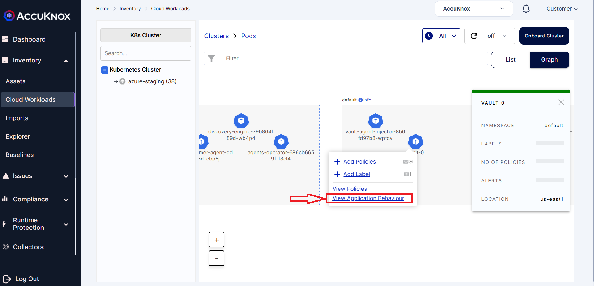
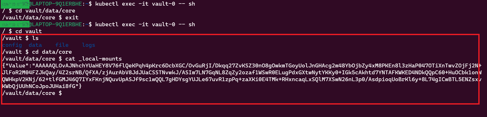
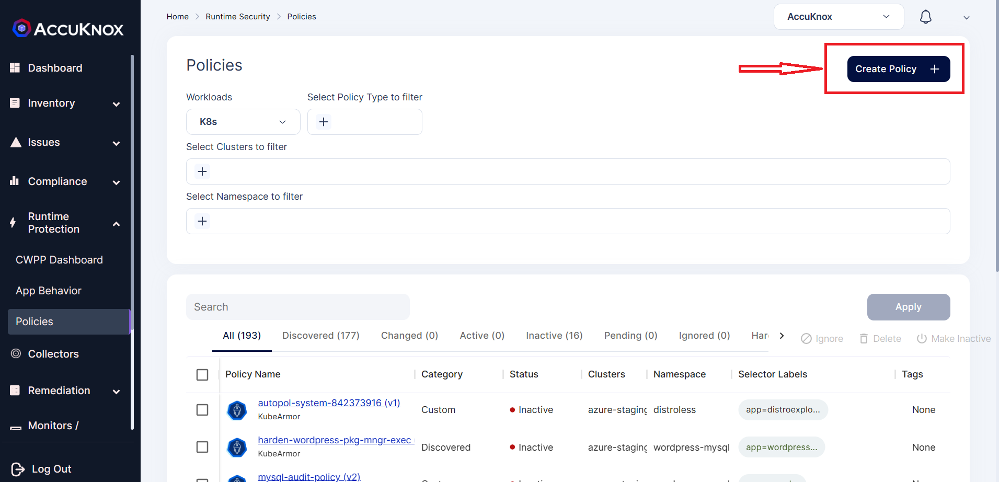
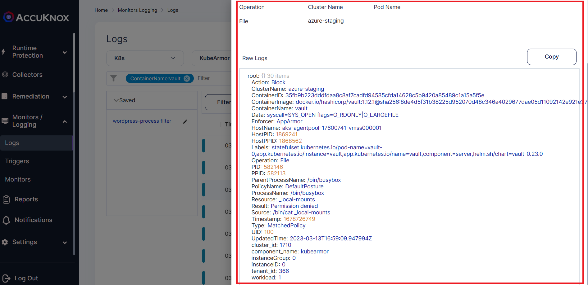

# Harshicorp Vault protection via Runtime Security

HashiCorp Vault helps organizations reduce the risk of breaches and data exposure with identity-based security automation and encryption as a service. When HashiCorp Vault is deployed in the Kubernetes cluster, Customer secrets are kept in a persistent volume mounted in a vault-* stateful sets/pods

Usually on /bin/vault accesses this volume mount points to get the secrets stored. If any ransomware attacker gets access to these volume mount points then the secrets can be accessed by them.


**Ransomware Attacks on HashiCorp Vault:**

If any ransomware attacker tries to compromise the security of the pod and gets access to the vault pod, they can do a command injection and encrypt the secrets stored in the Volume mount points. Then the organizations have to pay millions of dollars to get back their secrets decrypted. This will be a major challenge that organizations want to protect.


**KubeArmor Protection:**

AccuKnox CNCF sandbox open-source project KubeArmor can prevent this type of attack even before it happens. KubeArmor uses the eBPF for observability and LSMs Like AppArmor, SELinux, and BPF-LSM for policy enforcement. Using the eBPF, KubeArmor monitors the workload default Security Posture and also gets the file, process, and network access that are happening in the pod.


Based on the default Security Posture of the workload, policies will be auto-generated with the help of Compliance frameworks like MITRE, NIST, CIS and PCI DSS. Using KubeArmor we can apply policies to restrict malicious activities like remote code execution and command injection at the time of the attack. KubeArmor gives inline remediation so that attack is prevented at the runtime as and when it happens.

**Steps to prevent the attack:**

Once the Kubernetes cluster with Vault application installed is onboarded into the AccuKnox SaaS. We can see the Application Behaviour by clicking the View Application Behaviour option from the Vault pod.



**Application Behaviour of Vault pod:**

**Graphical View:**

Using this Graphical view we can get details about the ingress and egress network connections that are present in the pod.


**List view:**

The list view will be giving details regarding

+ File Observability: Files that are accessed in the Vault pod


+ Process Observability:Process that are running in the vault pod


We can protect the vault application using KubeArmor with the help of the following policy

```sh
apiVersion: security.kubearmor.com/v1
kind: KubeArmorPolicy
metadata:
  name: ksp-vault-protect
  namespace: default
spec:
  severity: 7
  selector:
    matchLabels:
      app.kubernetes.io/name: vault
      component: server
  file:
    matchDirectories:
      - dir: /vault/
        recursive: true
        action: Block
      - dir: /
        recursive: true
      - dir: /vault/
        recursive: true
        fromSource:
          - path: /bin/vault
  process:
    matchPaths:
    - path: /bin/busybox
    - path: /bin/vault
  action: Allow
```

The above KubeArmor policy

+ Allows only /bin/vault process to access /vault/ folder.

+ Allows execution of specific processes like
  + /bin/vault

  + /bin/vault-tool

**Before Applying policy:**

Before Applying the kubeArmor Policy any ransomware attacker who gains access to the shell or bash of the Vault can able to access the vault folder to get secret details.



**Applying the KubeArmorPolicy:**

**Step 1:** To create the policy Navigate to *Runtime Protection→Policies*. Then select *Create Policy* option from the screen.



**Step 2:** In the policy, editor tool create the above policy and Select Save to workspace option.


**Step 3:** When we apply the policy, it goes into the pending state for approval.


**Step 4:** Review the changes and approve the policy


**Step 5:** After Approval policy becomes active


**Step 6:** Now if you try to access the vault folder using the shell or bash of the vault pod, the access will be denied as the KubeArmor policy deny the permission.


**Step 7:** We can view the log alerts by navigating to the *Monitors/Logging→ logs*



This will save the Volume mount of the HashiCorp Vault to be accessed by any attacker and also it prevents the vault application from remote code execution via AccuKnox's inline remediation.

- - -
[SCHEDULE DEMO](https://www.accuknox.com/contact-us){ .md-button .md-button--primary }
