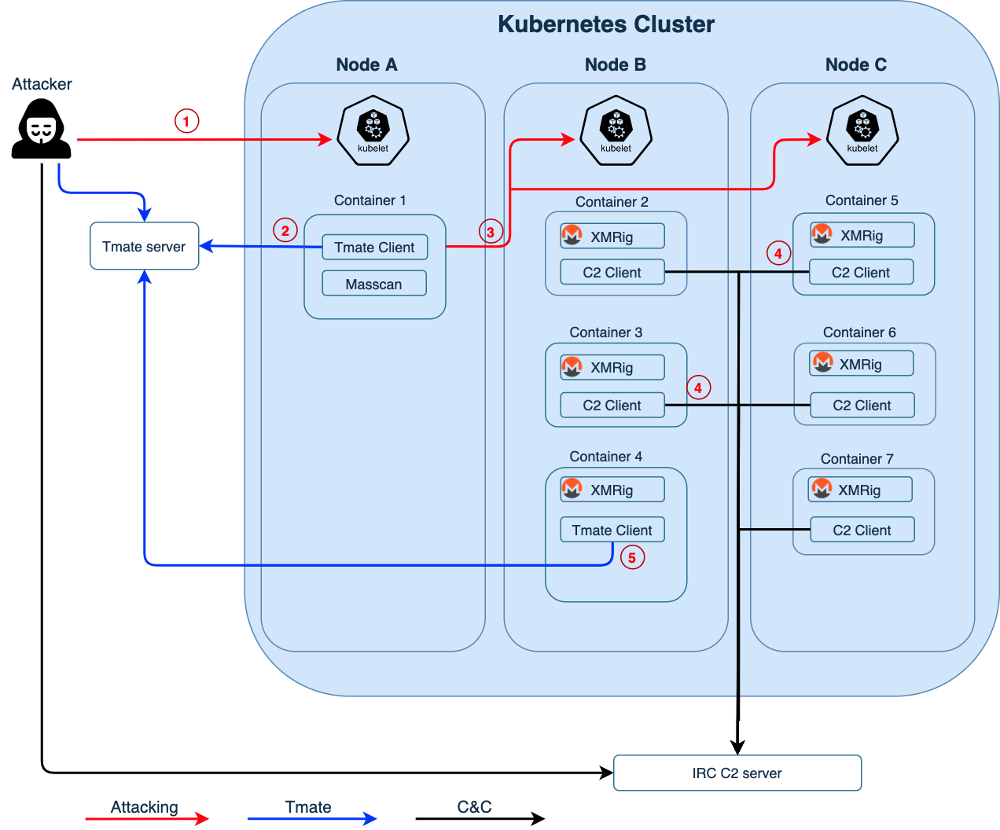

# Detecting and Mitigating Hildegard Attacks with AccuKnox

## **Introduction**

In a Kubernetes cluster, several attack vectors become possible through the combination of multiple vulnerabilities in the environment. These become the basis for the Hildegard attack to succeed:

- **Vulnerabilities in Container Image**

  - Malicious Container images pushed to registry which gets deployed on hosts

  - Cryptomining [<a href="https://intezer.com/blog/malware-analysis/teamtnt-cryptomining-explosion/" target="_blank">Ref</a>]

  - Embedded Secrets

  - SSH Keys, AWS Credentials, Github Tokens, NPM tokens, etc.

  - Proxy Avoidance, and many more..

- **Difficulty of implementing Runtime Security**

  - Rogue container reconnaissance

  - Malicious RCE at runtime or Unknown process exec

  - Lateral Movement (writable volume mount points on hosts, service account exploitation, etc.)

  - Credential Theft (exposure of service account token, credential in config files, write into volume mount point)

  - Execution (maliciousexec into containers, malicious container spin-up, etc.)

- **Modern attack vectors are complex and could target Linux Kernel Exploits**

  - [<a href="https://attack.mitre.org/techniques/T1496/" target="_blank">Resource Hijacking</a>] [T1496] for cryptocurrency attacks

- **Spaghetti of Access Controls**

  - Privilege Escalation via unused service account token, write to root certificate bundles etc.

## **Exploit**



1. The attacker started by exploiting an unsecured Kubelet on the internet and searched for containers running inside the Kubernetes nodes. After finding container 1 in Node A, the attacker attempted to perform remote code execution (RCE) in container 1.
2. The attacker downloaded tmate and issued a command to run it and establish a reverse shell to tmate • Instant terminal sharing from container 1. The attacker then continued the attack with this tmate session.
3. From container 1, the attacker used masscan to scan Kubernetes's internal network and found unsecured Kubelets in Node B and Node C. The attacker then attempted to deploy a malicious crypto mining script (xmr.sh) to containers managed by these Kubelets (containers 2-7).
4. Containers that ran xmr.sh started an xmrig process and established an IRC channel back to the IRC C2.
5. The attacker could also create another tmate session from one of the containers (container 4). With the reverse shell, the attacker could perform more manual reconnaissance and operations.

## **Protection**

Let us see how AccuKnox offers multiple layers of protection against this attack:

### Layer 1

The attacker gains access to the misconfigured kubelet that has anonymous access enabled. Then he makes API calls using the service account token present in the container.

```sh
# cat /run/secrets/kubernetes.io/serviceaccount/token
# curl https://$KUBERNETES_PORT_443_TCP_ADDR/api --insecure --header \
 "Authorization: Bearer $(cat /run/secrets/kubernetes.io/serviceaccount/token)"
```

To prevent this, AccuKnox can restrict access to the service account tokens to only the processes that require them using the below policy:

```sh
apiVersion: security.accuknox.com/v1
kind: KubeArmorPolicy
metadata:
 name: ksp-wordpress-sa-block
 namespace: wordpress-mysql
spec:
 severity: 7
 selector:
 matchLabels:
 app: wordpress
 file:
 matchDirectories:
 - dir: /run/secrets/kubernetes.io/serviceaccount/
 recursive: true
 action:
 Block
```

The above policy makes sure that no process is allowed access to the serviceaccount as this wordpress container does not require it at runtime. Hence, we can make use of this policy to prevent anyone from gaining access to it.

### Layer 2

The attacker downloaded `tmate` and issued a command to run it, for securing a reverse shell.

This can be completely prevented by using a whitelisting policy that allows only the necessary processes to make use of network protocols such as the following:

```sh
apiVersion: security.kubearmor.com/v1
kind: KubeArmorPolicy
metadata:
  name: restrict-proccess
  namespace: default
spec:
  severity: 4
  selector:
    matchLabels:
      app: nginx
  network:
    matchProtocols:
    - protocol: tcp
      fromSource:
      - path: /usr/bin/wget
    - protocol: udp
      fromSource:
      - path: /usr/bin/wget
  action:
    Allow
```

The above policy will only allow `wget` to make use of the TCP and UDP network protocols. `tmate` will thus be denied access to use TCP and UDP.

A similar policy can be created for any container, listing only the allowed binaries. The creation of these policies is automated using AccuKnox SaaS via Discover Engine.

### Layer 3

After identifying the target, the attacker executes the malicious binaries using a known Linux process name(bioset) to avoid detection.

A FIM policy can be used by AccuKnox to make sure the binary files do not get modified.

```sh
apiVersion: security.kubearmor.com/v1
kind: KubeArmorPolicy
metadata:
  name: harden-mysql-file-integrity-monitoring
  namespace: wordpress-mysql
spec:
  action: Block
  file:
    matchDirectories:
    - dir: /sbin/
      readOnly: true
      recursive: true
    - dir: /usr/bin/
      readOnly: true
      recursive: true
    - dir: /usr/lib/
      readOnly: true
      recursive: true
    - dir: /usr/sbin/
      readOnly: true
      recursive: true
    - dir: /bin/
      readOnly: true
      recursive: true
    - dir: /boot/
      readOnly: true
      recursive: true
  message: Detected and prevented compromise to File integrity
  selector:
    matchLabels:
      app: mysql
  severity: 1
  tags:
  - NIST
  - NIST_800-53_AU-2
  - NIST_800-53_SI-4
  - MITRE
  - MITRE_T1036_masquerading
  - MITRE_T1565_data_manipulation
```

The above policy denies all write access inside the `/bin/`, `/sbin/` and `/boot/` directories to prevent the attacker from tampering with the processes.

### Layer 4

After successfully running `tmate`, `xmrig`, and `ziggy`, the attacker hides them using `LD_PRELOAD`. In particular, the malware overwrites two functions: `readdir()` and `readdir64()`, which are responsible for returning the directory entries in the file system. This blinds most of the observability tools and container monitoring solutions.

KubeArmor taps the process execution in kernel space and will still be able to identify these processes even after the `/etc/ld.so.preload` file is modified to hide them.

### Layer 5

Hildegard encrypts the malicious payload for IRC (ziggystartux ELF) to avoid being detected by automated static analysis tools. The ziggystartux ELF is encrypted and packed in another binary (ziggy). When the binary is executed, the ziggystartux ELF is decrypted by a hardcoded Advanced Encryption Standard (AES) key and executed in memory.

AccuKnox can whitelist only the required processes in a container. A sample policy that can be used:

```sh
apiVersion: security.kubearmor.com/v1
kind: KubeArmorPolicy
metadata:
  name: allow-specific-process
  namespace: default
spec:
  action: Allow
  file:
    matchDirectories:
      - dir: /
        recursive: true
  process:
    matchPaths:
      - path: /bin/bash
      - fromSource:
          - path: /bin/dash
        path: /bin/ping
      - fromSource:
          - path: /usr/sbin/apache2
        path: /bin/sh
      - path: /usr/sbin/apache2
  selector:
    matchLabels:
      app: dvwa-web
      tier: frontend
  severity: 1
```

The above policy only allows a few processes to be executed - `ping` and `apache2` other than the shells. Everything else gets denied, making sure that the payload will still get blocked from execution. These policies are auto-generated on the AccuKnox SaaS platform making it much easier to identify the required processes.

### **Key points**

- **Initial Access**: Misconfigured kubelet allows anonymous access

- Malware attempted to spread over as many containers as possible using service account tokens(Kubelet API) and eventually launched cryptojacking operations.

  - Service account token access is strictly controlled.

  - Allow only specific processes to access the service account token.

- **Two C&C conns**: Reverse `tmate` shell and IRC channel

  - Network access is allowed for known binaries only

- Uses a known Linux process name (bioset) to disguise the malicious process.

  - FIM disallows modifications in systems binary folder

- `LD_PRELOAD` to hide the malicious processes.

  - Process execution is tapped in kernel space

- Encrypts the malicious payload inside a binary to make automated static analysis more difficult

  - Process whitelisting and binary tracking audits all the events.

## **Summary**

Hildegard takes advantage of the different vulnerabilities caused by non-conformance with the best practices and understanding the loopholes behind the monitoring and security practices that are followed.

AccuKnox acts as an additional layer of protection helping protect against exploitation of these vulnerabilities. Operating at the kernel level also allows AccuKnox to cover the blindspots of the traditional solutions and provide a complete and layered security against the Hildegard attack.
