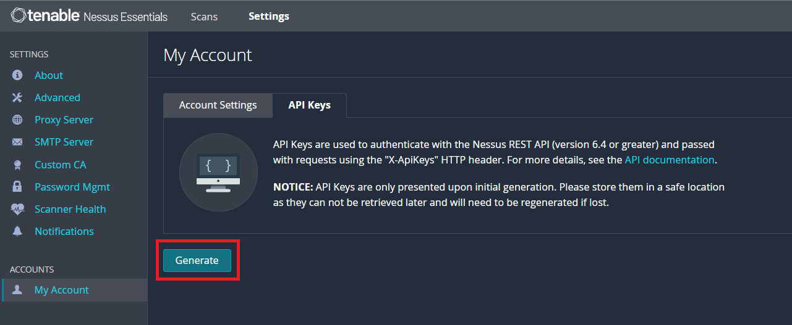

---
hide:
  - toc
---

AccuKnox provides host scanning capabilities through an integration with tools like Nessus, Masscan and Zeek.

Nessus is a remote security scanning tool for vulnerability scanning by Tenable. It is being used by IT Administration teams to scan for vulnerabilities in the workstations and servers, routers, and switches which are planted all over the network both in LAN as well as WAN. It is also leveraged by professionals for Penetration Testing and compliance.

Nessus is a very advanced tool for mainly highlighting server's configuration level, software level issues and missing security patches. For network devices it lists any configuration issues, outdated practice or patches required for improving security.

By integrating Nessus with AccuKnox, the following additional security capabilities are unlocked:

- Asset discovery of On-Prem Hosts And Network Devices

- Penetration Testing Reconnaissance

- Active Directory (AD) Checks

- Unsupported OS and Third-Party Software reports

- Network Infrastructure and Database Configuration Audits

- External Attack Surface Discovery

- Malware Scan

Thus, the integration allows AccuKnox to perform a deep scan of the On-Prem environment and provide a richer risk assessment, both for the Hosts and the Network Infrastucture. This integrates seamlessly into the platform along with the findings that AccuKnox provides out of the box for the Cloud Accounts and Workloads.

### Pre requisites for Nessus Integration

To integrate Nessus with AccuKnox, the Nessus scanner is required to be deployed securely in the target environment with the nessus port accessible by AccuKnox SaaS. To fetch the results from the Nessus deployment, AccuKnox requires the Nessus Deployment URL and the API keys.

To generate the API keys, switch to the **Settings** tab, navigate to **My Account** → **API keys** and click on **Generate**

Copy the Access and Secret keys that are generated for the integration.

### Asset Inventory

As Nessus scans all the hosts in the environment, the data is processed to improve the Asset Inventory of AccuKnox with additional data about the Hosts scanned through Nessus.

**Step 1**: Navigate to Inventory → Assets

**Step 2**: Filter using the **Label** name used for integrating Nessus to view only the assets that were identified using Nessus scanner and their associated findings.

### Vulnerability Management

The vulnerabilities found using Nessus are populated in the AccuKnox SaaS in addition to the findings from other tools for easy management on a single platform.

**Step 1**: Navigate to Issues → Vulnerabilities

**Step 2**: To view only the findings from Nessus, choose **Nessus** from the **Data Type** filter. 

This will list the issues identified by Nessus such as SSL certificate issues, vulnerable software versions in use, etc…

To learn more about how AccuKnox’s advanced Vulnerability Management can be leveraged, [refer here](./vulnerability.md)

AccuKnox can also leverage other tools such as Masscan and Zeek to provide host scanning. By integrating these tools, AccuKnox will be able to scan the on-premise environment and help in identifying issues on the hosts.

**Masscan** helps red teamers doing offensive research (penetration testing) as well as blue teamers and IT managers doing defensive research (to find attack vectors within the network).

**Zeek** is a Network Security Monitor (NSM) to support detection and investigations of suspicious or malicious activity. Zeek also supports a wide range of traffic analysis tasks beyond the security domain, including performance measurement and troubleshooting.