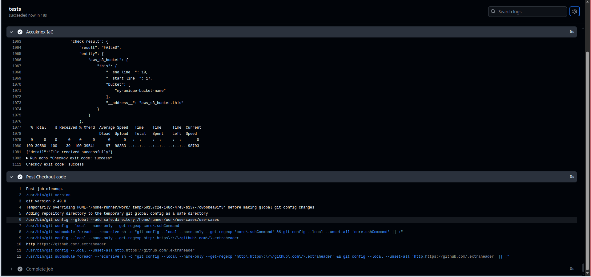
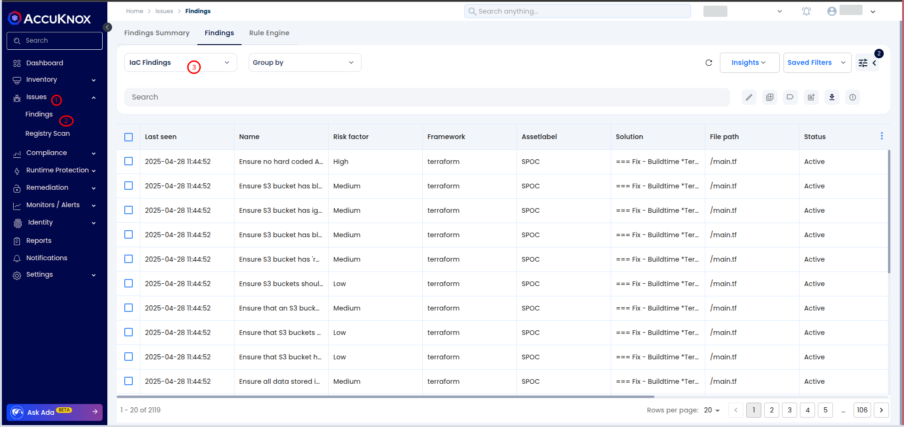
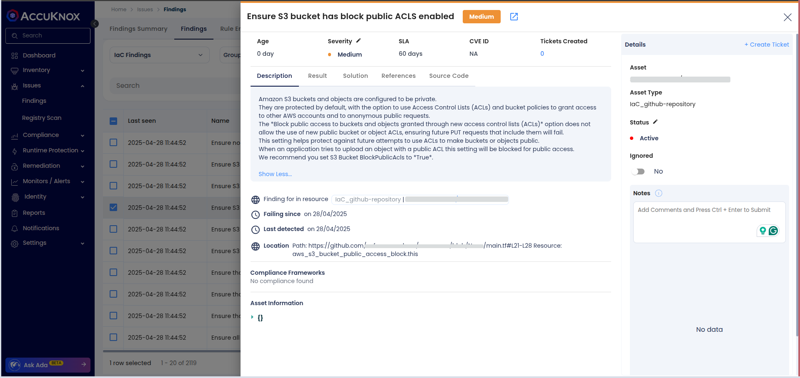
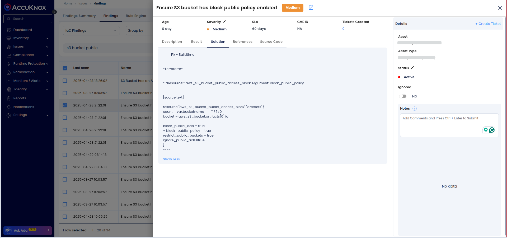
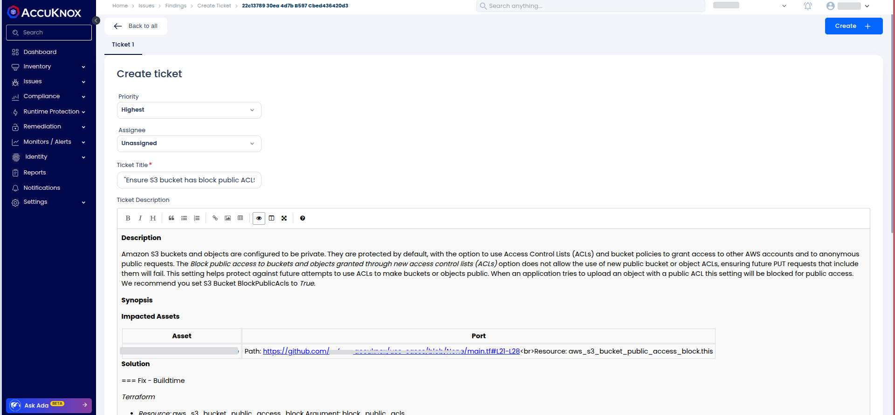

# Integrating AccuKnox IaC Scanning for AWS S3 Buckets in Your CI/CD Pipeline

This guide demonstrates how to integrate AccuKnox's IaC Scanner into a CI/CD pipeline to automatically detect and fix misconfigurations in Terraform projects.

🔗 **Check it out on GitHub Marketplace:** [**AccuKnox IaC Scanner**](https://github.com/marketplace/actions/accuknox-iac "https://github.com/marketplace/actions/accuknox-iac")

## Scenario

You manage AWS infrastructure using Terraform, including an S3 bucket for website hosting. Your GitHub Actions CI/CD pipeline automatically deploys changes. To enforce security best practices, you want to scan Terraform configurations before deployment.

## Objective

Integrate **AccuKnox IaC Scanner** into your CI/CD pipeline to identify and fix potential security misconfigurations, focusing on AWS S3 bucket security.

## Tools

- **AccuKnox** -- CNAPP platform

- **GitHub Actions** -- CI/CD platform (similar process for GitLab CI, Jenkins, etc.)

## Steps

### 1. Terraform Setup

Example Terraform code for creating an S3 bucket:

```hcl
resource "aws_s3_bucket" "my_bucket" {
  bucket = "my-unique-bucket-name"
  acl    = "public-read"

  website {
    index_document = "index.html"
    error_document = "error.html"
  }
}
```

### 2. GitHub Actions Workflow Integration

Create a GitHub Actions workflow at `.github/workflows/iac.yml`:


```yaml
name: AccuKnox IaC Scan Workflow

on:
  push:
    branches:
      - iac

jobs:
  tests:
    runs-on: ubuntu-latest
    steps:
      - name: Checkout code
        uses: actions/checkout@main

      - name: Accuknox IaC
        uses: accuknox/iac-scan-action@v0.0.1
        with:
          directory: ./
          output_file_path: ./results
          token: ${{ secrets.ACCUKNOX_TOKEN }}
          endpoint: ${{ secrets.ACCUKNOX_ENDPOINT }}
          tenant_id: ${{ secrets.ACCUKNOX_TENANT_ID }}
          label: ${{ secrets.ACCUKNOX_LABEL }}
          quiet: "true"
          soft_fail: true
```


### 3. Before Integration

Without the AccuKnox scan, insecure configurations like `acl = "public-read"` could be deployed without any warnings.

### 4. After Integration

Once AccuKnox is integrated:

- Every push or pull request triggers a security scan.

- Misconfigurations (e.g., public-read S3 buckets) are identified.

- Results are available under **Actions** → **Run IaC scan** in GitHub.

You can view:

- Which security checks passed or failed

- Detailed results are directly in the GitHub Action logs.



### 5. Viewing Findings on AccuKnox SaaS

- Log in to the AccuKnox SaaS platform.

- Navigate to **Issues → Findings**.

- Filter by **Data Type: IaC Scan**.



- Search for your repository or specific findings.

- Click on a finding for detailed information, remediation steps, and solutions.





### 6. Remediating Issues

#### 6.1 Create a Ticket

- You can **create a ticket directly from AccuKnox Findings** by integrating your organization's ticketing system (**Jira**, **ServiceNow**, etc.) with AccuKnox.

- This ensures vulnerabilities detected during scans are **automatically or manually ticketed** for tracking and resolution.

- Refer to the integration guide for setup:
  🔗 [**AccuKnox Jira Cloud Integration Guide**](https://help.accuknox.com/integrations/jira-cloud/ "https://help.accuknox.com/integrations/jira-cloud/")



#### 6.2 Fix the Code

- After fixing the vulnerability, rerun the pipeline.

- Navigate to the AccuKnox dashboard and verify that the vulnerability has been resolved.

## Conclusion

Integrating AccuKnox IaC Scans into your CI/CD pipeline helps:

- Catch misconfigurations early.

- Maintain security best practices.

- Ensure a faster, safer deployment process.
