# Integrating IaC Scanning for AWS S3 Buckets into Your CI/CD Pipeline

To provide a practical demonstration of using AccuKnox for a CI/CD scan, let's go through a detailed use case involving a Terraform project. AccuKnox IaC Scanner is a tool designed to identify misconfigurations in Infrastructure as Code (IaC) files, such as those written for Terraform, Kubernetes and more. It helps in enforcing best practices and security guidelines.

**Check it out on GitHub Marketplace**: [here](https://github.com/marketplace/actions/accuknox-iac)

## Scenario

You are responsible for maintaining an AWS infrastructure managed through Terraform. Your project includes an S3 bucket designed to host a website. The CI/CD pipeline is set up to automatically deploy changes pushed to your Git repository. You want to ensure that any changes meet security best practices and do not introduce any misconfigurations.

## Objective

Integrate AccuKnox into the CI/CD pipeline to automatically scan the Terraform code for potential security issues, specifically focusing on the S3 bucket configuration.

## Tools

- **Terraform** for infrastructure management.
- **AccuKnox** for IaC Scanning.
- **GitHub Actions** as the CI/CD platform (though the process is similar for other platforms like GitLab CI, Jenkins, etc.).

## Steps

### 1. Initial Setup

Your Terraform code for creating an S3 bucket is as follows:



```terraform
resource "aws_s3_bucket" "my_bucket" {
  bucket = "my-unique-bucket-name"
  acl    = "public-read"

  website {
    index_document = "index.html"
    error_document = "error.html"
  }
}
```



### 2. CI/CD Pipeline Integration

To integrate AccuKnox scans into your GitHub Actions workflow, set up a `.github/workflows/terraform.yml` file in your repository with the following content:



```yaml
name: AccuKnox IaC Scan Workflow

on:
  push:
    branches:
      - main
  pull_request:
    branches:
      - main
permissions:
  contents: read
  security-events: write

jobs:
  tests:
    runs-on: ubuntu-latest
    steps:
      - name: Checkout code
        uses: actions/checkout@main

      - name: Run IaC scan
        uses: accuknox/iac-scan-action@v0.0.1
        with:
          directory: ./
          output_file_path: ./results
          token: ${{ secrets.TOKEN }}
          endpoint: "cspm.dev.accuknox.com"
          tenant_id: ${{ secrets.TENANT_ID}}
          quiet: "true"
          soft_fail: "true"
```



### 3. Before AccuKnox Scan

Initially, the CI/CD pipeline does not include the AccuKnox scan. When you push the above Terraform code, it gets deployed without any security checks, potentially exposing sensitive data due to the public-read ACL setting on the S3 bucket.

### 4. After AccuKnox Scan Integration

After integrating AccuKnox into your CI/CD pipeline, the next push triggers the GitHub Actions workflow. The AccuKnox scan identifies the misconfiguration with the S3 bucket:

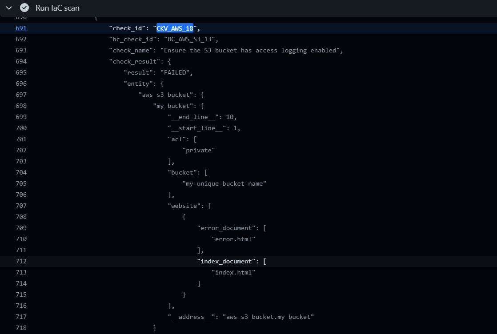
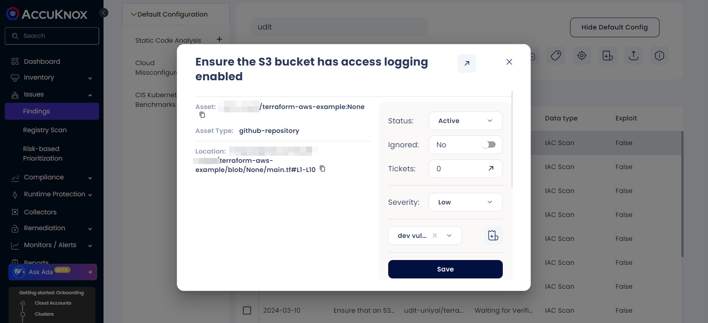

#### Under Github Actions

Go into Actions; under "All Workflows," you will be able to see all the instances when the workflow ran and the results that were sent over to the AccuKnox SaaS platform.

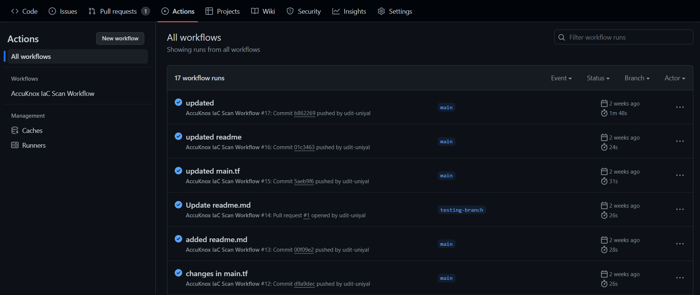

Click on the latest workflow run, and you will be able to see all the steps that were executed under the workflow.

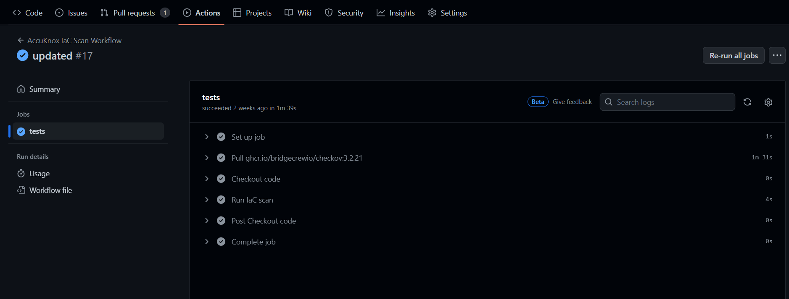

Under Workflow there is "Run IaC scan" step, clicking on the "Run IaC scan” user will be able to see the scan results, including which checks have failed or passed.

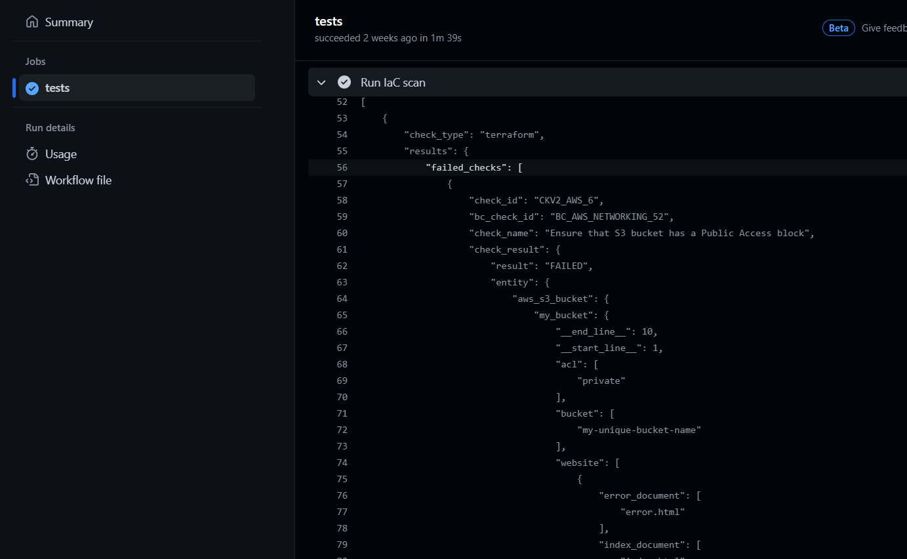

The image below shows the check for CKV_AWS_18:


#### Under AccuKnox SaaS

Once the scan is complete, users will be able to go into the AccuKnox SaaS platform and navigate to Issues → Findings, where they can find misconfigurations in their Infrastructure as Code.

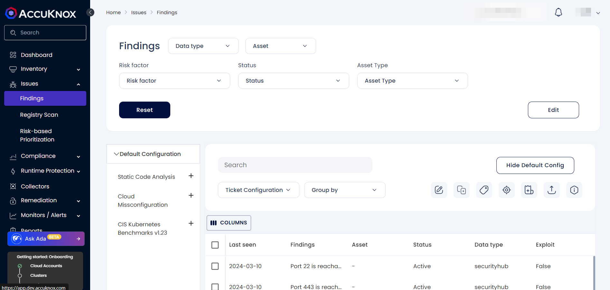

The user needs to select "IaC Scan" from the data type filter next to the findings.

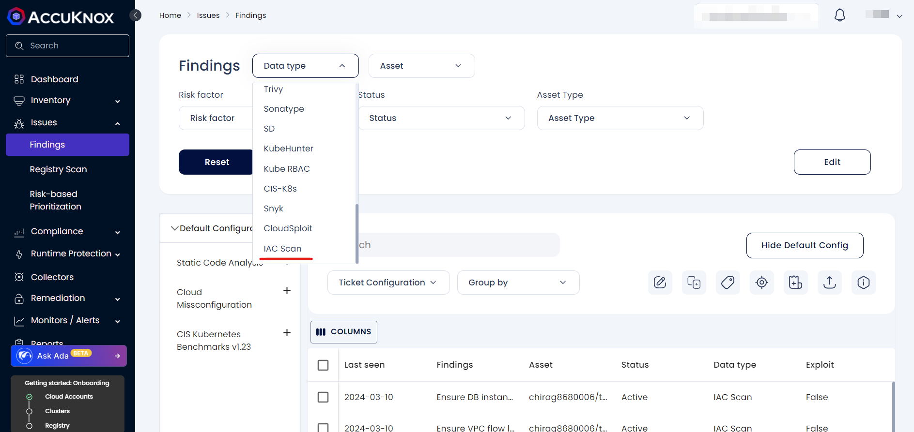
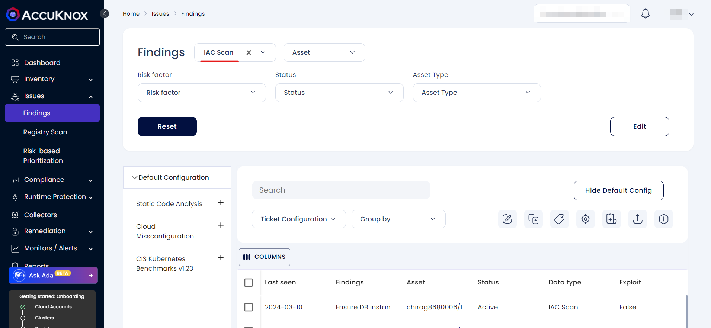
Users can search for their repository or findings from the search bar.

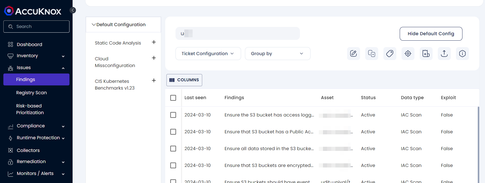

Clicking on the misconfiguration opens up the ticket creation dialog box.


Clicking on the arrow above will redirect you to a new page that provides detailed information and solutions regarding the misconfiguration.

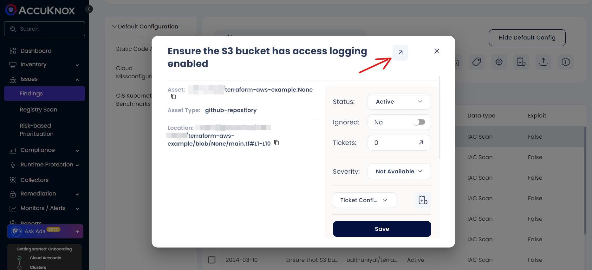

The image below shows details, solutions, and other information about the misconfiguration.

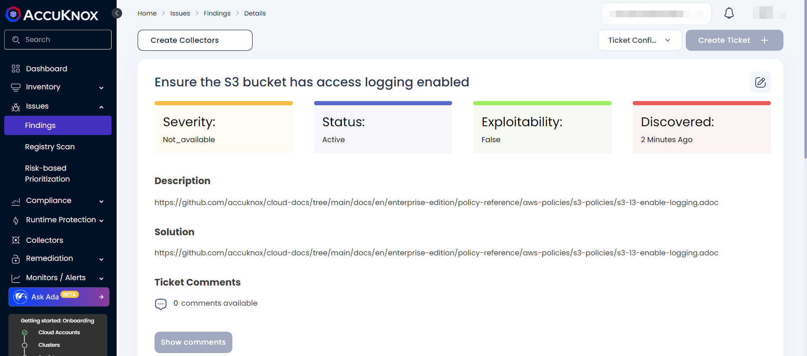

### 5. Resolution: You update the Terraform code to address the AccuKnox IaC Scan findings



```terraform
resource "aws_s3_bucket" "my_bucket" {
  bucket = "my-unique-bucket-name"
  acl    = "private"

  website {
    index_document = "index.html"
    error_document = "error.html"
  }

  logging {
    target_bucket = "my-logging-bucket"
    target_prefix = "log/"
  }
}
```



In the next scan ensure the S3 bucket has access logging enabled will not shown up in the logs.

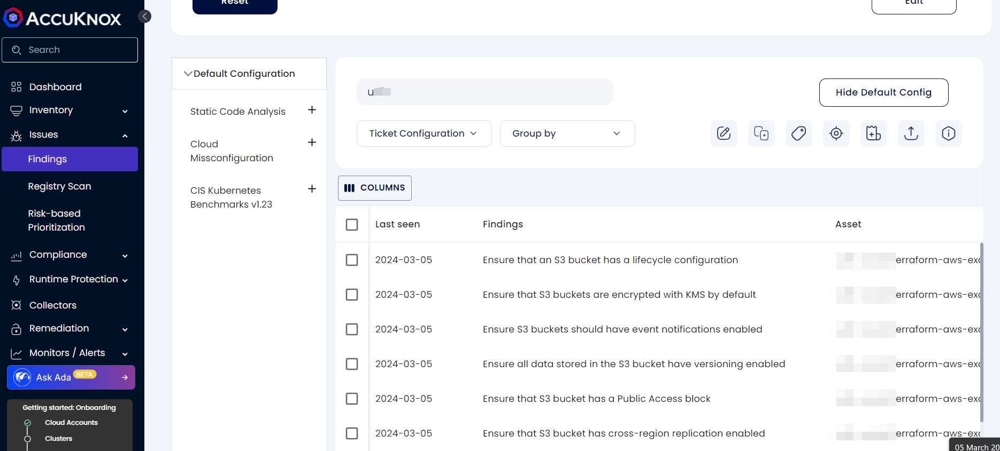

### 6. Final Outcome

After applying the updates and rerunning the CI/CD pipeline with the AccuKnox scan, the "Ensure the S3 bucket has access logging enabled" check is passed. Continue to address any other failed checks until your Infrastructure as Code (IaC) passes all checks. Once completed, your S3 bucket configuration will adhere to the best practices for security, ensuring that activity is logged.
