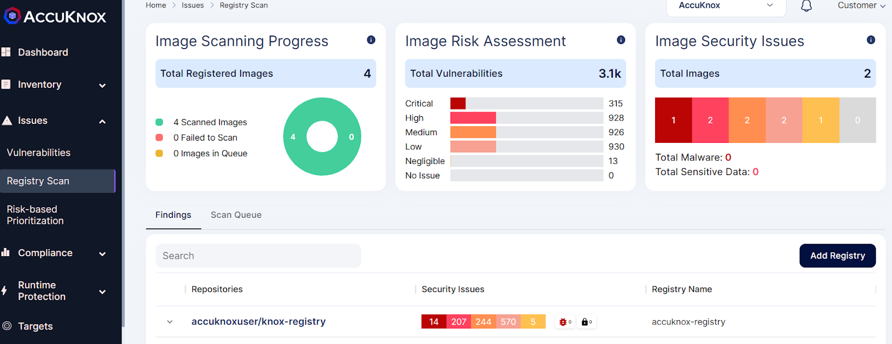
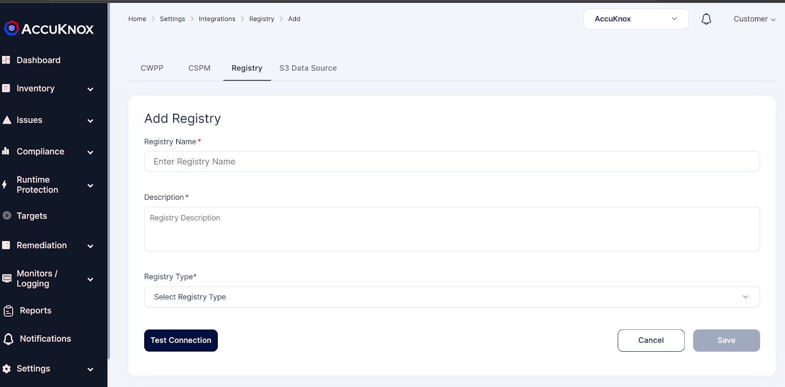
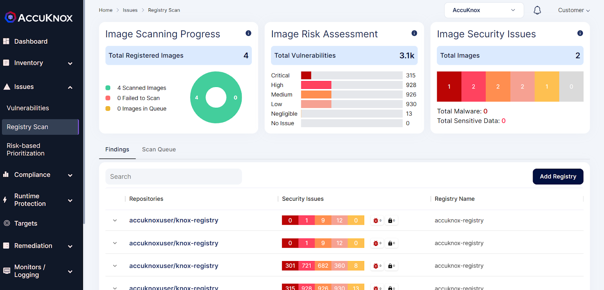

**Need for securing containers for Application Hardening**

With advent of digital transformation, there has been a significant increase in container adoption in production environments which is **making containers an easy target for exploitation**. Since the Pod is the smallest execution unit in Kubernetes and its usually unsecure which means once you do a exec in a Pod, you can access all sensitive paths, files or execute a binary. And therefore even a single vulnerable or compromised container could potentially become a point of entry into an organization's broader environment.

AccuKnox can secure containers by scanning container images, monitoring code in repositories and registries and evaluating it against security best practices using auto-recommended hardening policies as a part of continuous integration and continuous delivery workflows. We can secure both managed and unmanaged cluster, public and private cloud hosted workloads as well.

Lets understand this by an example use-case - **Container Image scanning**

+ User can add docker hub, ECR registries by navigating to *Issues->Registryscan*. In the screen click Add registry option

+ If you have an existing registry give the necessary details of your registry to scan.If you do not have an existing registry follow these steps:i) For creating ECR registry, refer here ii) For creating GCR registry, refer here iii) For creating Docker hub registry, refer here iv) For creating Nexus registry, refer here

+ Once the registry is added successfully. The scan will automatically start and user can navigate to the Issues->Registry scan option to see the findings

- - - 
[SCHEDULE DEMO](https://www.accuknox.com/contact-us){ .md-button .md-button--primary }
