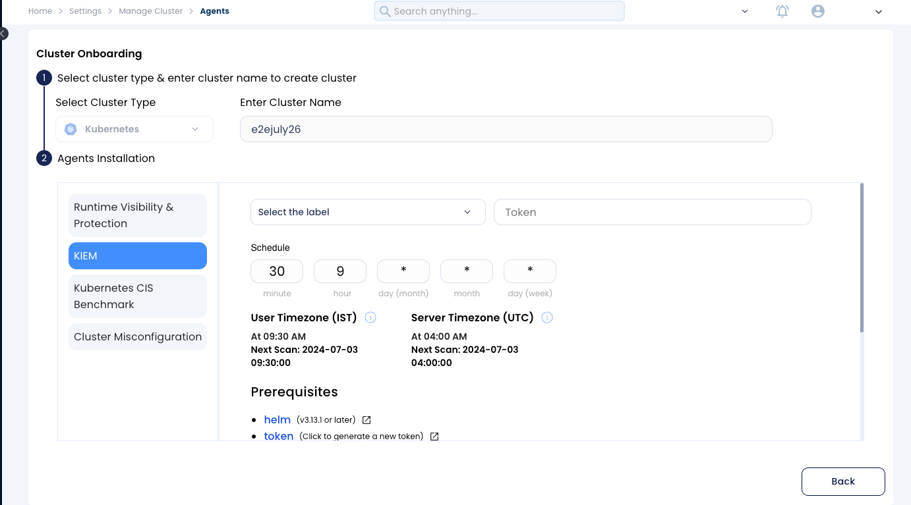

# Kubernetes Identity and Entitlement Management (KIEM)

KIEM addresses Kubernetes identity and entitlement security challenges by providing continuous visibility, event detection, and centralized permissions management. Designed for dynamic, auto-scaling infrastructures, it offers deep RBAC policy analysis and visualization. AccuKnox's solution is critical given that 65% of Kubernetes administrators struggle with policy configuration, enabling robust security in complex Kubernetes environments. By offering deep visibility, powerful analysis tools, and intuitive visualizations, KIEM empowers administrators to maintain robust security postures in even the most complex Kubernetes environments.

## Key Features

- **Full-text Search**: Search across all RBAC entities, including service accounts and role bindings.
- **Interactive Graph Visualization**: Visualize connections between users, permissions, and resources with interactive graphs.
- **Predefined Queries**: Handy built-in queries to identify critical issues like unnecessary privileges.
- **Custom Filtering**: Continuously monitor and filter access configurations and changes.
- **Simplified Access Control Management**: Streamline the complex task of managing Kubernetes access control and permissions.

## Onboarding Process

Follow these steps to set up and start using AccuKnox KIEM:

### Install KIEM Agents

1. Navigate to the "Manage Cluster" section in your AccuKnox dashboard.
2. Select the target cluster for KIEM installation.
3. Install the KIEM job on the selected cluster.
4. Set up and schedule the cron job for regular scans.

## Post-Onboarding Steps

After completing the onboarding process:

1. Wait for the initial KIEM cron job to complete its first scan.
2. Once the scan is finished, navigate to the "Identity > KIEM" section in your dashboard.
3. Review the initial findings and adjust configurations as necessary.

## KIEM Features

### Permissions Overview

- Summarizes all permissions in a unified view.
- Rolebinding and workloads are connected to permissions.
- Filter on constraints such as Role, Resource, ApiGroup, Verbs, Rolebinding, Service Accounts, Workload.
- View distilled permission summary for filtered entities.

### Key Queries

Our KIEM solution includes predefined queries that can detect security risks, misconfigurations, or compliance issues within Kubernetes RBAC configurations. With 15 built-in queries, you can better address common security concerns. These queries can detect dormant excess permissions, principals with excessive privileges, roles with permissions on workload resources modification, and list roles with read access to Kubernetes secrets, not in use. These prebuilt queries aid in maintaining Kubernetes RBAC configurations with security as a primary factor.

**Examples:**

- **Identify Service Accounts not connected to any workloads** (indicator of dormant excessive permissions).

- **Identify principals with excessive privileges**. Excessive privileges in Kubernetes can increase the risk of security breaches, as overprivileged users or processes can misuse their access, leading to data breaches, service disruptions, or unauthorized changes in the cluster.

- **Find roles that have permissions to modify workload resources**. Excessive access rights to Kubernetes workload resources can lead to security vulnerabilities, allowing unauthorized access or modifications to critical applications and data, undermining the cluster's security posture.

- **List roles that have read access to Kubernetes secrets**. Kubernetes secrets, often containing sensitive information like passwords, tokens, or encryption keys, can pose a significant security risk if read access to these roles is compromised, potentially leading to data leakage or unauthorized system access.

- **Identify roles that are not in use**. Unused roles can pose security risks if not regularly audited and cleaned up, potentially accumulating unnecessary permissions or becoming a target for exploitation by attackers.

### Full-text Search

Search across all RBAC entities:

- ServiceAccounts
- RoleBindings
- Roles And more

### Entity Exploration

- View connections and manifest for select entities.
- Discover excessive permissions.

- Explore all RBAC entities:
    - Service Accounts
    - Users
    - Groups
    - Roles
    - RoleBindings

### Interactive Visualization

Open any entity and view all its connections by clicking on the link.

## Use Case: Navigating RBAC Complexities

While Kubernetes RBAC provides powerful access management capabilities, it can become complex in large or dynamic environments. AccuKnox KIEM addresses these challenges through:

- **Intuitive Visualization**: Graphically represent RBAC relationships for easier understanding.
- **Powerful Search**: Quickly find and analyze specific permissions or entities.
- **Pre-defined Security Checks**: Automatically identify common misconfigurations or security risks.
- **Continuous Monitoring**: Track changes to RBAC configurations in real-time.
- **Compliance Mapping**: Align RBAC policies with industry standards and best practices.

By leveraging these features, administrators can effectively manage relationships between key entities, monitor configuration changes, and ensure a more secure Kubernetes environment, all while reducing the complexity typically associated with RBAC management.

!!!info
    **For more details, refer [AccuKnox KIEM Blog](https://www.accuknox.com/blog/kubernetes-identity-entitlement-management)**