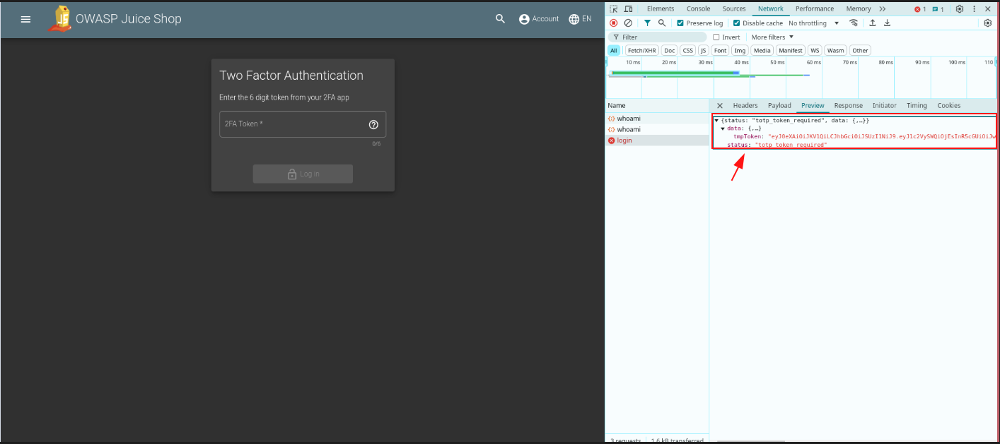
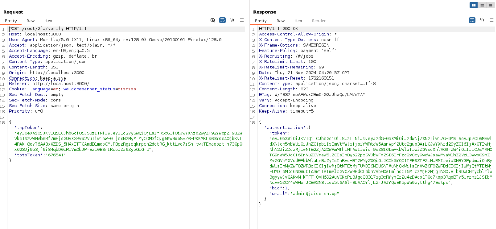
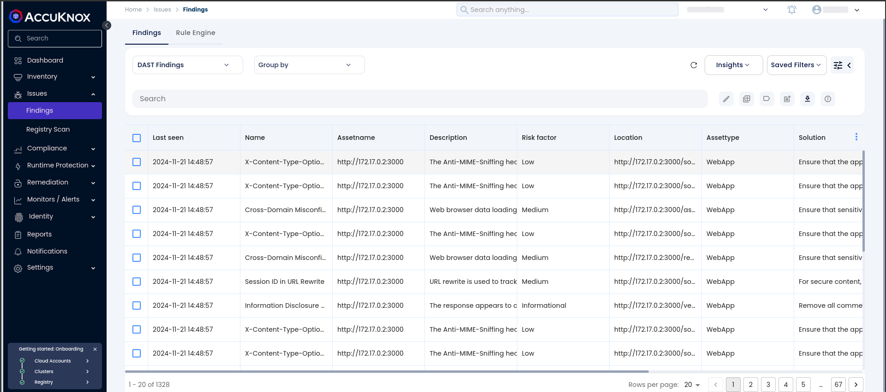
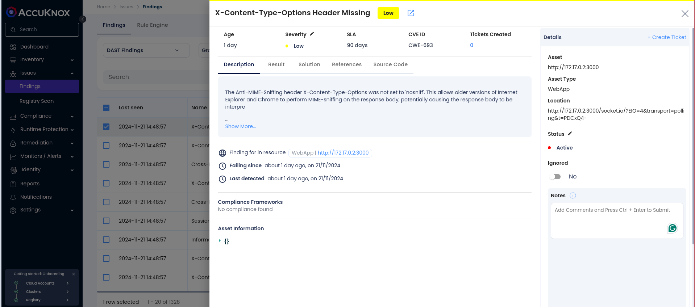
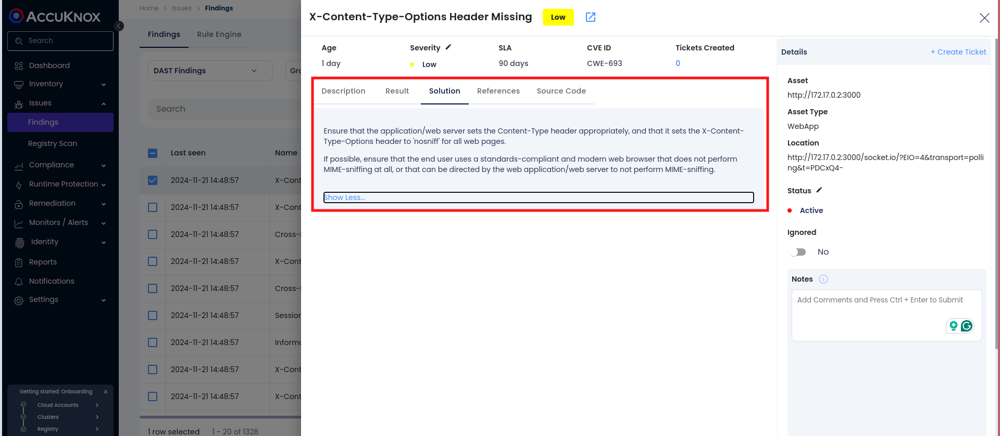
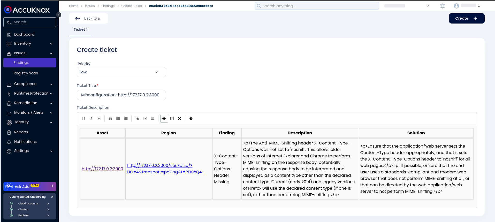

# MFA-Enabled Application DAST Scan

## Objective

To showcase how to run a Dynamic Application Security Testing (DAST) scan on an MFA-enabled application using GitHub CI/CD workflows. The OWASP Juice Shop, a deliberately vulnerable application, is used as a reference to demonstrate the process and analyze the findings effectively.

## Scenario

You are implementing Multi-Factor Authentication (MFA) to secure access to an application. As part of the CI/CD pipeline, you want to integrate a DAST scan using AccuKnox to identify potential vulnerabilities and evaluate the results for improved application security.

## Prerequisites

- GitHub Actions are enabled for the repository.

- AccuKnox Platform Access

- MFA configured for the demo application.

## **Steps**

### Setting the Stage

We'll focus on implementing the credentials flow with Multi-Factor Authentication (MFA) for the **OWASP Juice Shop** application, which has MFA enabled.

To authenticate with the OWASP Juice Shop, a POST request is sent with the user's email and password. After submitting the credentials, the system prompts for a Time-Based One-Time Password (TOTP).




An authorization token is issued once the TOTP is verified, allowing authenticated access for further interactions.




### Configuring AccuKnox for CI/CD Integration

**Step 1**: Log in to AccuKnox Navigate to Settings and select Tokens to create an AccuKnox token for forwarding scan results to SaaS. For details on generating tokens, refer to [How to Create Tokens](https://help.accuknox.com/how-to/how-to-create-tokens/?h=token "https://help.accuknox.com/how-to/how-to-create-tokens/?h=token").

**Step 2:** Navigate to the **Labels** section in **Settings** and create a label to categorize and identify your scan results. For step-by-step guidance, see [How to Create Labels](https://help.accuknox.com/how-to/how-to-create-labels/?h=label "https://help.accuknox.com/how-to/how-to-create-labels/?h=label").

Once tokens and labels are set up, you're ready to integrate them into the CI/CD pipeline.

### **Pipeline for AccuKnox DAST Integration**

In Jenkins, create a secret text credential with the ID `ACCUKNOX_TOKEN` to store the AccuKnox API token. This credential will be used in the pipeline for authentication when uploading scan results to the AccuKnox platform.

The pipeline performs DAST scanning. Once the scan is completed, the results are uploaded to the AccuKnox platform for further analysis and reporting.

```groovy
pipeline {
    agent any
    environment {
        TOKEN = credentials('ACCUKNOX_TOKEN')
        END_POINT = 'cspm.demo.accuknox.com'
        TENANT_ID = '167'
        LABEL = 'SPOC'
    }
    stages {
        stage('Checkout Repository') {
            steps {
                git 'https://github.com/safeer-accuknox/mfa-dast-integration-accuknox'  // Replace with your repository URL
            }
        }
        stage('Run Python container for updating MFA') {
            steps {
                script {
                    sh '''
                    docker run -d -it --name pythonmfa --rm -v workspace/Accuknox-DAST:/wrk/:rw python:3.11-slim /bin/bash -c "pip install --no-cache-dir pyotp && python /wrk/scripts/mfa-gen.py"
                    '''
                }
            }
        }
        stage('Run ZAP container') {
            steps {
                script {
                    sh '''
                    docker run --rm --cpus="8" --memory="8g" --name dastscan -v workspace/Accuknox-DAST:/zap/wrk/:rw -u zap -i ghcr.io/zaproxy/zaproxy:stable zap.sh -addoninstall communityScripts -addoninstall jython -loglevel debug -cmd -autorun /zap/wrk/config-mfa.yaml
                    '''
                }
            }
        }
        stage('Upload Scan Results') {
            steps {
                script {
                    sh '''
                    curl --location --request POST "https://${END_POINT}/api/v1/artifact/?tenant_id=${TENANT_ID}&data_type=ZAP&label_id=${LABEL}&save_to_s3=false" --header "Tenant-Id: ${TENANT_ID}" --header "Authorization: Bearer ${TOKEN}" --form 'file=@"report.json"'
                    '''
                }
            }
        }
        stage('Cleanup') {
            steps {
                script {
                    sh '''
                    docker ps -a -q -f name=pythonmfa | xargs -r docker stop | xargs -r docker rm
                    '''
                    sh '''
                    docker ps -a -q -f name=dastscan | xargs -r docker stop | xargs -r docker rm
                    '''
                }
            }
        }
    }
}
```

## **View Results in AccuKnox SaaS**

**Step 1**: After the pipeline completes, navigate to the AccuKnox SaaS dashboard.

**Step 2**: Go to **Issues** > **Findings** and select **DAST Findings** to see identified vulnerabilities.




**Step 3**: Click on a vulnerability to view more details.




**Step 4**: Fix the Vulnerability

Follow the instructions in the Solutions tab to fix the vulnerability




**Step 5**: Create a Ticket for Fixing the Vulnerability

Create a ticket in your issue-tracking system to address the identified vulnerability.




**Step 6**: Review Updated Results

- After fixing the vulnerability, rerun the Jenkins CI/CD pipeline.

- Navigate to the AccuKnox SaaS dashboard and verify that the vulnerability has been resolved.

## **Conclusion**

The integration of AccuKnox with CI/CD pipelines, including the DAST scan on MFA-enabled applications, strengthens security by identifying vulnerabilities early in the development lifecycle. By combining MFA updates with dynamic application security testing (DAST), the pipeline ensures that security risks in authenticated applications are addressed before deployment..
